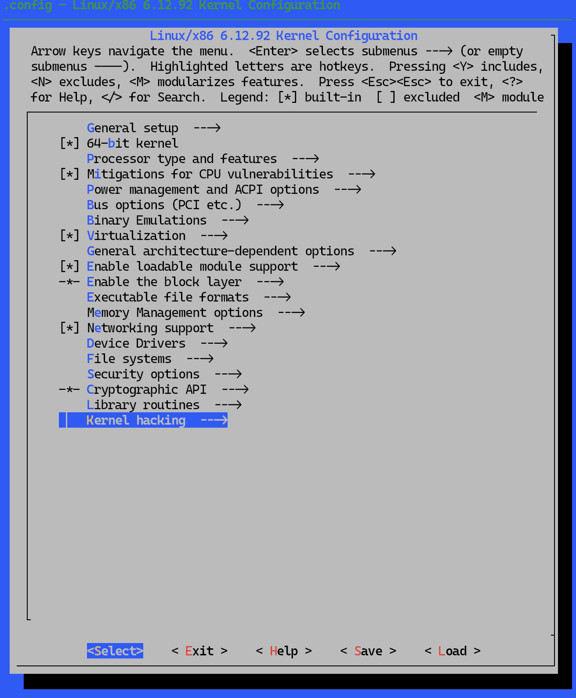
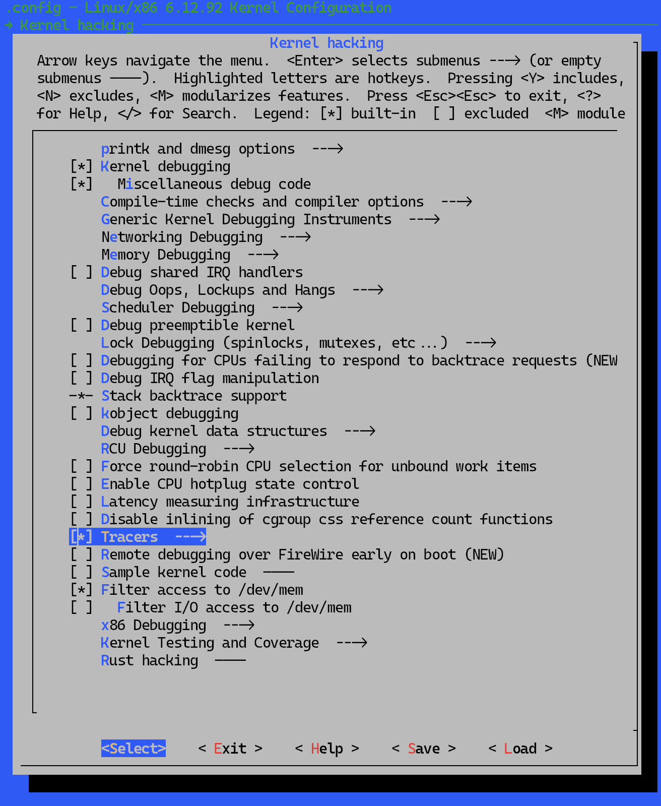
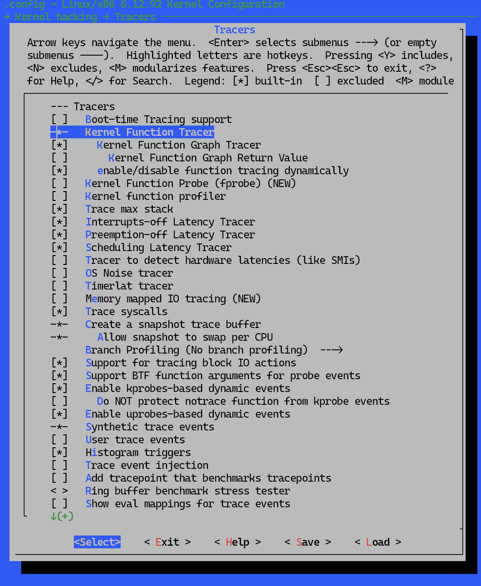
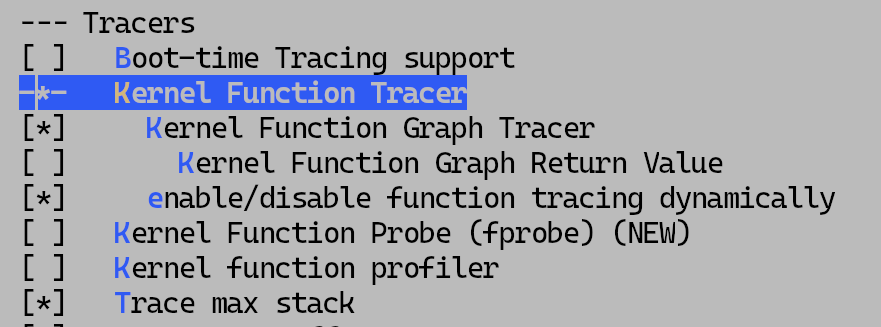

# ftrace 사용법 — tracefs 진입부터 trace-cmd까지

ftrace(function tracer)는 리눅스 커널 함수를 추적하거나, 사전에 정의된 특정 커널 이벤트를 추적하는 도구이다.

## tracefs — ftrace의 인터페이스

ftrace는 tracefs라는 가상 파일시스템으로 노출된다. 과거에는 debugfs의 일부였지만, 규모 증가 및 보안과 관련된 다양한 이유로 tracefs라는 별도 파일시스템으로 분리되었다. 이름에 `fs`라는 키워드가 붙은 만큼, 일반적인 리눅스 파일처럼 `echo`나 `cat` 같은 명령어로 각 항목의 값을 읽고 쓸 수 있다.

```bash
echo 0 > /sys/kernel/tracing/tracing_on
```

ftrace가 이런 방식으로 구성된 이유는 "모든 것은 파일(시스템)이다"라는 리눅스 커널의 방향성에 기인한다. 커널의 VFS(Virtual File System) 기능을 활용하여 실제 구현부를 사용자 입장에서 추상화하고, 쉘의 리다이렉트 같은 연산자로 파일에 operation을 수행하면 그에 대응하는 사전 정의된 작업이 백그라운드에서 동작한다. 따라서 사용자는 내부 작동과 구현 원리를 세밀하게 제어하지 않고도 추상화된 인터페이스만으로 ftrace를 사용할 수 있다.

만약 C(혹은 Go, Python, Rust 등) 코드 수준에서 위와 같은 작업을 더 빠르고 정밀하며 자유도 높게 제어하고자 한다면 eBPF 같은 대안이 있다.

## tracefs 디렉토리와 root 권한

ftrace를 사용하기에 앞서 tracefs는 `/sys/kernel/tracing`에 마운트된다.

7.0.5 버전 커널의 Arch Linux를 기준으로 `ls -al /sys/kernel/tracing` 명령어의 결과는 아래와 같다.

```text
total 0
drwxr-xr-x  9 root root 0 May 14 15:09 .
drwxr-xr-x 18 root root 0 May 14 16:09 ..
-r--r-----  1 root root 0 May 14 15:09 available_events
-r--r-----  1 root root 0 May 14 15:09 available_filter_functions
-r--r-----  1 root root 0 May 14 15:09 available_filter_functions_addrs
-r--r-----  1 root root 0 May 14 15:09 available_tracers # [!hl]
-rw-r-----  1 root root 0 May 14 15:09 buffer_percent
-rw-r-----  1 root root 0 May 14 15:09 buffer_size_kb
-rw-r-----  1 root root 0 May 14 15:09 buffer_subbuf_size_kb
-r--r-----  1 root root 0 May 14 15:09 buffer_total_size_kb
-rw-r-----  1 root root 0 May 14 15:09 current_tracer # [!hl]
-rw-r-----  1 root root 0 May 14 15:09 dynamic_events
-r--r-----  1 root root 0 May 14 15:09 dyn_ftrace_total_info
-r--r-----  1 root root 0 May 14 15:09 enabled_functions
-rw-r-----  1 root root 0 May 14 15:09 error_log
drwxr-xr-x  1 root root 0 May 14 15:09 events # [!hl]
--w-------  1 root root 0 May 14 15:09 free_buffer
-rw-r-----  1 root root 0 May 14 15:09 function_profile_enabled
drwxr-x---  2 root root 0 May 14 15:09 hwlat_detector
drwxr-x---  2 root root 0 May 14 15:09 instances
-rw-r-----  1 root root 0 May 14 15:09 kprobe_events
-r--r-----  1 root root 0 May 14 15:09 kprobe_profile
-rw-r-----  1 root root 0 May 14 15:09 max_graph_depth
drwxr-x---  2 root root 0 May 14 15:09 options
drwxr-x---  3 root root 0 May 14 15:09 osnoise
drwxr-x--- 10 root root 0 May 14 15:09 per_cpu
-r--r-----  1 root root 0 May 14 15:09 printk_formats
-r--r-----  1 root root 0 May 14 15:09 README
-r--r-----  1 root root 0 May 14 15:09 saved_cmdlines
-rw-r-----  1 root root 0 May 14 15:09 saved_cmdlines_size
-r--r-----  1 root root 0 May 14 15:09 saved_tgids
-rw-r-----  1 root root 0 May 14 15:09 set_event
-rw-r-----  1 root root 0 May 14 15:09 set_event_notrace_pid
-rw-r-----  1 root root 0 May 14 15:09 set_event_pid
-rw-r-----  1 root root 0 May 14 15:09 set_ftrace_filter # [!hl]
-rw-r-----  1 root root 0 May 14 15:09 set_ftrace_notrace
-rw-r-----  1 root root 0 May 14 15:09 set_ftrace_notrace_pid
-rw-r-----  1 root root 0 May 14 15:09 set_ftrace_pid
-rw-r-----  1 root root 0 May 14 15:09 set_graph_function
-rw-r-----  1 root root 0 May 14 15:09 set_graph_notrace
-r--r-----  1 root root 0 May 14 15:09 show_event_filters
-r--r-----  1 root root 0 May 14 15:09 show_event_triggers
-rw-r-----  1 root root 0 May 14 15:09 snapshot
-rw-r-----  1 root root 0 May 14 15:09 stack_max_size
-r--r-----  1 root root 0 May 14 15:09 stack_trace
-rw-r-----  1 root root 0 May 14 15:09 stack_trace_filter
-rw-r-----  1 root root 0 May 14 15:09 synthetic_events
-rw-r-----  1 root root 0 May 14 15:09 syscall_user_buf_size
-r--r-----  1 root root 0 May 14 15:09 timestamp_mode
-r--r-----  1 root root 0 May 14 15:09 touched_functions
-rw-r-----  1 root root 0 May 14 15:09 trace # [!hl]
-rw-r-----  1 root root 0 May 14 15:09 trace_clock
--w--w----  1 root root 0 May 14 15:09 trace_marker
--w--w----  1 root root 0 May 14 15:09 trace_marker_raw
-rw-r-----  1 root root 0 May 14 15:09 trace_options
-r--r-----  1 root root 0 May 14 15:09 trace_pipe
drwxr-x---  2 root root 0 May 14 15:09 trace_stat
-rw-r-----  1 root root 0 May 14 15:09 tracing_cpumask
-rw-r-----  1 root root 0 May 14 15:09 tracing_max_latency
-rw-r-----  1 root root 0 May 14 15:09 tracing_on # [!hl]
-rw-r-----  1 root root 0 May 14 15:09 tracing_thresh
-rw-r-----  1 root root 0 May 14 15:09 uprobe_events
-r--r-----  1 root root 0 May 14 15:09 uprobe_profile
-rw-r-----  1 root root 0 May 14 15:09 user_events_data
-r--r-----  1 root root 0 May 14 15:09 user_events_status
```

이 디렉토리와 하위 디렉토리에 있는 모든 파일이 ftrace 전용은 아니다. kprobe, uprobe 등 다양한 트레이싱 도구가 같은 위치에 공존한다.

ftrace를 활용하기에 앞서 해당 폴더에 file operation에 대한 root 권한이 필요하다. `sudo echo 0 > /sys/kernel/tracing/tracing_on`처럼 명령어 앞에 `sudo`만 붙이면 작동할 것으로 오해할 수도 있으나, 많은 경우 권한 오류로 실행되지 않는다. 따라서 `sudo -i` 또는 `sudo su` 같은 명령어로 루트 권한을 획득한 쉘로 작업을 진행해야 한다.

## tracefs의 주요 옵션 파일

ftrace를 file I/O로 키고 끄는 데 자주 쓰는 옵션은 다음과 같다.

- **`tracing_on`**: ftrace 전체 기능의 마스터 스위치. `1`이면 ring buffer로 trace가 기록되고, `0`이면 즉시 멈춘다. 아래 옵션들이 모두 설정되어 있더라도 이 값이 `0`이면 아무것도 기록되지 않는다.
- `available_tracers`: 현재 커널이 지원하는 ftrace tracer의 목록. read-only 파일이며, 빌드 시 활성화된 CONFIG 옵션에 따라 내용이 달라진다. `timerlat`, `osnoise`, `hwlat`, `blk`, `mmiotrace`, `function`, `function_graph`, `wakeup_dl`, `wakeup_rt`, `wakeup`, `nop` 등 11종이 존재한다. 이 중 본 글에서 다루는 함수·이벤트 추적과 직접 연관된 것은 다음 셋이다.
    - `function`: 모든 (또는 `set_ftrace_filter`로 좁힌) 커널 함수의 진입을 추적하는 가장 기본적인 tracer.
    - `function_graph`: 커널 함수의 entry/exit를 들여쓰기 트리로 표현하고, 함수별 실행 시간을 함께 기록. `function`과 함께 자주 활용.
    - `nop`: 함수 추적기를 비활성화한 상태를 나타내는 placeholder.
- `current_tracer`: `available_tracers` 중 현재 활성화된 tracer 한 개를 가리키는 단일 슬롯. 별도 설정을 하지 않으면 `nop`으로 설정되어 있으며, 이 파일에 tracer 이름을 쓰면 즉시 그 tracer로 전환된다. 단, `nop`은 '아무것도 추적하지 않는' 상태가 아니라 '함수 추적기만 비활성화된' 상태이다. tracepoint 기반 이벤트(`events/` 하위 `enable`, `set_event`)는 `current_tracer`와 독립된 경로로 ring buffer에 기록되므로, `current_tracer=nop`인 상태에서도 활성화된 tracepoint 이벤트는 정상적으로 trace된다. 즉 `nop`은 "이벤트 추적은 그대로 두고 함수 추적만 끈다"는 의미에 가깝다.
- `events/`: 커널 소스에 사전 정의된 tracepoint들을 서브시스템별로 디렉토리화해 둔 곳. 각 이벤트 폴더 안의 `enable` 파일에 `1`을 쓰면 그 이벤트가 켜지고, 상위 디렉토리의 `enable`에 쓰면 그 하위 전체가 일괄로 켜진다. `set_event` 파일에 `subsystem:event` 형식으로 쓰는 방식도 동일한 결과를 만든다. 한 번 켠 이벤트는 명시적으로 끄기 전까지 그대로 유지되므로, 직전 측정에서 켜 둔 이벤트가 다음 측정에 섞이지 않도록 매 측정을 시작할 때 비워 두는 편이 안전하다.
- `set_ftrace_filter`: function tracer가 추적할 커널 함수의 whitelist. 이 파일이 비어 있으면 모든 함수가 추적 대상이 되며, 함수명을 쓰면 그 집합으로 좁혀진다. `vfs_*` 같은 glob 패턴도 받는다. 이 필터 역시 세션 간 그대로 남아, 직전에 등록해 둔 패턴이 다음 측정의 추적 대상을 의도치 않게 넓힐 수 있다. 이런 설정 충돌을 피하려면 매 측정의 시작에서 한 번 비우고 출발하는 것이 안전하다 (초기화 방법은 뒤에서 다룬다).
- `set_ftrace_notrace`: `set_ftrace_filter`의 반대 — blacklist. whitelist에 포함되더라도 여기에 매칭되면 추적에서 제외된다.

ftrace와 tracepoint를 동일한 개념이라고 생각하는 경우가 많으나, 엄밀하게는 다른 개념이다. tracepoint에 ftrace를 attach할 수도, eBPF를 attach할 수도 있다.

중요한 점은, ftrace는 '이벤트'를 추적하는 것과 '함수'를 추적하는 기능 두 가지를 제공한다는 사실이다. 일반적으로 이벤트는 하나의 커널 함수에 1:1 대응되어 정의되어 있다. 이 때 "유일한 커널 함수의 코드 내부에 이벤트를 삽입하는 것이라면 왜 굳이 함수 추적과 이벤트 추적을 구분하는가?"라는 의문이 들 수 있다. 답은 함수의 크기에 있다. 커널 함수는 적게는 수십 줄에서 많게는 수천 줄을 차지하는 경우도 흔하며, 따라서 함수의 시작 직전과 그 함수 내부에서 실제로 이벤트가 일어나는 지점 사이의 거리가 큰 경우도 많다. 이벤트에 추적을 걸어두면 바로 그 지점을 타깃팅해 더 정교한 추적이 가능하다.

## 커널에 ftrace 활성화하기

ftrace는 현대적인 버전의 커널로 빌드된 대부분의 PC용 리눅스 배포판에서 별다른 추가 설정 없이 tracefs에서 바로 사용할 수 있다. 하지만 QEMU로 커널을 새로 빌드해 가상머신에 구동할 목적이거나 호스트 커널이 ftrace를 활성화하여 빌드된 경우가 아니라면, 커널 configuration을 수정하고 (재)빌드해야 한다. `make menuconfig`의 `Kernel hacking` → `Tracers` 항목에서 최소한 다음 옵션들을 활성화해야 한다.

- `CONFIG_FTRACE=y` — ftrace 인프라 자체.
- `CONFIG_FUNCTION_TRACER=y` — 함수 진입을 추적하는 기본 tracer.
- `CONFIG_FUNCTION_GRAPH_TRACER=y` — 함수 진입과 종료를 들여쓰기 트리로 표현하는 tracer.
- `CONFIG_DYNAMIC_FTRACE=y` — 비활성화된 함수를 nop 명령으로 패치해, 추적이 꺼져 있을 때의 오버헤드를 0에 가깝게 만드는 옵션. 사실상 필수.
- `CONFIG_FTRACE_SYSCALLS=y` — 시스템 콜 enter/exit 이벤트 활성화.
- `CONFIG_KPROBE_EVENTS=y`, `CONFIG_UPROBE_EVENTS=y` — `kprobe_events`, `uprobe_events` 인터페이스를 통한 동적 이벤트 등록.
- `CONFIG_STACK_TRACER=y`, `CONFIG_TRACER_SNAPSHOT=y` — 스택 사용량 추적과 스냅샷 기능.

v6.12.92 트리 기준으로, `make menuconfig`를 실행하면 다음과 같은 최상위 메뉴를 만난다. 여기서 맨 아래의 `Kernel hacking` 항목으로 진입한다.



Kernel hacking 메뉴 하위에 `Tracers` 항목이 보인다.



`Tracers`를 열면 ftrace 관련 옵션들이 나타난다. 위에서 적은 `CONFIG_FTRACE`, `CONFIG_FUNCTION_TRACER` 등을 여기서 직접 토글한다.



function tracer 핵심 옵션 부분을 확대하면 다음과 같다. 메뉴 라벨과 `CONFIG_*`의 대응은 `kernel/trace/Kconfig`의 prompt 문자열에서 나온다 — `Kernel Function Tracer`가 `CONFIG_FUNCTION_TRACER`, `Kernel Function Graph Tracer`가 `CONFIG_FUNCTION_GRAPH_TRACER`, `enable/disable function tracing dynamically`가 `CONFIG_DYNAMIC_FTRACE`이다.



`make menuconfig` 같은 대화형 인터페이스를 거치지 않고 `CONFIG_*` 값을 설정하는 방법도 여러 가지 있다. 그 방법들을 이해하려면 우선 옵션이 어디에 어떻게 저장되어 있는지부터 짚어야 한다.

- **옵션 정의 — `Kconfig` 파일들**: `CONFIG_*`가 어떤 옵션인지, 어떤 의존성을 가지는지에 대한 메타정보는 커널 소스 트리 곳곳에 분산된 `Kconfig` 파일들에 정의되어 있다. ftrace 관련 옵션은 `kernel/trace/Kconfig`에 모여 있다. `make menuconfig`가 보여주는 메뉴 트리는 이 파일들을 파싱한 결과이다.
- **현재 빌드의 활성화 상태 — `.config`**: 실제로 "이번 빌드에서 어떤 옵션을 켤지"는 커널 소스 루트의 `.config` 파일에 한 줄씩 (`CONFIG_FTRACE=y`, `# CONFIG_FOO is not set` 형식으로) 기록된다. `make menuconfig`는 사실상 메뉴 기반 TUI의 `.config` 편집기에 불과하며, 모든 빌드 단계는 결국 `.config`만 참조한다.
- **아키텍처별 baseline과 목적별 fragment**: `.config`와 동일한 텍스트 형식 — `CONFIG_X=y` (활성), `# CONFIG_X is not set` (비활성), `CONFIG_X=m` (모듈), `CONFIG_HZ=250` 같은 정수값 — 을 공유하는 사전 정의 파일들이 트리 곳곳에 있다. 정리하면 세 위치이다.
    - `arch/<arch>/configs/` — 아키텍처별 baseline + 그 아키텍처용 fragment가 모여 있다.
        - `arch/x86/configs/` : baseline `i386_defconfig`, `x86_64_defconfig`, fragment `hardening.config`, `tiny.config`, `xen.config`.
        - `arch/arm64/configs/` : baseline `defconfig`, fragment `hardening.config`, `virt.config`.
        - `arch/riscv/configs/` : baseline `defconfig`와 nommu 타깃용 `nommu_virt_defconfig`, `nommu_k210_defconfig`, `nommu_k210_sdcard_defconfig`, fragment `32-bit.config`, `64-bit.config`.
    - `kernel/configs/*.config` — arch 독립적인 목적별 fragment. v6.12에는 `debug.config`, `hardening.config`, `kvm_guest.config`, `nopm.config`, `rust.config`, `tiny.config`, `tiny-base.config`, `x86_debug.config`, `xen.config`가 들어 있다.
    - `include/config/auto.conf` — 빌드 시점에 `.config`에서 자동 파생되는 파일. 사용자가 직접 만질 일은 없지만 최상위 Makefile이 실제로 `include`하는 변환 결과물이다.

    baseline의 파일명 규칙은 아키텍처마다 다르다. x86은 `<variant>_defconfig` 식으로 여러 개를 두고, arm64는 `defconfig` 하나만 둔다. `make x86_64_defconfig` (x86)나 `make defconfig` (arm64, 또는 `ARCH=arm64` 환경) 같은 명령이 이 중 하나를 `.config`로 복사하는 동작이며, `kernel/configs/*.config`의 fragment들은 `scripts/kconfig/merge_config.sh`로 기존 `.config` 위에 합쳐 넣는다. 즉 `CONFIG_X=y` 형식이 등장하는 파일의 출처는 `.config`, `arch/<arch>/configs/`, `kernel/configs/*.config`, `include/config/auto.conf`의 네 곳이다.

이 형식의 파일을 실제로 들여다보면 다음과 같다. 아래는 한 빌드의 `.config`에서 ftrace 관련 영역만 발췌한 것이다.

```text
CONFIG_TRACING=y
CONFIG_TRACING_SUPPORT=y
CONFIG_FTRACE=y
# CONFIG_BOOTTIME_TRACING is not set
CONFIG_FUNCTION_TRACER=y
CONFIG_FUNCTION_GRAPH_TRACER=y
CONFIG_DYNAMIC_FTRACE=y
CONFIG_DYNAMIC_FTRACE_WITH_DIRECT_CALLS=y
CONFIG_DYNAMIC_FTRACE_WITH_CALL_OPS=y
CONFIG_DYNAMIC_FTRACE_WITH_ARGS=y
# CONFIG_FUNCTION_PROFILER is not set
CONFIG_STACK_TRACER=y
CONFIG_IRQSOFF_TRACER=y
CONFIG_PREEMPT_TRACER=y
# CONFIG_HWLAT_TRACER is not set
# CONFIG_OSNOISE_TRACER is not set
# CONFIG_TIMERLAT_TRACER is not set
CONFIG_FTRACE_SYSCALLS=y
CONFIG_TRACER_SNAPSHOT=y
CONFIG_TRACER_SNAPSHOT_PER_CPU_SWAP=y
CONFIG_BLK_DEV_IO_TRACE=y
CONFIG_UPROBE_EVENTS=y
CONFIG_BPF_EVENTS=y
CONFIG_DYNAMIC_EVENTS=y
CONFIG_FTRACE_MCOUNT_RECORD=y
CONFIG_FTRACE_MCOUNT_USE_PATCHABLE_FUNCTION_ENTRY=y
CONFIG_TRACING_MAP=y
```

한 줄이 곧 하나의 옵션 상태다. `=y`와 `# ... is not set`의 단순한 두 형태가 가장 많고, 여기에 모듈로 빌드되는 옵션의 `CONFIG_FOO=m`, 정수값을 받는 `CONFIG_HZ=250`, 문자열값을 받는 `CONFIG_LOCALVERSION="-test"`, 16진수값을 받는 `CONFIG_PHYSICAL_START=0x1000000` 같은 형태가 더해진다.

따라서 비대화형으로 `CONFIG_FTRACE` 류 옵션을 켜는 정공법은 `.config`를 어떻게 변형하느냐의 문제로 귀결된다.

- **`.config` 직접 편집**: 텍스트 에디터로 열어 `# CONFIG_FTRACE is not set` 줄을 `CONFIG_FTRACE=y`로 교체한다. 의존 옵션을 자동으로 채워 넣기 위해 편집 직후 `make olddefconfig`를 실행한다.
- **`scripts/config` 헬퍼**: 커널 소스 트리에 동봉된 셸 스크립트로 `.config`를 안전하게 수정한다. 예: `./scripts/config --enable CONFIG_FTRACE --enable CONFIG_FUNCTION_TRACER` 후 `make olddefconfig`.
- **config fragment 병합**: 필요한 옵션만 모은 단편 파일(`ftrace.frag`)을 만들고 `./scripts/kconfig/merge_config.sh .config ftrace.frag`로 합친다. 동일한 옵션 묶음을 여러 빌드에서 재사용할 때 유용하다.
- **`KCONFIG_CONFIG` 환경변수**: `KCONFIG_CONFIG=my.config make ...` 형태로 `.config`가 아닌 다른 파일을 그 빌드의 설정으로 사용하게 할 수 있다.

한 가지 구분해 둘 점이 있다. make 명령에 변수를 붙이는 것 자체는 커널 빌드에서 흔하고 정상적인 방식이다. 실전에서는 아래와 같은 형태가 자주 등장한다.

```bash
make -j$(nproc) ARCH=arm64 CROSS_COMPILE=aarch64-linux-gnu- O=../build LLVM=1 V=1
```

각 인자의 역할은 다음과 같다.

- `-j$(nproc)`: 빌드 병렬도. make 자체의 옵션이며, `nproc`은 가용 CPU 코어 수를 반환한다.
- `ARCH=arm64`: 타깃 아키텍처. `arch/<ARCH>/` 디렉토리를 가리킨다.
- `CROSS_COMPILE=aarch64-linux-gnu-`: 크로스 컴파일러 prefix. `${CROSS_COMPILE}gcc`, `${CROSS_COMPILE}ld` 식으로 툴체인 실행 파일 이름을 조립할 때 쓰인다.
- `O=../build`: out-of-tree 빌드 디렉토리. 소스 트리를 더럽히지 않고 별도 폴더에 결과물을 모은다.
- `LLVM=1`: clang/LLVM 툴체인으로 빌드. 생략하면 GCC 기본.
- `V=1`: 상세 로그(컴파일러 호출 한 줄 한 줄 출력). `V=2`는 의존성까지.

이 외에도 `KCONFIG_CONFIG=`, `INSTALL_MOD_PATH=`, `INSTALL_PATH=`, `W=1|2|3` 등 다양한 변수가 make 인자로 빌드 동작을 제어한다.

다만 **`CONFIG_*` 이름의 옵션들만은 예외다.** `make CONFIG_FTRACE=y`처럼 인자를 넘겨도, 빌드 시스템이 "어떤 옵션이 켜졌는가"의 진실 원본으로 삼는 것은 `.config`와 그로부터 자동 생성되는 `include/config/auto.conf`, `include/generated/autoconf.h`이다. C 소스의 `#ifdef CONFIG_FTRACE` 분기와 Makefile의 `obj-$(CONFIG_FTRACE)` 라인 모두 이 두 파일을 읽기 때문에, 동명의 make 변수를 명령줄에 둔다고 해서 그 옵션이 활성화되지는 않는다. CONFIG 옵션을 비대화형으로 바꾸려면 결국 위에 정리한 네 가지 방법(`.config` 직접 편집 / `scripts/config` / fragment 병합 / `KCONFIG_CONFIG=`으로 파일 자체를 교체) 중 하나를 거쳐야 한다.

## 빌드 Makefile의 위치와 구성

지금까지 등장한 `make defconfig`, `make x86_64_defconfig`, `make menuconfig`, `make olddefconfig` 같은 명령들은 사실 커널을 빌드하지 않는다. 이들은 **config target** 으로 분류되며, `.config` 파일을 만들거나 수정하고 그 자리에서 종료한다. vmlinux도, `.o` 파일 하나도 만들어지지 않는다. 실제 컴파일·링크는 별도의 **build target** 을 호출해야 비로소 일어난다. `make` (인자 없음 = `make all`), `make vmlinux`, `make modules`, `make Image` / `make bzImage`, 또는 `make kernel/trace/`처럼 서브 디렉토리만 빌드하는 명령이 여기 해당한다.

또 한 가지 짚어둘 점은 **Makefile 자체는 어디에서도 새로 생성되지 않는다** 는 사실이다. 최상위 `Makefile`부터 `kernel/trace/Makefile` 같은 서브 디렉토리 Makefile까지 모두 git으로 관리되는 정적 소스 파일이다. config target이 갱신하는 것은 `.config` 한 파일뿐이고, 그로부터 빌드 시점에 자동 파생되는 것은 `include/config/auto.conf` (Makefile이 `include`함)와 `include/generated/autoconf.h` (C 코드의 `#ifdef CONFIG_*`가 참조함) 둘뿐이다. Makefile의 `obj-$(CONFIG_FOO)` 라인에서 `$(CONFIG_FOO)`는 변수 참조이며, `auto.conf`가 include되기 전에는 모두 빈 문자열이지만 include된 뒤에는 `y` / `m` / 빈 값으로 채워져 `obj-y += ...` / `obj-m += ...` / (해당 라인 무시)로 평가된다.

이 정적 Makefile들이 어떤 구조로 배치되어 있는지를 본다. 커널 빌드 시스템은 하나의 거대 Makefile이 아니라, 디렉토리마다 자리잡은 작은 Makefile / Kbuild들의 재귀 구조로 동작한다.

- **최상위 Makefile** — `<kernel-source>/Makefile`. 커널 버전(`VERSION`, `PATCHLEVEL`, `SUBLEVEL`, `EXTRAVERSION`), 빌드 phony 타깃(`all`, `modules`, `menuconfig`, `clean`, ...), 빌드 인프라 전반을 정의한다. 첫 줄의 헤더는 다음과 같다.

    ```makefile
    # SPDX-License-Identifier: GPL-2.0
    VERSION = 6
    PATCHLEVEL = 12
    SUBLEVEL = 79
    EXTRAVERSION =
    NAME = Baby Opossum Posse
    ```

    `make` 라고만 치면 이 파일의 기본 타깃부터 시작해 모든 빌드가 흘러나간다.
- **build machinery** — `scripts/Makefile.build`, `scripts/Makefile.modpost`, `scripts/Makefile.lib`, `scripts/Makefile.host` 등. 최상위 Makefile이 각 서브 디렉토리로 재귀해 들어갈 때 이 파일들을 include하여 실제 컴파일·링크·모듈화 규칙을 적용한다. 일반 사용자가 직접 손댈 일은 거의 없다.
- **서브 디렉토리별 Makefile / Kbuild** — 컴파일 대상 코드가 있는 모든 디렉토리에 자리잡고, "이 디렉토리에서 어떤 오브젝트 파일을 만들지"를 `obj-y`, `obj-m`, `obj-$(CONFIG_*)` 형식으로 선언한다. ftrace의 경우 `kernel/trace/Makefile`이 그 역할을 맡는다.

`kernel/trace/Makefile`의 핵심부(빌드 대상 선언부)에서 발췌하면 다음과 같다.

<!-- kernel-ref id="trace_makefile" -->
```makefile
obj-$(CONFIG_FUNCTION_TRACER) += libftrace.o
obj-$(CONFIG_RING_BUFFER) += ring_buffer.o
obj-$(CONFIG_RING_BUFFER_BENCHMARK) += ring_buffer_benchmark.o

obj-$(CONFIG_TRACING) += trace.o
obj-$(CONFIG_TRACING) += trace_output.o
obj-$(CONFIG_TRACING) += trace_seq.o
obj-$(CONFIG_TRACING) += trace_stat.o
obj-$(CONFIG_TRACING) += trace_printk.o
obj-$(CONFIG_TRACING) += 	pid_list.o
obj-$(CONFIG_TRACING_MAP) += tracing_map.o
obj-$(CONFIG_PREEMPTIRQ_DELAY_TEST) += preemptirq_delay_test.o
obj-$(CONFIG_SYNTH_EVENT_GEN_TEST) += synth_event_gen_test.o
obj-$(CONFIG_KPROBE_EVENT_GEN_TEST) += kprobe_event_gen_test.o
obj-$(CONFIG_CONTEXT_SWITCH_TRACER) += trace_sched_switch.o
obj-$(CONFIG_FUNCTION_TRACER) += trace_functions.o
obj-$(CONFIG_PREEMPTIRQ_TRACEPOINTS) += trace_preemptirq.o
obj-$(CONFIG_IRQSOFF_TRACER) += trace_irqsoff.o
obj-$(CONFIG_PREEMPT_TRACER) += trace_irqsoff.o
obj-$(CONFIG_SCHED_TRACER) += trace_sched_wakeup.o
obj-$(CONFIG_HWLAT_TRACER) += trace_hwlat.o
obj-$(CONFIG_OSNOISE_TRACER) += trace_osnoise.o
obj-$(CONFIG_NOP_TRACER) += trace_nop.o
obj-$(CONFIG_STACK_TRACER) += trace_stack.o
obj-$(CONFIG_MMIOTRACE) += trace_mmiotrace.o
obj-$(CONFIG_FUNCTION_GRAPH_TRACER) += trace_functions_graph.o
obj-$(CONFIG_TRACE_BRANCH_PROFILING) += trace_branch.o
obj-$(CONFIG_BLK_DEV_IO_TRACE) += blktrace.o
obj-$(CONFIG_FUNCTION_GRAPH_TRACER) += fgraph.o
ifeq ($(CONFIG_BLOCK),y)
obj-$(CONFIG_EVENT_TRACING) += blktrace.o
endif
obj-$(CONFIG_EVENT_TRACING) += trace_events.o
obj-$(CONFIG_EVENT_TRACING) += trace_export.o
obj-$(CONFIG_FTRACE_SYSCALLS) += trace_syscalls.o
ifeq ($(CONFIG_PERF_EVENTS),y)
obj-$(CONFIG_EVENT_TRACING) += trace_event_perf.o
endif
obj-$(CONFIG_EVENT_TRACING) += trace_events_filter.o
obj-$(CONFIG_EVENT_TRACING) += trace_events_trigger.o
obj-$(CONFIG_PROBE_EVENTS) += trace_eprobe.o
obj-$(CONFIG_TRACE_EVENT_INJECT) += trace_events_inject.o
obj-$(CONFIG_SYNTH_EVENTS) += trace_events_synth.o
obj-$(CONFIG_HIST_TRIGGERS) += trace_events_hist.o
obj-$(CONFIG_USER_EVENTS) += trace_events_user.o
obj-$(CONFIG_BPF_EVENTS) += bpf_trace.o
obj-$(CONFIG_KPROBE_EVENTS) += trace_kprobe.o
obj-$(CONFIG_TRACEPOINTS) += error_report-traces.o
obj-$(CONFIG_TRACEPOINTS) += power-traces.o
ifeq ($(CONFIG_PM),y)
obj-$(CONFIG_TRACEPOINTS) += rpm-traces.o
endif
ifeq ($(CONFIG_TRACING),y)
obj-$(CONFIG_KGDB_KDB) += trace_kdb.o
endif
obj-$(CONFIG_DYNAMIC_EVENTS) += trace_dynevent.o
obj-$(CONFIG_PROBE_EVENTS) += trace_probe.o
obj-$(CONFIG_PROBE_EVENTS_BTF_ARGS) += trace_btf.o
obj-$(CONFIG_UPROBE_EVENTS) += trace_uprobe.o
obj-$(CONFIG_BOOTTIME_TRACING) += trace_boot.o
obj-$(CONFIG_FTRACE_RECORD_RECURSION) += trace_recursion_record.o
obj-$(CONFIG_FPROBE) += fprobe.o
obj-$(CONFIG_RETHOOK) += rethook.o
obj-$(CONFIG_FPROBE_EVENTS) += trace_fprobe.o

obj-$(CONFIG_TRACEPOINT_BENCHMARK) += trace_benchmark.o
obj-$(CONFIG_RV) += rv/

libftrace-y := ftrace.o
```

각 줄의 의미는 단순하다. `obj-$(CONFIG_FOO) += bar.o`는 "`.config`에 `CONFIG_FOO=y`가 설정되어 있으면 이 디렉토리에 `bar.o`를 빌드 대상으로 추가한다. `CONFIG_FOO=m`이면 모듈(`bar.ko`)로 빌드하고, `# CONFIG_FOO is not set`이면 아예 건드리지 않는다"는 뜻이다.

마지막 줄의 `libftrace-y := ftrace.o`는 `obj-$(CONFIG_FUNCTION_TRACER) += libftrace.o`와 짝을 이룬다. 즉 `CONFIG_FUNCTION_TRACER=y`인 빌드에서 `libftrace.o`라는 작은 합성 오브젝트가 만들어지고, 그 안에 `ftrace.o`가 들어가는 구조이다. 이렇게 `<name>-y :=` 형태로 작은 라이브러리를 합성해 큰 단위(`obj-$(CONFIG_*)`)로 노출하는 패턴은 커널 Makefile 전반에서 흔히 보인다.

즉 `.config`의 한 줄짜리 변경이 어떻게 최종 vmlinux의 차이로 이어지는지의 연결고리가 바로 이 `obj-$(CONFIG_*)` 라인들이다. `make menuconfig`의 GUI, `.config`의 텍스트, `kernel/trace/Makefile`의 빌드 룰 세 가지는 결국 같은 정보의 서로 다른 표현이며, ftrace 코드 한 줄이 vmlinux 안에 들어가는 길은 이 세 표현이 모두 일치할 때 비로소 열린다.

## 순서에 맞추어 ftrace를 활성화하기

tracefs를 통해 ftrace를 키고 끄는 과정에서 가장 중요한 것은 "어떤 파일을 어떤 순서로 건드리는가"이다. 큰 골격은 단순하다.

1. **`tracing_on = 0` 상태에서만 설정을 만진다.** 설정 변경(echo로 다른 tracefs 파일에 값을 쓰는 행위) 자체도 커널 코드 실행이므로, `tracing_on = 1` 상태에서 설정을 만지면 그 설정 변경 경로가 ring buffer에 노이즈로 잡힌다.
2. **`tracing_on = 1` 구간 안에서만 측정한다.** 이 구간이 곧 "측정 윈도우"이다.
3. **다시 `tracing_on = 0`으로 돌아온 뒤에 결과를 읽는다.** 켜진 상태에서 `watch -n 1 cat /sys/kernel/tracing/trace`처럼 반복해서 읽으면 매번 buffer의 상태가 달라져 일관된 스냅샷을 얻을 수 없다. 단발성 `cat trace`도 buffer 갱신이 매우 빠르면 read() 호출 사이에 데이터가 덮어쓰여 일부 엔트리가 누락될 수 있다. 측정 윈도우를 명확히 닫고 buffer를 "동결" 상태로 만든 뒤에 읽어야 분석이 재현 가능해진다.

이 세 단계가 시간적으로 절대 겹치지 않도록 분리하는 것이 ftrace 사용의 핵심이다. 위 골격을 9단계의 코드로 옮기면 다음과 같다.

```bash
# 1) 설정 변경 자체가 ring buffer에 노이즈로 잡히지 않도록 우선 트레이싱을 끈다.
echo 0 > /sys/kernel/tracing/tracing_on # [!hl]

# 2) 직전 세션의 tracer 상태를 깨끗하게 비운다.
#    nop는 함수 추적기가 비활성화된 상태를 의미한다.
echo nop > /sys/kernel/tracing/current_tracer

# 3) 직전 데이터가 남아 있을 수 있는 ring buffer를 비운다.
#    tracing_on=0 상태에서 비워야 새 데이터와 시간적으로 깨끗하게 분리된다.
echo > /sys/kernel/tracing/trace

# 4) 사용할 tracer를 지정한다.
#    tracing_on=0 이므로 tracer는 "장전" 만 될 뿐 아직 데이터가 들어가지 않는다.
echo function > /sys/kernel/tracing/current_tracer

# 5) 추적 대상 함수를 좁힌다. 패턴이 여럿이면 >> 로 누적한다. (이 부분은 선택사항이다)
#    필터는 반드시 tracing_on=1 이전에 적용해야 "필터링되지 않은 잠깐의 윈도우" 가 생기지 않는다.
echo 'vfs_*'        >  /sys/kernel/tracing/set_ftrace_filter
echo 'do_sys_open*' >> /sys/kernel/tracing/set_ftrace_filter

# 6) tracepoint 이벤트도 함께 켤 수 있다. function tracer 와 독립된 경로로
#    같은 ring buffer 에 쌓이므로, 함수 호출 흐름과 함께 분석할 수 있다. (이 부분은 선택사항이다)
echo 1 > /sys/kernel/tracing/events/sched/sched_switch/enable
echo 1 > /sys/kernel/tracing/events/syscalls/sys_enter_openat/enable
#    한 줄로 묶어 지정해도 같은 효과 (subsystem:event 형식).
# echo 'sched:sched_switch syscalls:sys_enter_openat' > /sys/kernel/tracing/set_event

# 7) 측정 구간 시작. 이 줄 직후부터의 커널 이벤트가 ring buffer에 들어간다.
#    이 줄 뒤에서 측정 대상 워크로드를 수행한다 — 별도 셸에서 명령 실행,
#    자식 프로세스 호출, 또는 단순히 `sleep N` 으로 N초간 buffer가 채워지기를 기다리는 식이다.
echo 1 > /sys/kernel/tracing/tracing_on # [!hl]

# 8) 측정 구간 종료. 이 줄 이후로는 새 이벤트가 buffer에 더 이상 들어가지 않는다.
echo 0 > /sys/kernel/tracing/tracing_on # [!hl]

# 9) 결과를 읽는다.
#    tracing_on=0 상태이므로 cat 도중에 buffer가 변하지 않는다.
cat /sys/kernel/tracing/trace # [!hl]
```

순서를 어겼을 때 실제로 나타나는 증상을 정리하면 다음과 같다.

- 1번 과정을 잊고 곧바로 설정을 만지면, 결과 trace의 시작 부분에 `current_tracer` / `set_ftrace_filter` 파일에 echo하는 동안 호출된 VFS·tty 관련 함수들이 섞여 들어와 분석을 방해한다.
- 2번 과정을 잊으면 직전 세션에서 설정한 `set_ftrace_filter`, `current_tracer`가 그대로 살아 있다가 이번 측정에 영향을 준다.
- 3번 과정을 잊으면 이번 측정 구간의 데이터와 직전 측정 데이터가 시간순으로 한 buffer에 섞이며, 타임스탬프만 보고는 구분이 어렵다.
- 5번 과정 (필터) 또는 6번 과정 (tracepoint enable)을 7번 과정 (tracing_on=1) 뒤로 미루면, 7번 과정과 그 설정 사이의 짧은 시간 동안 필터·이벤트 설정이 적용되지 않은 채 측정이 진행되어 buffer가 의도하지 않은 데이터로 오염된다.
- 8번 과정을 잊으면 9번 과정의 `cat` 도중에도 새 이벤트가 들어오므로, 출력 결과가 cat의 호출·종료 시점에 의존하는 비결정적 스냅샷이 된다.

즉 위 순서는 임의의 절차가 아니라, ring buffer의 상태(비어 있는지 / 측정 중인지 / 동결되어 있는지)와 사용자의 의도된 구간(설정 / 측정 / 읽기)을 일치시키기 위해 권장하는 작업이다.

### 어디까지가 고정이고 어디부터는 유동적인가

위 9단계가 한 줄도 빠짐없이 그 순서대로 강제되는 것은 아니다. 단계 사이의 의존 관계를 풀어 보면 다음과 같다.

- **고정된 골격**: `1 → 7 → 8 → 9`. "측정 외 구간에서는 `tracing_on=0`, 측정 구간에서만 `tracing_on=1`, 결과는 다시 동결 상태에서 읽기"라는 큰 윤곽은 깨면 안 된다.
- **2 ~ 6 단계 사이의 상대 순서는 자유**: 모두 `tracing_on=0`인 구간 안에서 일어나는 setup 이므로, 어느 것을 먼저 하든 최종 ring buffer의 상태는 같다. 단, 4번(`current_tracer=function`) 단계는 2번(`current_tracer=nop`) 단계 뒤에 와야 한다. 그래야 직전 세션의 tracer 상태가 깨끗이 비워진 뒤에 새 tracer가 장전된다.
- **3번 (buffer 클리어)단계의 위치도 유동적**: setup 구간 어디에 있어도 무방하지만, 4–6번 단계 (tracer / 필터 / 이벤트 설정)의 echo 호출 자체가 ring buffer에 흔적을 남기지는 않으므로(이 단계들은 `tracing_on=0` 상태이다) 실제로 위치 차이는 결과에 영향을 주지 않는다.

### 같은 setup으로 측정을 여러 번 반복하기

9번 과정까지 한 번 끝낸 뒤, 처음부터 다시 setup하지 않고 옵션 일부만 바꿔 곧바로 다시 측정을 돌릴 수 있다. ftrace의 상태 (current_tracer, set_ftrace_filter, 활성화된 events, buffer 크기 등)는 명시적으로 변경하지 않는 한 재부팅 이전까지 그대로 유지되기 때문이다.

```bash
# 첫 번째 측정이 끝난 직후 (위 1~9 단계를 마치고 결과를 한 번 본 상태).

# 측정 윈도우를 다시 닫는다 (이미 8번 딘계에서 닫혔다면 멱등적인 한 줄).
echo 0 > /sys/kernel/tracing/tracing_on

# 이전 측정의 buffer 를 비운다. 이 줄을 빼면 다음 측정이 첫 번째 결과 위에 누적된다. (이 부분은 선택사항이다)
echo > /sys/kernel/tracing/trace

# 바꾸고 싶은 옵션만 수정한다. 여기서는 필터에 패턴 하나를 추가하는 예시.
echo 'do_filp_open*' >> /sys/kernel/tracing/set_ftrace_filter # [!hl]

# 다시 측정 시작.
echo 1 > /sys/kernel/tracing/tracing_on
# ... 워크로드 ...
echo 0 > /sys/kernel/tracing/tracing_on
cat /sys/kernel/tracing/trace
```

즉 한 번 잘 깔아둔 setup 위에서 "옵션만 살짝 바꾸어 다시 측정 → 비교"하는 사이클을 반복해서 활용할 수 있다. 매번 측정 사이클 사이에 처음부터 1~6 단계를 다시 반복할 필요가 없다.

## ftrace로 설정 가능한 옵션의 조합

지금까지 다룬 옵션들을 어떻게 조합하느냐에 따라 ftrace의 측정 대상이 달라진다. 실제로 쓰이는 조합은 다음 셋이다.

- **이벤트만** — `current_tracer=nop` + tracepoint enable. 커널이 사전 정의한 정형 이벤트(스케줄러, 시스템 콜, VM, 블록 I/O 등)만 buffer에 남는다. 함수 단위의 호출 정보가 필요 없을 때 가장 가벼운 선택이며, 오버헤드도 가장 낮다.
- **함수만** — `current_tracer=function` (또는 `function_graph`) + `set_ftrace_filter`로 좁힘. tracepoint 이벤트는 enable하지 않으므로 buffer에는 함수 호출 라인만 남는다. 호출 그래프나 함수별 실행 시간을 보고 싶을 때 쓴다.
- **둘 다** — function tracer + 필터 + tracepoint enable. 함수 호출 흐름 위에 tracepoint 이벤트를 "앵커"처럼 깔아 두 시야를 동시에 본다. 예를 들어 `vfs_*` 함수 호출과 `syscalls:sys_enter_*` 이벤트를 함께 잡으면, 사용자 공간의 syscall 진입 시점과 그 안에서 일어난 VFS 호출 흐름을 동일한 timeline 위에서 매핑할 수 있다.

세 조합 모두 유효한 사용 패턴이며, 시나리오에 맞춰 골라 쓰는 도구일 뿐 우열 관계가 아니다.

`current_tracer`를 `function` 또는 `function_graph`로 두면서도 함수는 하나도 추적하지 않고 이벤트만 잡는 것은 기술적으로는 가능하다. `set_ftrace_filter`에 어떤 함수도 매칭되지 않는 패턴(예: `echo 'zzz_no_such_function' > set_ftrace_filter`)을 쓰면 function tracer 인프라는 활성화되어 있지만 매칭이 0건이라 호출 라인이 나오지 않고, tracepoint 이벤트만 buffer에 쌓인다. 그러나 이는 **권장되지 않는다.** function tracer가 활성화된 상태는 ftrace_caller 분기·필터 매칭 점검 같은 오버헤드를 매 함수 호출마다 동반하는데, 매칭이 0건이라 결과적으로 그 비용만 치르고 아무 함수 호출도 잡지 않는다. 이벤트만 잡을 때의 표준은 `current_tracer = nop`이며, 앞서 서술한 이벤트만 추적대상으로 설정하는 케이스가 바로 그것이다.

문제는 이 세 가지 어디에도 속하지 않는 경우이다.

- **함수 추적기 활성화 + 필터 미지정**: `current_tracer=function` (또는 `function_graph`)인데 `set_ftrace_filter`가 비어 있는 상태. 커널의 모든 함수(수만 ~ 수십만 개)가 한꺼번에 추적 대상이 되어 ring buffer가 1초 안에 가득 차고, 정작 관심 영역의 호출은 buffer 밖으로 밀려나거나 처음부터 덮어쓰여 분석이 사실상 불가능해진다. 앞서 서술한 함수만 추적대상으로 설정하는 케이스가 필터 없이 추적을 시도한 케이스이며, ftrace 사용에서 가장 흔한 실수이다. 이 함정의 대처를 별도로 다룬다.

부수적으로 "정말 아무것도 명시하지 않은 상태"(`current_tracer=nop`인데 tracepoint 이벤트도 하나 켜지 않은 경우)가 있다. 이는 시스템에 해를 끼치지는 않고, 단순히 buffer가 비어 있는 채로 측정이 진행되는 무용한 setup 상태가 된다. 결과 trace에 헤더만 출력되어 있다면 가장 먼저 확인해야 할 항목이다.

## `set_ftrace_filter`를 활용하여 추적 대상 설정하기

위 코드의 5번 단계에 등장한 `echo 'vfs_*' > /sys/kernel/tracing/set_ftrace_filter`는 짧지만 ftrace 실전 사용 전반에서 핵심적인 도구이므로 따로 풀어둔다.

`set_ftrace_filter` 자체는 앞서 정리한 대로 function tracer의 whitelist 파일이다. 이 파일을 비워 둔 default 상태에서 function tracer를 켜면 커널의 모든 함수(수만 ~ 수십만 개)가 한꺼번에 추적 대상이 되며, 일반적인 워크로드에서는 1초도 지나지 않아 ring buffer가 가득 차고 그 뒤로는 오래된 엔트리부터 덮어쓰이거나(circular 모드) 새 엔트리가 거부된다(overwrite 비활성화 모드). 따라서 실전에서 function tracer를 의미 있게 쓰려면 이 파일로 관심 영역을 좁히는 단계가 사실상 필수이다.

쓰는 값은 단순 문자열이 아니라 glob 패턴이다. 다음 네 가지 형태를 가장 자주 쓴다.

- `vfs_open` — 정확히 그 이름의 함수만 추적.
- `vfs_*` — `vfs_`로 시작하는 모든 함수. `vfs_read`, `vfs_write`, `vfs_open`, `vfs_unlink`, `vfs_rename`, `vfs_statx`, `vfs_fsync` 등이 한꺼번에 잡힌다.
- `*_read` — `_read`로 끝나는 모든 함수.
- `*open*` — 이름 어디에든 `open`이 포함된 모든 함수.

`vfs_` prefix가 의미하는 것은 추적하고 싶은 호출 계층의 위치다. 리눅스의 파일 I/O 경로는 대략 `사용자 코드 → syscall (sys_read 등) → VFS (vfs_read 등) → 파일시스템별 구현 (ext4_file_read_iter, btrfs_file_read_iter 등) → 블록 계층`의 순서를 거치는데, 이 중 VFS 계층은 모든 파일시스템이 공유하는 추상 진입점이며 함수 이름이 일관되게 `vfs_`로 시작한다. 따라서 `vfs_*` 한 패턴이면 "파일시스템 종류와 무관하게, 사용자가 일으킨 파일 I/O 동작 전반"을 단일 시야에서 볼 수 있다. ext4만 보고 싶다면 `ext4_*`, 네트워크 송신 경로를 보고 싶다면 `__dev_queue_xmit*`처럼 prefix만 바꾸면 그 계층으로 옮겨갈 수 있다.

따옴표(`''`)는 셸의 glob 확장을 차단하기 위한 것이다. 따옴표 없이 `echo vfs_* > set_ftrace_filter`라고 쓰면 셸이 현재 디렉토리에서 `vfs_`로 시작하는 파일을 찾으려 시도하고, 일치하는 파일이 있으면 그 파일 이름들이, 없으면 (셸의 `nullglob` 설정에 따라) 빈 문자열이나 패턴 그대로가 ftrace에 전달된다. ftrace가 자체적으로 glob 매칭을 해야 하므로 셸에는 리터럴 문자열을 그대로 넘기는 것이 안전하다.

여러 패턴을 한 번에 적용하고 싶을 때는 (**선택**) `>` 대신 `>>` (append redirect)를 사용한다.

```bash
echo 'vfs_*'        > /sys/kernel/tracing/set_ftrace_filter   # 첫 번째 패턴 — 기존 내용을 덮어쓰며 시작
echo 'do_sys_open*' >> /sys/kernel/tracing/set_ftrace_filter  # 추가 — 기존 위에 얹기
echo 'ksys_*'       >> /sys/kernel/tracing/set_ftrace_filter
```

대상 패턴이 하나뿐이라면 `>` 한 번으로 충분하므로 `>>`는 어디까지나 필요할 때만 쓰는 선택지이다.

처음부터 `>` 없이 `>>`만 사용해도 기술적으로는 같은 결과를 만들 수 있다. 빈 상태의 파일에 `>>`로 append 한 결과는 한 줄을 새로 쓴 것과 동일하기 때문이다. 그러나 이 방식은 **`set_ftrace_filter`의 직전 상태가 빈 상태였다는 암묵적 가정** 에 의존한다. 직전 세션에서 남아 있던 패턴이 있다면 `>>`는 그 위에 얹히므로, 의도하지 않은 함수까지 함께 추적 대상에 포함된다. 따라서 실전에서 안전한 패턴은 첫 번째 패턴을 `>`로 시작해 "직전 상태가 무엇이든 이번 측정의 시작은 깨끗한 새 집합"임을 명시적으로 만들고, 그 이후의 추가 패턴만 `>>`로 누적하는 것이다. 정 `>>`만으로 시작하고 싶다면 그 직전에 `echo > /sys/kernel/tracing/set_ftrace_filter`로 한 번 비워 두는 단계를 두면 등가가 된다.

적용 후 `cat /sys/kernel/tracing/set_ftrace_filter`를 하면 입력했던 패턴이 아니라 패턴에 의해 확장된 실제 함수 이름들이 한 줄씩 출력된다. 즉 패턴이 매칭한 함수 목록 자체를 직접 확인할 수 있다. 매칭 후보 전체는 `cat /sys/kernel/tracing/available_filter_functions`에서 볼 수 있으며, 이 목록에 없는 이름의 패턴은 매칭이 0건이 되어 필터 효과를 내지 못한다.

### 필터를 명시하지 않으면

`set_ftrace_filter`에 아무것도 쓰지 않은 채 `current_tracer`를 `function`으로 두면 위에서 짚었듯 모든 함수가 대상이 된다. 이는 거의 항상 분석에 쓸모없는 결과를 낳는다. ring buffer가 1초 안에 가득 차고, 정작 관심 영역의 호출이 buffer의 다른 영역으로 밀려나거나 처음부터 덮어쓰이기 때문이다.

그럼에도 의도적으로 "모든 함수 추적"을 해야 하는 상황(특정 패닉 직전의 호출 흐름 전체를 재구성하거나, 커널 부팅부터 끝까지의 전수 프로파일을 받는 경우 등)은 존재할 수 있다. 그때는 다음 세 가지를 함께 설정한다.

- **buffer 크기 확장**: `echo 102400 > /sys/kernel/tracing/buffer_size_kb`처럼 CPU당 buffer 크기를 KB 단위로 키운다 (기본값은 보통 1408 KB 수준). 위 값은 CPU당 100 MB로 잡는 예시이며, 멀티코어 시스템에서는 `nproc` 배수로 메모리가 소비된다는 점을 고려해야 한다.
- **`set_ftrace_notrace`로 노이즈 차단**: 모든 함수를 보더라도 `do_idle`, `cpu_idle_loop`, ftrace 자체 내부 함수 등은 굳이 잡을 필요가 없는 경우가 많다. `echo 'do_idle*' > /sys/kernel/tracing/set_ftrace_notrace` 식으로 blacklist를 함께 운용하면 buffer 사용을 크게 줄일 수 있다.
- **실시간 스트리밍**: `cat /sys/kernel/tracing/trace` 대신 `cat /sys/kernel/tracing/trace_pipe`를 사용하면 buffer가 가득 차기를 기다리지 않고 호출이 발생하는 순간순간 표준출력으로 흘려보낼 수 있다. 보통 별도 셸에서 `cat trace_pipe > /tmp/full_trace.txt`처럼 파일로 리다이렉트해 둔 채 측정을 진행한다. 단 이 방식도 buffer가 폭증할 때 일부 엔트리가 lost되는 한계는 있으며, 그 경우 `trace_pipe` 출력에 `CPU:N [LOST EVENTS: M]` 같은 라인이 섞인다.

요약하면 "모든 함수 추적"은 기술적으로 가능하지만, 사후 분석 가능한 결과로 이어지려면 buffer 확장 + 명시적 notrace + `trace_pipe` 스트리밍의 조합이 필요하다. 일반적인 워크플로에서는 `set_ftrace_filter`로 관심 영역을 좁히는 쪽이 훨씬 효율적이다.

## tracepoint 이벤트의 동작 — 어디에 걸리고 무엇을 남기는가

본 글 앞부분에서 "ftrace는 함수 추적과 이벤트 추적 두 가지를 제공한다" 고 짧게 짚어둔 바 있다. 이 둘이 어떻게 다르게 작동하는지, 그리고 같은 ring buffer에 들어가는 결과가 왜 서로 다른 모습인지를 본 절에서 풀어둔다.

### 두 추적이 trigger되는 지점은 서로 다르다

함수 추적과 tracepoint 이벤트 추적은 trigger되는 시점 자체가 본질적으로 다르다.

- **함수 추적 (`function`, `function_graph`)**: 모든 추적 가능한 커널 함수의 **진입 직후** 에 자동으로 trigger된다. 컴파일러가 함수 진입부에 미리 심어둔 정해진 위치의 명령들이 ftrace의 callback으로 분기된다.
- **tracepoint 이벤트**: 커널 개발자가 소스 코드의 **특정 라인에 명시적으로** 심어둔 `trace_<event>(...)` 호출 지점에서 trigger된다. 그 호출이 어느 함수의 어느 위치에 있는지는 발생 사건의 의미에 따라 결정되며, 함수 진입과는 무관하다.

직관적으로는 "이벤트 하나 = 함수 하나"로 생각하기 쉽다. 실제로는 **하나의 tracepoint 이벤트는 대체로 하나의 함수 내부의 한 줄에 존재** 하며, 그 함수의 진입과 이벤트가 실제로 일어나는 라인 사이에는 (그 함수의 길이만큼) 거리가 있을 수 있다. 커널 함수가 적게는 수십 줄, 많게는 수천 줄에 이르는 만큼, "함수 진입을 잡는 것"과 "함수 내부의 실제 사건이 일어난 라인을 잡는 것"은 같은 정보를 주지 않는다.

이 점은 한 예시로 분명하게 드러난다. 스케줄러가 task를 전환할 때마다 발생하는 `sched_switch` 이벤트는 `__schedule()`이라는 한 함수 내부에서만 호출되지만, 그 함수 안에서 trace 호출이 위치한 자리는 함수 진입부와 멀리 떨어져 있다. `kernel/sched/core.c`에서 확인하면 다음과 같다.

<!-- kernel-ref id="sched_core" -->
```c
static void __sched notrace __schedule(int sched_mode) /* [!hl] */
{
	struct task_struct *prev, *next;
	/*
	 * On PREEMPT_RT kernel, SM_RTLOCK_WAIT is noted
	 * as a preemption by schedule_debug() and RCU.
	 */
	bool preempt = sched_mode > SM_NONE;
	unsigned long *switch_count;
	unsigned long prev_state;
	struct rq_flags rf;
	struct rq *rq;
	int cpu;

	cpu = smp_processor_id();
	rq = cpu_rq(cpu);
	prev = rq->curr;

	schedule_debug(prev, preempt);

	if (sched_feat(HRTICK) || sched_feat(HRTICK_DL))
		hrtick_clear(rq);

	local_irq_disable();
	rcu_note_context_switch(preempt);

	/*
	 * Make sure that signal_pending_state()->signal_pending() below
	 * can't be reordered with __set_current_state(TASK_INTERRUPTIBLE)
	 * done by the caller to avoid the race with signal_wake_up():
	 *
	 * __set_current_state(@state)		signal_wake_up()
	 * schedule()				  set_tsk_thread_flag(p, TIF_SIGPENDING)
	 *					  wake_up_state(p, state)
	 *   LOCK rq->lock			    LOCK p->pi_state
	 *   smp_mb__after_spinlock()		    smp_mb__after_spinlock()
	 *     if (signal_pending_state())	    if (p->state & @state)
	 *
	 * Also, the membarrier system call requires a full memory barrier
	 * after coming from user-space, before storing to rq->curr; this
	 * barrier matches a full barrier in the proximity of the membarrier
	 * system call exit.
	 */
	rq_lock(rq, &rf);
	smp_mb__after_spinlock();

	/* Promote REQ to ACT */
	rq->clock_update_flags <<= 1;
	update_rq_clock(rq);
	rq->clock_update_flags = RQCF_UPDATED;

	switch_count = &prev->nivcsw;

	/* Task state changes only considers SM_PREEMPT as preemption */
	preempt = sched_mode == SM_PREEMPT;

	/*
	 * We must load prev->state once (task_struct::state is volatile), such
	 * that we form a control dependency vs deactivate_task() below.
	 */
	prev_state = READ_ONCE(prev->__state);
	if (sched_mode == SM_IDLE) {
		/* SCX must consult the BPF scheduler to tell if rq is empty */
		if (!rq->nr_running && !scx_enabled()) {
			next = prev;
			goto picked;
		}
	} else if (!preempt && prev_state) {
		try_to_block_task(rq, prev, &prev_state);
		switch_count = &prev->nvcsw;
	}

	next = pick_next_task(rq, prev, &rf);
picked:
	clear_tsk_need_resched(prev);
	clear_preempt_need_resched();
#ifdef CONFIG_SCHED_DEBUG
	rq->last_seen_need_resched_ns = 0;
#endif

	if (likely(prev != next)) {
		rq->nr_switches++;
		/*
		 * RCU users of rcu_dereference(rq->curr) may not see
		 * changes to task_struct made by pick_next_task().
		 */
		RCU_INIT_POINTER(rq->curr, next);
		/*
		 * The membarrier system call requires each architecture
		 * to have a full memory barrier after updating
		 * rq->curr, before returning to user-space.
		 *
		 * Here are the schemes providing that barrier on the
		 * various architectures:
		 * - mm ? switch_mm() : mmdrop() for x86, s390, sparc, PowerPC,
		 *   RISC-V.  switch_mm() relies on membarrier_arch_switch_mm()
		 *   on PowerPC and on RISC-V.
		 * - finish_lock_switch() for weakly-ordered
		 *   architectures where spin_unlock is a full barrier,
		 * - switch_to() for arm64 (weakly-ordered, spin_unlock
		 *   is a RELEASE barrier),
		 *
		 * The barrier matches a full barrier in the proximity of
		 * the membarrier system call entry.
		 *
		 * On RISC-V, this barrier pairing is also needed for the
		 * SYNC_CORE command when switching between processes, cf.
		 * the inline comments in membarrier_arch_switch_mm().
		 */
		++*switch_count;

		migrate_disable_switch(rq, prev);
		psi_account_irqtime(rq, prev, next);
		psi_sched_switch(prev, next, !task_on_rq_queued(prev) ||
					     prev->se.sched_delayed);

		trace_sched_switch(preempt, prev, next, prev_state); /* [!hl] */

		/* Also unlocks the rq: */
		rq = context_switch(rq, prev, next, &rf);
	} else {
		rq_unpin_lock(rq, &rf);
		__balance_callbacks(rq);
		raw_spin_rq_unlock_irq(rq);
	}
}
```

함수 시그니처 `static void __sched notrace __schedule(int sched_mode)`가 함수 추적기의 hook 지점에 해당하며, 함수 후반부의 `trace_sched_switch(preempt, prev, next, prev_state);` 호출이 sched_switch tracepoint가 fire되는 자리이다. 두 줄 사이에는 IRQ 비활성, RCU note, rq 락 획득, clock update, `prev->__state` 로드, `pick_next_task`, resched 플래그 정리에 이르는 100 줄 가까운 "스케줄링 결정" 로직이 끼어 있다. `__schedule` 진입을 hook해서 얻는 정보(함수가 호출되었다는 사실 자체)와 sched_switch 이벤트를 hook해서 얻는 정보(결정이 실행으로 옮겨지기 직전의 한 점)는 같은 함수 안에서 일어나지만 시점도 의미도 다르다. 함수 안에서 이벤트의 위치를 결정한 것은 커널 개발자이며, 이러한 자유도가 tracepoint 추적의 가치이다.

이 자유는 mainline 커널 개발자에게만 있는 것이 아니다. tracepoint는 전적으로 커널 소스 안에 정의되므로, 커널 소스를 따로 유지하는 쪽이면 누구든 자기 tracepoint를 새로 심어 넣을 수 있다. SoC 벤더, BSP 공급사, 배포판처럼 out-of-tree 또는 downstream 커널을 유지하는 곳에서는 실제로 자사 드라이버나 서브시스템의 관심 지점에 전용 tracepoint를 정의해 넣는다(모듈 안에서 정의하는 것도 가능하다). 이렇게 추가한 이벤트도 빌드되고 나면 mainline의 것과 똑같이 `events/` 아래 자기 서브시스템 디렉토리로 노출되고, `enable`이나 `set_event`로 켜고 끄는 방식까지 본 글에서 다룬 것과 동일하다.

시그니처에 보이는 `notrace` 키워드는 이 함수가 function tracer의 추적 대상에서 명시적으로 제외되어 있음을 의미한다. ftrace 내부 함수들과 스케줄러 코어가 재귀적으로 자기 자신을 추적해 buffer가 폭주하는 사고를 막기 위한 안전장치이다. 따라서 `current_tracer=function`인 상태에서도 `__schedule`의 진입 라인은 실제로는 잡히지 않으며, 시그니처를 함수 hook 지점에 대응하는 자리로 다룬 것은 어디까지나 개념 비교를 위한 것이다. 같은 도식이 `notrace`가 없는 일반 커널 함수에는 그대로 적용된다.

### x86_64에서 함수 진입이 실제로 어떻게 hook되는가

함수 추적기가 말하는 "함수 진입 직후"가 구체적으로 무엇을 의미하는지는 각 아키텍처의 ftrace 구현에서 직접 확인할 수 있다. 먼저 x86_64부터 본다. 함수 진입에서 분기해 들어오는 `ftrace_caller`는 `arch/x86/kernel/ftrace_64.S`에 다음과 같이 정의되어 있다.

<!-- kernel-ref id="ftrace_x86" -->
```asm
SYM_FUNC_START(__fentry__)
	CALL_DEPTH_ACCOUNT
	RET
SYM_FUNC_END(__fentry__)
EXPORT_SYMBOL(__fentry__)

SYM_FUNC_START(ftrace_caller)
	/* save_mcount_regs fills in first two parameters */
	save_mcount_regs

	CALL_DEPTH_ACCOUNT

	/* Stack - skipping return address of ftrace_caller */
	leaq MCOUNT_REG_SIZE+8(%rsp), %rcx
	movq %rcx, RSP(%rsp)

SYM_INNER_LABEL(ftrace_caller_op_ptr, SYM_L_GLOBAL)
	ANNOTATE_NOENDBR
	/* Load the ftrace_ops into the 3rd parameter */
	movq function_trace_op(%rip), %rdx

	/* regs go into 4th parameter */
	leaq (%rsp), %rcx

	/* Only ops with REGS flag set should have CS register set */
	movq $0, CS(%rsp)

	/* Account for the function call below */
	CALL_DEPTH_ACCOUNT

SYM_INNER_LABEL(ftrace_call, SYM_L_GLOBAL)
	ANNOTATE_NOENDBR
	call ftrace_stub

	/* Handlers can change the RIP */
	movq RIP(%rsp), %rax
	movq %rax, MCOUNT_REG_SIZE(%rsp)

	restore_mcount_regs

	/*
	 * The code up to this label is copied into trampolines so
	 * think twice before adding any new code or changing the
	 * layout here.
	 */
SYM_INNER_LABEL(ftrace_caller_end, SYM_L_GLOBAL)
	ANNOTATE_NOENDBR
	RET
SYM_FUNC_END(ftrace_caller);
```

x86_64 빌드에서 컴파일러는 모든 추적 가능 함수의 첫 명령 자리에 `call __fentry__`를 emit한다. 이 플래그의 출처는 빌드 시스템에서 그대로 추적할 수 있다. 최상위 `Makefile`은 `CONFIG_FUNCTION_TRACER=y`일 때 `CC_FLAGS_FTRACE := -pg`를 기본값으로 잡고, `CONFIG_HAVE_FENTRY=y`면 거기에 `-mfentry`를 덧붙인다. x86은 `arch/x86/Kconfig`의 `select HAVE_FENTRY if X86_64 || DYNAMIC_FTRACE`로 64비트 빌드에서 항상 이 경로를 탄다. `-pg` 단독으로는 profiling 호출이 함수 프롤로그 뒤에 들어가지만, `-mfentry`가 그 호출을 함수의 가장 첫 명령(프롤로그보다 앞)으로 끌어올린다. 위 코드의 진입 심볼이 `__fentry__`인 이유가 이 플래그이다.

이렇게 emit된 `call __fentry__` 자리(`arch/x86/include/asm/ftrace.h`의 `MCOUNT_INSN_SIZE` = 5바이트)는 부팅 과정에서 모두 NOP로 패치되어 평소에는 오버헤드가 없고, ftrace가 특정 함수에 대해 활성화될 때만 그 자리가 `call ftrace_caller`로 다시 패치되어 위 dispatch 경로로 들어간다. 이것이 앞서 다룬 `CONFIG_DYNAMIC_FTRACE=y`의 핵심, 곧 "비활성화된 함수의 진입부에는 NOP만 남아 있어 오버헤드가 0에 가깝고, 활성화될 때만 호출 분기 명령으로 살아난다"의 실제 모습이다. 한 가지 덧붙이면, 5바이트 명령 하나를 바꾸는 일조차 다른 CPU가 그 중간 바이트를 실행하고 있을 수 있어 단순 메모리 쓰기로는 안전하지 않다. 그래서 `arch/x86/kernel/ftrace.c`의 패치 경로는 breakpoint 기반의 `text_poke_bp()` / `text_poke_queue()` 인프라를 사용한다.

### arm64에서는 어떻게 hook되는가

같은 메커니즘이 arm64에서는 형태를 바꿔 적용된다. `arch/arm64/kernel/entry-ftrace.S`의 `ftrace_caller` 정의 앞 주석이 그 차이를 요약한다.

<!-- kernel-ref id="ftrace_arm64" -->
```asm
/*
 * Due to -fpatchable-function-entry=2, the compiler has placed two NOPs before
 * the regular function prologue. For an enabled callsite, ftrace_init_nop() and
 * ftrace_make_call() have patched those NOPs to:
 *
 * 	MOV	X9, LR
 * 	BL	ftrace_caller
 *
 * Each instrumented function follows the AAPCS, so here x0-x8 and x18-x30 are
 * live (x18 holds the Shadow Call Stack pointer), and x9-x17 are safe to
 * clobber.
 *
 * We save the callsite's context into a struct ftrace_regs before invoking any
 * ftrace callbacks. So that we can get a sensible backtrace, we create frame
 * records for the callsite and the ftrace entry assembly. This is not
 * sufficient for reliable stacktrace: until we create the callsite stack
 * record, its caller is missing from the LR and existing chain of frame
 * records.
 */
SYM_CODE_START(ftrace_caller)
	bti	c
```

arm64 빌드에서는 컴파일러가 모든 추적 가능 함수의 진입부에 **NOP 두 개** (`-fpatchable-function-entry=2`)를 미리 끼워 둔다. x86의 `-mfentry`가 "호출 명령을 emit해 두고 부팅 시 NOP로 바꾸는" 방식이라면, arm64는 처음부터 NOP를 emit한다. 이 NOP들은 ftrace 활성화 시점에 `ftrace_init_nop()` / `ftrace_make_call()`에 의해 `MOV X9, LR; BL ftrace_caller`로 동적 패치되어, 함수가 호출되는 매 순간 `ftrace_caller`로 분기된다. `BL`은 반환 주소를 항상 LR(x30)에 덮어쓰므로, 호출자의 원래 반환 주소를 잃지 않기 위한 `MOV X9, LR` 한 명령이 앞에 붙는다.

플래그의 진실 원본은 `arch/arm64/Makefile`이다. `CONFIG_DYNAMIC_FTRACE_WITH_CALL_OPS=y`면 `-fpatchable-function-entry=4,2`, 그 외 `CONFIG_DYNAMIC_FTRACE_WITH_ARGS=y`면 `=2`를 쓴다. `4,2`는 NOP 네 개 중 두 개를 함수 심볼 **앞** 에 배치한다는 뜻으로, 그 8바이트 자리에 해당 callsite가 쓸 `ftrace_ops` 포인터 리터럴이 저장된다. 위 발췌의 주석 바로 아래에서 `ftrace_caller`가 `bic x11, x30, 0x7`로 정렬을 맞춰 이 리터럴을 읽어 들인다 (`arch/arm64/kernel/entry-ftrace.S`의 `CONFIG_DYNAMIC_FTRACE_WITH_CALL_OPS` 분기). 앞서 "커널에 ftrace 활성화하기" 절의 `.config` 발췌에 있던 `CONFIG_DYNAMIC_FTRACE_WITH_CALL_OPS=y`가 바로 이 모드이다.

패치 자체는 x86보다 단순하다. 바꿔야 하는 것이 4바이트 정렬된 명령 하나(NOP ↔ `BL`)뿐이어서, `arch/arm64/kernel/ftrace.c`의 `ftrace_modify_code()`가 주석 그대로 "Replace a single instruction" — 단일 명령 교체로 끝난다. x86처럼 breakpoint를 거칠 필요가 없다.

### RISC-V에서는 어떻게 hook되는가

RISC-V도 arm64처럼 함수 진입부에 미리 깔린 NOP를 동적 패치하는 patchable-entry 계열이다. 다른 점은 "호출 한 번"을 만드는 데 명령이 두 개 필요하다는 ISA 특성이며, 이 제약이 구현 전반을 결정한다. `arch/riscv/include/asm/ftrace.h`의 주석과 패치 매크로가 그 구조를 그대로 보여준다.

<!-- kernel-ref id="ftrace_riscv" -->
```c
/*
 * A general call in RISC-V is a pair of insts:
 * 1) auipc: setting high-20 pc-related bits to ra register
 * 2) jalr: setting low-12 offset to ra, jump to ra, and set ra to
 *          return address (original pc + 4)
 *
 *<ftrace enable>:
 * 0: auipc  t0/ra, 0x?
 * 4: jalr   t0/ra, ?(t0/ra)
 *
 *<ftrace disable>:
 * 0: nop
 * 4: nop
 *
 * Dynamic ftrace generates probes to call sites, so we must deal with
 * both auipc and jalr at the same time.
 */

/* ... */

#define NOP4			(0x00000013)

/* ... */

#define make_call_t0(caller, callee, call)				\
do {									\
	unsigned int offset =						\
		(unsigned long) (callee) - (unsigned long) (caller);	\
	call[0] = to_auipc_t0(offset);					\
	call[1] = to_jalr_t0(offset);					\
} while (0)

/* ... */

/*
 * Let auipc+jalr be the basic *mcount unit*, so we make it 8 bytes here.
 */
#define MCOUNT_INSN_SIZE 8
```

RISC-V의 직접 분기 명령 `jal`은 ±1 MB 까지밖에 닿지 않아, 커널 텍스트 어디서든 `ftrace_caller`에 도달한다는 보장이 없다. 그래서 호출은 `auipc` (PC 기준 상위 20비트) + `jalr` (하위 12비트) 두 명령으로 32비트 상대 오프셋을 조립해야 한다. 주석의 도식이 보여주듯 비활성 상태는 NOP 두 개, 활성 상태는 `auipc t0` + `jalr t0` 쌍이며, `make_call_t0` 매크로가 호출지–목적지 오프셋으로부터 두 명령의 비트 패턴을 만든다. 이 8바이트 묶음이 패치의 최소 단위라는 점은 같은 파일의 `MCOUNT_INSN_SIZE 8` 정의("Let auipc+jalr be the basic *mcount unit*")에 명시되어 있고, `ftrace_make_nop()` (`arch/riscv/kernel/ftrace.c`)는 그 8바이트를 4바이트 NOP(`NOP4` = `0x00000013`) 두 개로 되돌린다.

NOP 자리를 예약하는 플래그는 `arch/riscv/Makefile`에 있다. `CONFIG_DYNAMIC_FTRACE=y`일 때 `CONFIG_RISCV_ISA_C=y` (압축 명령 확장) 빌드면 `-fpatchable-function-entry=4`, 아니면 `=2`를 고른다. C 확장 빌드에서는 컴파일러가 NOP를 2바이트 압축형으로 emit하므로, 같은 8바이트 영역을 확보하려면 4 개가 필요하기 때문이다. 같은 분기 안의 `LDFLAGS_vmlinux += --no-relax`도 한 몸으로 움직인다. linker relaxation이 호출 시퀀스를 더 짧은 명령으로 줄여 버리면 "함수 진입부에 정확히 8바이트"라는 전제가 깨질 수 있기 때문이다.

호출 쌍이 `ra`가 아닌 `t0`를 쓰는 데에도 이유가 있다. arm64의 `BL`은 링크 레지스터가 LR로 고정이라 원래 반환 주소를 살리는 `MOV X9, LR`이 따로 필요했지만, RISC-V의 `jalr`은 반환 주소를 받을 레지스터를 명령 안에서 고를 수 있다. 패치된 쌍은 반환 주소를 `t0`에 받아 호출자의 `ra`를 건드리지 않은 채 `ftrace_caller`로 들어가고, `arch/riscv/kernel/mcount-dyn.S`의 `ftrace_caller`는 `addi a0, t0, -FENTRY_RA_OFFSET` (`FENTRY_RA_OFFSET` = 8 — `t0`에서 패치 쌍의 크기를 빼면 곧 함수 진입 주소)로 추적 대상 함수의 주소를, `mv a1, ra`로 그 함수를 부른 쪽(parent IP)을 callback 인자로 구성한다. 레지스터를 스택에 보존하고 공통 ftrace 코어를 부르는 골격은 x86의 `save_mcount_regs`, arm64의 `stp` 연쇄와 같다.

두 명령 패치의 대가는 패치 절차에서 치른다. arm64는 4바이트 명령 하나만 바꾸면 되고 x86은 breakpoint 트릭으로 5바이트 교체를 안전하게 만들지만, RISC-V는 `auipc`와 `jalr`을 **함께** 바꿔야 하므로 다른 CPU가 두 명령 사이를 실행 중일 가능성을 배제할 수 없다. 그래서 `arch/riscv/kernel/ftrace.c`는 패치 구간 동안 `stop_machine()`으로 머신 전체를 세운다. `ftrace_arch_code_modify_prepare()`의 주석 그대로다 — "The code sequences we use for ftrace can't be patched while the kernel is running, so we need to use stop_machine() to modify them for now".

### 세 아키텍처 정리

| 구분 | x86_64 | arm64 | RISC-V |
|---|---|---|---|
| patchable 자리 예약 | `-pg -mfentry` (`call __fentry__` emit 후 부팅 시 NOP 화) | `-fpatchable-function-entry=2` (CALL_OPS면 `4,2`) | `-fpatchable-function-entry=4` (C 확장) / `=2` |
| 비활성 상태 | 5바이트 NOP | NOP 2개 (8바이트) | NOP 2개 (8바이트) |
| 활성화 시 패치 | `call ftrace_caller` | `MOV X9, LR` + `BL ftrace_caller` | `auipc t0` + `jalr t0` |
| 반환 주소 처리 | `call`이 스택에 push | `MOV X9, LR`로 별도 보존 | `jalr`이 `t0`에 기록, `ra` 무손상 |
| 런타임 패치 방식 | breakpoint (`text_poke_bp()`) | 단일 명령 교체 | `stop_machine()` |

디테일은 모두 다르지만 골격은 하나다. 함수의 프롤로그보다 앞, 실행 가능한 첫 명령 자리에 컴파일러가 미리 마련해 둔 patchable 영역이 있고, 추적이 꺼져 있으면 NOP가, 켜지면 `ftrace_caller`로의 분기가 그 자리에 들어간다. 함수 추적기의 trigger 시점이 "함수 진입"이라고 표현되는 이유이며, 세 아키텍처의 `ftrace_caller`가 모두 "레지스터 보존 → 공통 callback 호출 → 복원"의 같은 순서로 짜여 있는 이유이다.

### tracepoint 이벤트는 어떻게 정의되고 어떻게 출력되는가

tracepoint 이벤트의 출력 포맷은 매크로 정의 자체에 박혀 있다. `include/trace/events/sched.h`의 `sched_switch` 정의를 보면 다음과 같다.

<!-- kernel-ref id="sched_switch_event" -->
```c
TRACE_EVENT(sched_switch,

	TP_PROTO(bool preempt,
		 struct task_struct *prev,
		 struct task_struct *next,
		 unsigned int prev_state),

	TP_ARGS(preempt, prev, next, prev_state),

	TP_STRUCT__entry(
		__array(	char,	prev_comm,	TASK_COMM_LEN	)
		__field(	pid_t,	prev_pid			)
		__field(	int,	prev_prio			)
		__field(	long,	prev_state			)
		__array(	char,	next_comm,	TASK_COMM_LEN	)
		__field(	pid_t,	next_pid			)
		__field(	int,	next_prio			)
	),

	TP_fast_assign(
		memcpy(__entry->prev_comm, prev->comm, TASK_COMM_LEN);
		__entry->prev_pid	= prev->pid;
		__entry->prev_prio	= prev->prio;
		__entry->prev_state	= __trace_sched_switch_state(preempt, prev_state, prev);
		memcpy(__entry->next_comm, next->comm, TASK_COMM_LEN);
		__entry->next_pid	= next->pid;
		__entry->next_prio	= next->prio;
		/* XXX SCHED_DEADLINE */
	),

	TP_printk("prev_comm=%s prev_pid=%d prev_prio=%d prev_state=%s%s ==> next_comm=%s next_pid=%d next_prio=%d",
		__entry->prev_comm, __entry->prev_pid, __entry->prev_prio,

		(__entry->prev_state & (TASK_REPORT_MAX - 1)) ?
		  __print_flags(__entry->prev_state & (TASK_REPORT_MAX - 1), "|",
				{ TASK_INTERRUPTIBLE, "S" },
				{ TASK_UNINTERRUPTIBLE, "D" },
				{ __TASK_STOPPED, "T" },
				{ __TASK_TRACED, "t" },
				{ EXIT_DEAD, "X" },
				{ EXIT_ZOMBIE, "Z" },
				{ TASK_PARKED, "P" },
				{ TASK_DEAD, "I" }) :
		  "R",

		__entry->prev_state & TASK_REPORT_MAX ? "+" : "",
		__entry->next_comm, __entry->next_pid, __entry->next_prio)
);
```

각 매크로 인자의 역할은 다음과 같다.

- **`TP_PROTO`** — tracepoint 호출 시 넘기는 C 함수 시그니처. `__schedule`이 `trace_sched_switch(preempt, prev, next, prev_state)`로 부를 때의 인자 타입을 정의한다.
- **`TP_STRUCT__entry`** — 이 이벤트 하나가 ring buffer에 차지하는 레코드의 필드 구성. 위 예에서는 prev/next task의 comm·pid·prio와 prev_state.
- **`TP_fast_assign`** — tracepoint가 fire 될 때 인자(`prev`, `next` 등)로부터 `__entry` 필드들을 채우는 코드. 가능한 한 짧고 빨라야 hot path의 오버헤드가 작다.
- **`TP_printk`** — `cat /sys/kernel/tracing/trace` 등으로 buffer를 텍스트로 출력할 때 한 라인이 어떤 모양으로 찍힐지의 포맷 문자열. `prev_comm=... prev_pid=... ==> next_comm=... next_pid=...` 형식이 바로 여기서 결정된다.

이 정의로부터 실제 buffer에 남는 한 줄은 다음과 같은 모양이 된다 (앞서 nop tracer 예시에서도 본 형태이다).

```text
          <idle>-0       [002] d..2.     7.157935: sched_switch: prev_comm=swapper/2 prev_pid=0 prev_prio=120 prev_state=R ==> next_comm=sh next_pid=160 next_prio=120
```

앞부분의 `TASK-PID [CPU#] FLAGS TIMESTAMP:`까지는 모든 trace 라인에 공통으로 붙는 헤더이고, `sched_switch:` 이후가 `TP_printk`가 만든 이벤트 고유 payload이다. 다른 tracepoint 이벤트를 켜면 `sched_switch:` 자리에 그 이벤트 이름이, 그 뒤에 그 이벤트의 `TP_printk`가 만든 payload가 들어간다.

예를 들어 `events/syscalls/sys_enter_openat/enable`을 켠 채 측정한 결과는 다음과 같이 나온다.

```text
            find-170     [003] ...1.    16.429552: sys_openat(dfd: ffffffffffffff9c, filename: aaab1f299620, flags: 241, mode: 1b6)
```

시스템 콜 enter 이벤트는 `sched_switch:`처럼 `이름: payload` 형태가 아니라 **`sys_openat(...)` 같은 함수 호출 형태**로 찍히며, 괄호 안에 인자 4개(`dfd` / `filename` 포인터 / `flags` / `mode`)가 16진수로 나열된다. (위 raw `cat trace` 출력은 값을 16진수 그대로 보여주지만, 배포판처럼 libtraceevent가 끼는 환경에서는 `filename`이 실제 경로 문자열로, `flags`가 `O_RDONLY|O_CLOEXEC` 같은 심볼로 디코딩되어 보이기도 한다.)이 syscall 이벤트의 출력 포맷은 일반 `TRACE_EVENT`의 `TP_printk`가 아니라 커널의 시스템 콜 추적 인프라가 자동 생성한다.

정리하면 tracepoint 이벤트는 "커널 코드 곳곳의 의미 있는 지점에 미리 심어두고, 자기 자신의 출력 포맷까지 동봉한 정형 instrumentation 점"이다. 함수 추적기가 컴파일러 차원의 자동 hook이라면, tracepoint는 개발자가 그 함수 내부에서 정말 중요한 한 줄을 골라 "여기서 이런 이벤트가 일어난다" 고 명시한, 사람 손에 의한 hook이다.

## 함수·이벤트를 켜고 끄는 여러 인터페이스

지금까지 본 글이 보여준 명령들은 가장 기본적인 한 가지씩이었지만, ftrace는 같은 작업을 여러 진입점으로 제공한다. 함수와 이벤트 양쪽에서 자주 쓰는 방법들을 한자리에 정리해 둔다.

### function tracer 측

- **켜기 / 끄기 / 전환** — `current_tracer`에 tracer 이름을 쓰면 즉시 활성화, `nop`을 쓰면 비활성화이다.

    ```bash
    echo function       > /sys/kernel/tracing/current_tracer   # 켜기
    echo function_graph > /sys/kernel/tracing/current_tracer   # 다른 tracer 로 전환
    echo nop            > /sys/kernel/tracing/current_tracer   # 끄기
    ```

- **대상 함수 좁히기 (whitelist)** — `set_ftrace_filter`. 빈 줄을 쓰면 다시 "모든 함수가 대상" 상태로 돌아간다.

    ```bash
    echo 'vfs_*'        >  /sys/kernel/tracing/set_ftrace_filter
    echo 'do_sys_open*' >> /sys/kernel/tracing/set_ftrace_filter
    echo                >  /sys/kernel/tracing/set_ftrace_filter   # 초기화
    ```

- **대상 함수 제외 (blacklist)** — `set_ftrace_notrace`. 형식은 동일하며, whitelist와 blacklist 양쪽에 매칭되면 blacklist가 이긴다.
- **PID 단위 좁히기** — `set_ftrace_pid`에 PID를 쓰면 그 task의 호출만 잡힌다. `set_ftrace_notrace_pid`는 반대.

### tracepoint 이벤트 측

이벤트를 켜고 끄는 방법은 더 다양하다. 결과는 같지만 경로가 여러 갈래다.

- **단일 이벤트의 `enable` 토글** — 가장 직접적인 방법. 각 이벤트 디렉토리 안의 `enable`에 `1` / `0`을 쓴다.

    ```bash
    echo 1 > /sys/kernel/tracing/events/sched/sched_switch/enable
    echo 0 > /sys/kernel/tracing/events/sched/sched_switch/enable
    ```

- **서브시스템 단위 일괄 토글** — 상위 디렉토리의 `enable`에 쓰면 그 아래 모든 이벤트가 한꺼번에 켜진다.

    ```bash
    echo 1 > /sys/kernel/tracing/events/sched/enable    # sched 서브시스템 전체
    echo 1 > /sys/kernel/tracing/events/enable          # 모든 tracepoint 이벤트
    ```

- **`set_event` 한 줄로 묶어 지정** — `subsystem:event` 형식으로 켤 이벤트들을 공백 구분으로 한 번에 적는다. `>`면 전체 덮어쓰기, `>>`면 누적이다.

    ```bash
    echo 'sched:sched_switch syscalls:sys_enter_openat' >  /sys/kernel/tracing/set_event
    echo 'block:block_rq_issue'                         >> /sys/kernel/tracing/set_event
    ```

- **`!` prefix로 `set_event`에서 제외** — `set_event`에 `!sys:event` 형태로 쓰면 해당 이벤트를 끄는 동작이다.

    ```bash
    echo '!sched:sched_switch' >> /sys/kernel/tracing/set_event
    ```

- **모든 이벤트 일괄 해제** — `set_event`를 빈 줄로 덮어쓰면 enable된 이벤트가 전부 꺼진다.

    ```bash
    echo > /sys/kernel/tracing/set_event
    ```

- **PID 단위 좁히기** — `set_event_pid` / `set_event_notrace_pid`. 함수 쪽 `set_ftrace_pid`와 동일한 의미이다.

### 두 인터페이스의 관계

같은 enable 비트를 건드리는 여러 표현이 공존하기 때문에, 어느 경로로 켜고 어느 경로로 꺼도 결과는 같다. `set_event`로 일부 이벤트를 켜둔 상태에서 추가로 `events/<sys>/<event>/enable`에 `1`을 써도 단순히 한 이벤트가 더 켜질 뿐이고, 반대로 `set_event`에 빈 줄을 쓰면 어떤 경로로 켜놨든 모두 일괄 해제된다. 짧은 일회성 작업에는 단일 `enable` 파일이 편하다. 여러 이벤트를 묶어 켜둘 때는 `set_event` 한 줄을 쓰고, 자주 쓰는 묶음을 재사용할 때는 fragment 파일과 `tee` / 셸 함수 같은 외부 도구를 쓰는 것이 효율적이다.

## tracer 출력 읽기 — `nop`, `function`, `function_graph`

실전에서 가장 자주 쓰이는 tracer는 `nop`, `function`, `function_graph` 셋이다. 각각이 어떤 형태로 ring buffer에 결과를 남기는지 읽는 법을 정리한다.

### `nop` — "함수 추적은 끄고 이벤트만 본다"

`nop`이 "추적이 일체 동작하지 않는 상태"라는 표현은 정확하지 않다. function tracer만 비활성화한 placeholder일 뿐이며, `cat /sys/kernel/tracing/trace`는 다음과 같이 항상 헤더를 출력한다.

```text
# tracer: nop
#
# entries-in-buffer/entries-written: 0/0   #P:4
#
#                                _-----=> irqs-off/BH-disabled
#                               / _----=> need-resched
#                              | / _---=> hardirq/softirq
#                              || / _--=> preempt-depth
#                              ||| / _-=> migrate-disable
#                              |||| /     delay
#           TASK-PID     CPU#  |||||  TIMESTAMP  FUNCTION
#              | |         |   |||||     |         |
```

`entries-in-buffer/entries-written: 0/0` 줄에서 보듯 위 예시에선 buffer에 들어간 항목이 아직 없다. 그러나 `current_tracer=nop`인 상태에서 tracepoint 이벤트를 하나 켜고 (예: `echo 1 > /sys/kernel/tracing/events/sched/sched_switch/enable`) 잠시 워크로드를 돌린 뒤 `cat trace`를 하면, 함수 호출은 단 한 줄도 잡히지 않고 sched_switch 이벤트만 buffer에 쌓여 있는 것을 확인할 수 있다.

```text
# tracer: nop
#
# entries-in-buffer/entries-written: 62/62   #P:4
#
#                                _-----=> irqs-off/BH-disabled
#                               / _----=> need-resched
#                              | / _---=> hardirq/softirq
#                              || / _--=> preempt-depth
#                              ||| / _-=> migrate-disable
#                              |||| /     delay
#           TASK-PID     CPU#  |||||  TIMESTAMP  FUNCTION
#              | |         |   |||||     |         |
          <idle>-0       [002] d..2.     7.157935: sched_switch: prev_comm=swapper/2 prev_pid=0 prev_prio=120 prev_state=R ==> next_comm=sh next_pid=160 next_prio=120
              sh-154     [000] d..2.     7.157954: sched_switch: prev_comm=sh prev_pid=154 prev_prio=120 prev_state=S ==> next_comm=swapper/0 next_pid=0 next_prio=120
          <idle>-0       [001] d..2.     7.159602: sched_switch: prev_comm=swapper/1 prev_pid=0 prev_prio=120 prev_state=R ==> next_comm=rcu_preempt next_pid=18 next_prio=120
     rcu_preempt-18      [001] d..2.     7.159884: sched_switch: prev_comm=rcu_preempt prev_pid=18 prev_prio=120 prev_state=I ==> next_comm=swapper/1 next_pid=0 next_prio=120
           sleep-160     [002] d..2.     7.164502: sched_switch: prev_comm=sleep prev_pid=160 prev_prio=120 prev_state=S ==> next_comm=swapper/2 next_pid=0 next_prio=120
```

`vfs_read <-ksys_read` 같은 함수 호출 라인이 한 줄도 없는 대신, 매 라인이 `sched_switch:`로 시작하는 tracepoint payload로 채워져 있다. 즉 `nop`은 **"이벤트 추적은 그대로 두고 함수 추적기만 끈다"** 의 의미이며, tracepoint 기반 분석을 할 때 함수 추적기의 노이즈를 제거한 default baseline으로 쓰인다.

### `function` — "어떤 함수를, 누가 호출했나"

`current_tracer=function`으로 두고 워크로드를 돌리면 다음과 같은 형태의 라인이 buffer에 쌓인다.

```text
# tracer: function
#
# entries-in-buffer/entries-written: 16991/16991   #P:4
#
#                                _-----=> irqs-off/BH-disabled
#                               / _----=> need-resched
#                              | / _---=> hardirq/softirq
#                              || / _--=> preempt-depth
#                              ||| / _-=> migrate-disable
#                              |||| /     delay
#           TASK-PID     CPU#  |||||  TIMESTAMP  FUNCTION
#              | |         |   |||||     |         |
              sh-154     [001] .....    12.319025: vfs_fstatat <-__do_sys_newfstatat
              sh-154     [001] .....    12.319111: vfs_statx <-vfs_fstatat
              sh-154     [001] .....    12.319251: vfs_statx_path <-vfs_statx
            find-162     [002] .....    12.324242: do_sys_openat2 <-__arm64_sys_openat
            find-162     [002] .....    12.324306: vfs_open <-path_openat
           xargs-164     [000] .....    12.326993: do_sys_openat2 <-__arm64_sys_openat
            find-162     [002] .....    12.329506: vfs_read <-ksys_read
            find-162     [002] .....    12.329632: vfs_fstat <-__do_sys_newfstat
            find-162     [002] .....    12.329640: vfs_getattr <-vfs_fstat
```

각 컬럼의 의미는 다음과 같다.

- `TASK-PID` — 호출 시점 task의 `comm`과 pid. `<idle>-0`은 idle task.
- `CPU#` — 어느 CPU에서 일어났는지.
- `|||||` (5자리 플래그) — 좌측부터 irqs-off / need-resched / hardirq·softirq / preempt-depth / migrate-disable. 위 사용자 컨텍스트의 `vfs_*` 호출은 다섯 자리가 모두 비활성인 `.....`이고, 뒤에서 볼 `sched_switch`의 `d..2.`는 `d`(IRQ 비활성)와 preempt depth `2`를 뜻한다.
- `TIMESTAMP` — trace 시작 시점부터의 상대 시간(초.마이크로초).
- `FUNCTION <-CALLER` — 호출된 함수와 그 즉시 상위 호출자. 화살표는 "함수 ← 호출자"로 읽는다.

따라서 `vfs_read <-ksys_read` 한 줄은 "어떤 CPU의 어떤 task가 어떤 시각에 `ksys_read` 안에서 `vfs_read`를 호출했다"를 뜻한다. 호출 깊이나 함수별 소요 시간 정보는 담겨 있지 않고, "누가 누구를 부르는 패턴"만 보인다. 호출 그래프를 거꾸로 따라가는 분석에 가장 적합하다.

여기에 tracepoint 이벤트를 함께 켜면 (예: `events/sched/sched_switch/enable=1`, `events/syscalls/sys_enter_openat/enable=1`) 함수 호출 라인과 이벤트 라인이 같은 buffer에 시간 순으로 섞여 출력된다. 두 종류는 공통 헤더(`TASK-PID [CPU#] FLAGS TIMESTAMP:`)까지는 같은 모양이고, 그 뒤가 다르다. 함수는 `FUNCTION <-CALLER`, 이벤트는 `event_name: payload` 형식이다.

```text
          <idle>-0       [003] d..2.    16.427878: sched_switch: prev_comm=swapper/3 prev_pid=0 prev_prio=120 prev_state=R ==> next_comm=sh next_pid=170 next_prio=120
            find-170     [003] ...1.    16.429552: sys_openat(dfd: ffffffffffffff9c, filename: aaab1f299620, flags: 241, mode: 1b6)
            find-170     [003] .....    16.429596: do_sys_openat2 <-__arm64_sys_openat
            find-170     [003] .....    16.429679: vfs_open <-path_openat
            head-171     [000] d..2.    16.434550: sched_switch: prev_comm=head prev_pid=171 prev_prio=120 prev_state=D ==> next_comm=swapper/0 next_pid=0 next_prio=120
           xargs-172     [002] ...1.    16.434557: sys_openat(dfd: ffffffffffffff9c, filename: aaab1f2995c0, flags: 241, mode: 1b6)
           xargs-172     [002] .....    16.434566: do_sys_openat2 <-__arm64_sys_openat
            find-170     [003] .....    16.435972: vfs_read <-ksys_read
            find-170     [003] .....    16.436155: vfs_fstat <-__do_sys_newfstat
```

라인 단위로 함수와 이벤트가 평면적으로 나란히 늘어선다는 점이 `function` tracer의 특징이다.

### `function_graph` — "어디서 시간이 얼마나 쓰였나"

`function_graph`는 함수의 진입과 탈출을 모두 기록해 들여쓰기 트리와 함수별 실행 시간을 동시에 보여준다.

```text
# tracer: function_graph
#
# CPU  DURATION                  FUNCTION CALLS
# |     |   |                     |   |   |   |
 0)               |  do_sys_openat2() {
 0)               |    getname() {
 0)               |      getname_flags.part.0() {
 0)   8.176 us    |        kmem_cache_alloc_noprof();
 0) + 24.448 us   |      }
 0) + 35.040 us   |    }
 0)               |    get_unused_fd_flags() {
 0)               |      alloc_fd() {
 0)               |        _raw_spin_lock() {
 0)   3.584 us    |          preempt_count_add();
 0) + 11.648 us   |        }
 0)   4.240 us    |        expand_files();
 0)               |        _raw_spin_unlock() {
 0)   3.760 us    |          preempt_count_sub();
 0) + 10.752 us   |        }
 0) + 44.560 us   |      }
 0) + 52.464 us   |    }
 0)               |    do_filp_open() {
 0)               |      path_openat() {
 0)               |        alloc_empty_file() {
 0)   5.584 us    |          kmem_cache_alloc_noprof();
 0)               |          init_file() {
 0)               |            security_file_alloc() {
 0)   3.792 us    |              bpf_lsm_file_alloc_security();
 0) + 12.624 us   |            }
 0)   3.840 us    |            __mutex_init();
 0) + 30.032 us   |          }
 0) + 48.464 us   |        }
 0)               |        path_init() {
 0)   3.744 us    |          __rcu_read_lock();
 0)               |          nd_jump_root() {
 0)   4.624 us    |            set_root();
 0) + 13.280 us   |          }
 0) + 29.104 us   |        }
 0)               |        link_path_walk.part.0.constprop.0() {
 0)               |          inode_permission() {
 0)               |            generic_permission() {
 0)   3.712 us    |              make_vfsuid();
 0) + 12.240 us   |            }
 0)               |            security_inode_permission() {
 0)   3.616 us    |              bpf_lsm_inode_permission();
 0) + 11.632 us   |            }
 0) + 36.544 us   |          }
 0)               |          walk_component() {
 0)               |            lookup_fast() {
 0)   5.360 us    |              __d_lookup_rcu();
 0) + 13.680 us   |            }
 0)               |            step_into() {
 0)   4.864 us    |              __lookup_mnt();
 0) + 15.520 us   |            }
 0) + 41.728 us   |          }
 0)               |          inode_permission() {
 0)               |            generic_permission() {
 0)   3.936 us    |              make_vfsuid();
 0) + 11.664 us   |            }
 0)               |            security_inode_permission() {
 0)   3.520 us    |              bpf_lsm_inode_permission();
 0) + 10.624 us   |            }
 0) + 33.552 us   |          }
 0)   3.744 us    |          make_vfsuid();
 0) ! 136.864 us  |        } # [!hl]
 0)               |        lookup_fast() {
 0)   5.232 us    |          __d_lookup_rcu();
 0) + 16.624 us   |        }
 0)   3.808 us    |        step_into();
 0)               |        complete_walk() {
 0)               |          try_to_unlazy() {
 0)   4.800 us    |            legitimize_links();
 0)               |            __legitimize_path() {
 0)   4.144 us    |              __legitimize_mnt();
 0) + 12.672 us   |            }
 0)   3.744 us    |            __rcu_read_unlock();
 0) + 36.656 us   |          }
 0) + 44.096 us   |        }
 0)               |        may_open() {
 0)               |          inode_permission() {
 0)   3.680 us    |            make_vfsuid();
 0) + 14.128 us   |            make_vfsgid();
 0)               |            generic_permission() {
 0)   3.632 us    |              make_vfsuid();
 0) + 11.408 us   |            }
 0)               |            devcgroup_check_permission() {
 0)   3.616 us    |              __rcu_read_lock();
 0)   3.920 us    |              match_exception_partial();
 0)   3.648 us    |              __rcu_read_unlock();
 0) + 27.120 us   |            }
 0)               |            security_inode_permission() {
 0)   4.352 us    |              bpf_lsm_inode_permission();
 0) + 11.584 us   |            }
 0) + 91.776 us   |          }
 0) ! 100.704 us  |        }
 0)               |        vfs_open() {
 0)               |          do_dentry_open() {
 0)               |            path_get() {
 0)   4.160 us    |              mntget();
 0) + 12.848 us   |            }
 0)   4.160 us    |            try_module_get();
 0)               |            security_file_open() {
 0)   3.776 us    |              bpf_lsm_file_open();
 0) + 12.400 us   |            }
 0)               |            chrdev_open() {
 0)               |              _raw_spin_lock() {
 0)   3.792 us    |                preempt_count_add();
 0) + 11.936 us   |              }
 0)   3.504 us    |              try_module_get();
 0)               |              _raw_spin_unlock() {
 0)   4.464 us    |                preempt_count_sub();
 0) + 11.968 us   |              }
 0)   4.000 us    |              try_module_get();
 0)   4.064 us    |              module_put();
 0)   5.440 us    |              memory_open();
 0) + 72.576 us   |            } # [!hl]
 0)               |            file_ra_state_init() {
 0)   4.832 us    |              inode_to_bdi();
 0) + 13.088 us   |            }
 0) ! 151.728 us  |          } # [!hl]
 0) ! 161.312 us  |        } # [!hl]
 0)               |        security_file_post_open() {
 0)   3.952 us    |          bpf_lsm_file_post_open();
 0) + 12.016 us   |        }
 0)               |        terminate_walk() {
 0)               |          dput() {
 0)   3.904 us    |            __rcu_read_lock();
 0)   4.560 us    |            __rcu_read_unlock();
 0) + 21.312 us   |          }
 0)               |          mntput() {
 0)               |            mntput_no_expire() {
 0)   3.728 us    |              __rcu_read_lock();
 0)   3.776 us    |              __rcu_read_unlock();
 0) + 19.984 us   |            }
 0) + 27.712 us   |          }
 0) + 61.920 us   |        }
 0) ! 661.584 us  |      } # [!hl]
 0) ! 671.296 us  |    } # [!hl]
 0)               |    fd_install() {
 0)   4.144 us    |      preempt_count_add();
 0)   4.080 us    |      preempt_count_sub();
 0) + 20.992 us   |    }
 0)               |    putname() {
 0)   6.416 us    |      kmem_cache_free();
 0) + 15.264 us   |    }
 0) ! 844.144 us  |  } # [!hl]
```

각 컬럼은 다음과 같다.

- `CPU` — 호출이 일어난 CPU.
- `DURATION` — 함수 진입에서 탈출까지의 총 시간. **함수 탈출 라인(`}`)에만** 출력되며 진입 라인(`{`)에는 비어 있다. 진입과 탈출이 한 줄로 합쳐진 leaf 호출(예: `kmem_cache_alloc_noprof();`)은 그 줄에 DURATION이 표시된다.
- `FUNCTION CALLS` — 호출 트리. 들여쓰기로 호출 깊이를, `{`로 진입을, `}`로 탈출을 표현한다.
- DURATION 앞 prefix marker — 함수 실행 시간이 어느 구간에 드는지를 기호로 표시한다. 각 기호는 "초과"가 아니라 한 구간을 뜻한다. 예를 들어 `+`는 10µs를 넘고 100µs 이하인 호출에만 붙는다.
  - `+` — 10µs ~ 100µs
  - `!` — 100µs ~ 1ms
  - `#` — 1ms ~ 10ms
  - `*` — 10ms ~ 100ms
  - `@` — 100ms ~ 1초
  - `$` — 1초 초과

들여쓰기는 그대로 호출의 깊이를 나타낸다. 어떤 함수의 `{`와 `}` 사이에 한 단계 더 들어간 줄들이 그 함수가 부른 함수이고, 그 안에서 또 들어간 줄들은 다시 그 아래에서 불린 함수다. 그래서 `}` 줄에 찍힌 DURATION은 그 함수가 혼자 쓴 시간이 아니라, 진입부터 탈출까지 그 안에서 일어난 호출을 전부 더한 시간이다.

바깥 함수의 시간은 그 안에서 부른 함수들의 시간을 모두 더한 값에, 바깥 함수가 호출과 호출 사이에 직접 쓴 시간을 합한 값이다. 추적 자체의 비용도 조금 추가되므로, 안쪽 함수들의 시간을 다 더해도 바깥 함수의 시간에 딱 맞지 않고 늘 조금 적은 실행시간이 잡힌다.

위 트리에서 `do_sys_openat2`가 부른 `getname`(35.040), `get_unused_fd_flags`(52.464), `do_filp_open`(671.296), `fd_install`(20.992), `putname`(15.264)을 더하면 795.056µs다. `do_sys_openat2` 자신은 844.144µs이니, 그 차이인 약 49µs가 `do_sys_openat2`가 자식 바깥에서 직접 쓴 시간이다. 진입과 탈출이 한 줄로 합쳐진 leaf 호출은 그 안에서 부른 함수가 없으니 그 줄의 시간이 곧 그 함수가 통째로 쓴 시간이다.

DURATION은 진입 시각과 탈출 시각의 차이를 그대로 잰 값이라, 그 사이에 함수가 선점되거나 인터럽트를 처리하느라 멈춰 있던 시간까지 그대로 들어간다. 따라서 시간이 길다고 그 함수가 CPU를 오래 붙들고 있었다고 단정할 수는 없고, 병목으로 지목하기 전에 그 구간이 실제로 일을 한 시간인지 그냥 기다린 시간인지를 함께 봐야 한다.

위 예시에서 `do_sys_openat2()` 한 번의 호출이 총 844.144µs 걸렸음을 마지막 `!` 표가 알려준다. 그 안에서 `do_filp_open`이 671.296µs, 다시 그 안의 `path_openat`이 661.584µs로 거의 전부를 차지하며, 그 내부는 다시 경로 탐색(`link_path_walk.part.0` 136.864µs)과 파일 열기(`vfs_open` 161.312µs, 그 내부의 `do_dentry_open` 151.728µs와 `chrdev_open` 72.576µs)로 나뉜다. 즉 한 번의 `open(2)` 호출에서 어느 단계가 병목인지를 한눈에 짚어내는 데 적합하다. (이 트리에 `bpf_lsm_*`·`security_*` 같은 LSM 훅이 곳곳에 보이는 것은 이 커널이 BPF LSM을 켜고 빌드된 실제 환경이기 때문이다.)

한 가지 실전에서 자주 부딪히는 문제가 있다. `function_graph`의 `trace` 파일은 **모든 CPU의 출력을 타임스탬프 순으로 한데 섞어** 내보낸다. 그래서 CPU가 여러 개이고 같은 시간대에 여러 CPU가 바쁘면, 서로 다른 CPU의 호출 트리가 줄 단위로 교차해 찍히고 `{`와 `}`의 들여쓰기 대응이 시각적으로 무너져 호출 관계를 따라가기 어려워진다. 맨 앞의 `0)`·`3)` 같은 CPU 번호로 구분은 되지만, 눈으로 트리를 읽기는 힘들다. 깨끗한 단일 트리를 보려면 **CPU를 하나로 좁히면** 된다. 방법은 둘이다.

- **추적 자체를 한 CPU로 제한** — `tracing_cpumask`에 비트마스크를 쓴다. `echo 1 > /sys/kernel/tracing/tracing_cpumask`는 CPU 0만(`1` = `0b0001`) 추적하므로, 처음부터 다른 CPU의 엔트리가 buffer에 섞이지 않는다.
- **특정 CPU의 버퍼만 읽기** — ring buffer는 본래 CPU 별로 분리되어 있으므로, 모든 CPU를 추적했더라도 `cat /sys/kernel/tracing/per_cpu/cpu0/trace`로 CPU 0의 버퍼만 떠내면 그 CPU의 트리가 교차 없이 깨끗하게 중첩되어 나온다.

여기에 측정 대상 명령을 특정 CPU에 붙박아 두려면 `taskset -c 0 <command>`로 그 CPU에 고정해 실행하면 된다. 위 `function_graph` 예시도 이렇게 CPU 0 하나의 트리만 떼어 본 것이며, 그래서 모든 줄의 머리가 `0)`으로 통일되어 들여쓰기 트리가 한눈에 읽힌다.

`function_graph`에서 tracepoint 이벤트가 함께 켜져 있을 때는 출력 형식이 또 한 번 달라진다. 이벤트는 `function` tracer처럼 평면적인 한 줄이 아니라, 발생한 시점의 호출 깊이에 맞춰 `/* event_name: payload */` 형식의 주석으로 트리 안에 박힌다. 이 처리는 `kernel/trace/trace_functions_graph.c`의 `print_graph_comment()`가 담당하며, `TRACE_GRAPH_ENT`·`TRACE_GRAPH_RET`(및 `TRACE_FN`·`TRACE_STACK`)를 제외한 나머지 entry가 이 경로로 렌더링된다. 아래 실제 출력에서는 추적 대상 함수(`do_sys_openat2`)가 호출되지 않는 idle 구간에 `sched_switch`들이 발생해 깊이 0에 주석으로 찍히고, function_graph가 task 전환을 표시하는 `---- prev => next ----` 구분선이 함께 출력된다. 반면 `sys_openat` 이벤트는 마침 `openat` 시스템 콜 진입 직후에 fire되어 그 호출의 `do_sys_openat2()` 트리 바로 앞에 자리한다.

```text
 0)               |  /* sched_switch: prev_comm=swapper/0 prev_pid=0 prev_prio=120 prev_state=R ==> next_comm=rcu_preempt next_pid=18 next_prio=120 */
 ------------------------------------------
 0)    <idle>-0    =>   rcu_pre-18
 ------------------------------------------

 0)               |  /* sched_switch: prev_comm=rcu_preempt prev_pid=18 prev_prio=120 prev_state=I ==> next_comm=swapper/0 next_pid=0 next_prio=120 */
 ------------------------------------------
 0)   rcu_pre-18   =>    <idle>-0
 ------------------------------------------

 0)               |  /* sched_switch: prev_comm=swapper/0 prev_pid=0 prev_prio=120 prev_state=R ==> next_comm=sh next_pid=188 next_prio=120 */
 ------------------------------------------
 0)    <idle>-0    =>   xargs-188
 ------------------------------------------

 0)               |  /* sys_openat(dfd: ffffffffffffff9c, filename: aaab1f2995c0, flags: 241, mode: 1b6) */
 0)               |  do_sys_openat2() {
 0)               |    getname() {
 0)               |      getname_flags.part.0() {
 0)   6.992 us    |        kmem_cache_alloc_noprof();
 0) + 18.688 us   |      }
 0) + 30.880 us   |    }
 0)               |    get_unused_fd_flags() {
 0)               |      alloc_fd() {
 0)               |        _raw_spin_lock() {
 0)   4.272 us    |          preempt_count_add();
 0) + 10.096 us   |        }
 0)   2.816 us    |        expand_files();
 0)               |        _raw_spin_unlock() {
 0)   2.944 us    |          preempt_count_sub();
 0)   8.800 us    |        }
 0) + 34.320 us   |      }
 0) + 42.032 us   |    }
 0)               |    do_filp_open() {
 0)               |      path_openat() {
 0)               |        alloc_empty_file() {
 0)   3.888 us    |          kmem_cache_alloc_noprof();
 0)               |          init_file() {
 0)               |            security_file_alloc() {
 0)   3.696 us    |              bpf_lsm_file_alloc_security();
 0) + 12.560 us   |            }
 0)   3.120 us    |            __mutex_init();
 0) + 27.552 us   |          }
 0) + 41.760 us   |        }
```

함수 호출 트리의 구조 (들여쓰기·`{`·`}`)는 그대로 유지되며, 이벤트는 그 사이사이에 자신이 발생한 시점의 들여쓰기 깊이를 그대로 가지고 들어간다. 덕분에 "어느 함수 안의 어느 지점에서 이 이벤트가 발생했는가"가 한눈에 잡힌다. 평면적인 `function` tracer의 시간순 나열보다 의미를 추적하기 쉬운 경우가 많다.

### 세 tracer의 용도 요약

- `nop`: function tracer의 부재. tracepoint 이벤트만으로 분석할 때의 default baseline.
- `function`: "누가 누구를 호출하는지" — 호출 관계 추적에 적합. 오버헤드는 비교적 낮다.
- `function_graph`: "어디서 시간이 얼마나 쓰이는지" — 시간 분포·핫스팟 분석에 적합. 진입/탈출을 모두 기록하므로 `function`보다 무겁다.

대상 함수 집합을 좁히지 않으면 두 tracer 모두 buffer를 순식간에 가득 채운다. 따라서 앞서 다룬 `set_ftrace_filter`로 관심 영역을 좁히는 것이 두 tracer를 실전에서 쓰기 위한 공통 전제이다.

## trace-cmd — ftrace의 CLI front-end

지금까지 다룬 `echo X > /sys/kernel/tracing/Y` 흐름은 tracefs의 가장 원초적인 인터페이스이지만, 매 측정마다 9 줄짜리 echo 시퀀스를 직접 타이핑하는 것은 실전에서 번거롭다. `trace-cmd`는 이 시퀀스를 한 번의 CLI 호출로 묶어 주는 사용자 공간 front-end이다.

### trace-cmd는 ftrace의 별도 구현이 아니라 래퍼이다

`trace-cmd`는 ftrace의 **wrapper** 라는 표현이 정확하다. 커널 측에 trace-cmd 전용 인터페이스가 따로 존재하지 않으며, 내부적으로는 본 글에서 다룬 것과 똑같은 `/sys/kernel/tracing/*` 파일들을 그대로 읽고 쓴다. 즉 trace-cmd가 하는 일은 다음 세 가지이다.

- **인간 친화적인 CLI 래퍼**: `-p`로 tracer 선택, `-l`로 필터 추가, `-e`로 tracepoint 이벤트 활성화 등의 옵션을 받아 해당 echo들을 대신 실행한다.
- **binary 형식의 dump**: 측정 종료 시 ring buffer의 내용을 `trace.dat` 파일로 떠낸다. 텍스트만 다루던 `cat trace`와 달리, 이 binary 포맷은 측정 직후의 원본 데이터를 손실 없이 저장하고 추후에 다양한 view로 재가공할 수 있게 해준다.
- **후처리 도구 제공**: `trace-cmd report`가 그 `trace.dat`를 사람이 읽을 수 있는 텍스트로 변환한다 — 사실상 `cat trace`가 보여주던 라인 단위 출력을 재구성하는 역할이다.

따라서 trace-cmd와 raw tracefs는 "같은 데이터에 대한 두 가지 사용자 인터페이스"이며, 한쪽으로 켜고 다른 쪽으로 끄는 식의 혼용도 (권장되지는 않지만) 동작한다.

### 앞 절의 9 단계를 trace-cmd로 옮기면

본 글의 앞 절에서 echo 9 줄로 풀어 쓴 측정 시퀀스는 trace-cmd 한 줄로 압축된다.

```bash
sudo trace-cmd record \ # [!hl]
    -p function \
    -l 'vfs_*' -l 'do_sys_open*' \
    -e sched:sched_switch \
    -e syscalls:sys_enter_openat \
    -o trace.dat \
    sleep 5

sudo trace-cmd report -i trace.dat # [!hl]
```

각 옵션이 앞 절의 어느 단계에 대응되는지는 다음과 같다.

- `-p function` ↔ 4단계 (`echo function > current_tracer`).
- `-l 'vfs_*' -l 'do_sys_open*'` ↔ 5단계의 `set_ftrace_filter` 누적(`> ... >> ...`). `-l`은 반복 지정이 가능하며, 각 호출이 한 줄씩 `set_ftrace_filter`에 append된다.
- `-e sched:sched_switch -e syscalls:sys_enter_openat` ↔ 6단계의 tracepoint 이벤트 enable. `-e`도 반복 지정 가능.
- 마지막 인자 `sleep 5` ↔ 7단계(`tracing_on=1`) 직후의 워크로드. trace-cmd는 이 자식 프로세스가 실행되는 동안만 측정 윈도우를 열어 두고, 프로세스 종료 시 자동으로 8단계(`tracing_on=0`)를 수행한 뒤 buffer를 `trace.dat`로 dump한다.
- `-o trace.dat` ↔ 출력 파일 지정 (생략하면 default가 현재 디렉토리의 `trace.dat`).
- `trace-cmd report -i trace.dat` ↔ 9단계 (`cat /sys/kernel/tracing/trace`)의 대체 — binary dump를 사람이 읽을 수 있게 풀어 준다.

추가로 1, 2, 3단계 (`tracing_on=0`, `nop`으로 리셋, buffer 클리어)는 trace-cmd가 측정 시작 직전에 알아서 수행한다. 사용자가 따로 신경 쓸 필요 없이 매 `record` 호출이 깨끗한 상태에서 시작된다.

워크로드를 별도 셸에서 돌리고 싶을 때는 마지막 인자를 생략하고 한쪽 셸에서 `trace-cmd record`를 띄운 채 두면 된다. Ctrl-C를 받기 전까지 측정을 계속한다.

```bash
# 셸 A — 측정 시작 (Ctrl-C 까지 기록 유지)
sudo trace-cmd record -p function -l 'vfs_*' -e sched:sched_switch # [!hl]

# 셸 B — 워크로드 수행
ls -R /var/log > /dev/null
# 셸 A 로 돌아가 Ctrl-C → trace.dat 가 현재 디렉토리에 생성된다.

# 셸 A 또는 어디서든 — 결과 읽기
sudo trace-cmd report # [!hl]
```

### 자주 쓰는 서브커맨드

- `trace-cmd record …` — 측정과 dump. 위 예시들이 모두 이 명령을 쓴다.
- `trace-cmd report [-i trace.dat]` — `trace.dat`를 사람이 읽을 수 있는 텍스트로 변환. 옵션 없이 호출하면 현재 디렉토리의 `trace.dat`를 자동으로 찾는다.
- `trace-cmd start` / `stop` / `reset` — `record` 없이 ftrace의 현재 상태만 수동 제어. binary dump는 없고 ring buffer에만 데이터가 쌓인다.
- `trace-cmd extract` — 현재 ring buffer 상태를 그대로 `trace.dat`로 떠낸다. `start/stop` 흐름과 짝지어 쓰인다.
- `trace-cmd list -p` — 사용 가능한 tracer 목록 (앞 절의 `available_tracers`와 같은 결과).
- `trace-cmd list -e` — 사용 가능한 tracepoint 이벤트 목록 (`available_events`와 같은 결과).
- `trace-cmd stat` — 현재 tracing 상태 요약 (어떤 tracer가 켜져 있고, 어떤 이벤트가 enable되어 있는지 등).

### 어느 쪽을 언제 쓰는가

- **raw tracefs (echo / cat)**: 학습 단계, 일회성 짧은 실험, 또는 trace-cmd가 설치되지 않은 최소 환경 (임베디드 보드 등). 어떤 파일이 어떻게 작동하는지를 직접 보게 되므로 ftrace의 내부 모델을 이해하기 쉽다.
- **trace-cmd**: 반복 측정, 측정 결과의 보존·재가공이 필요한 경우, 또는 `function_graph` 같이 출력량이 많아 텍스트 buffer로는 부담스러운 측정. `trace.dat`라는 binary 산출물을 두고 다양한 후처리를 돌릴 수 있다.

"측정 결과를 파일로 저장하려면 trace-cmd가 있어야 한다"고 오해하기 쉽지만, 그렇지 않다. `trace`는 tracefs의 평범한 읽기 가능한 파일이므로, 일반 셸 리다이렉트로 그대로 떠낼 수 있다.

```bash
# 측정 종료 (tracing_on=0) 후 한 줄로 보존
cat /sys/kernel/tracing/trace > /tmp/my-trace.log

# 측정 중에 실시간으로 흘려보내며 저장하려면 trace_pipe 쪽을 쓴다
cat /sys/kernel/tracing/trace_pipe > /tmp/my-trace.log &
```

trace-cmd가 raw tracefs를 `echo`·`cat`으로 직접 조작하는 방식 대비 가지는 진짜 차별점은 **binary 포맷의 보존** 이다. `trace.dat`는 텍스트로 풀리기 전의 per-CPU ring buffer 원본 데이터를 그대로 담고 있어서, 추후 `trace-cmd report`의 옵션을 바꿔 가며 다양한 view (필드 선택, 시간 범위 자르기, 특정 CPU만 보기 등)로 재가공하기 쉽다. 단순한 텍스트 보존이 목적이라면 raw tracefs 쪽으로도 충분하고, "측정 직후의 원본을 후에 계속해서 쓰겠다"가 목적이라면 trace-cmd 쪽을 고르면 된다.

ftrace의 내부 모델을 raw tracefs로 한 번 익혀 두면 trace-cmd의 모든 옵션이 어느 tracefs 파일에 대응되는지를 자연스럽게 머릿속에 그릴 수 있다.
