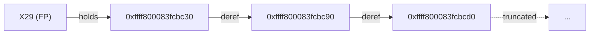
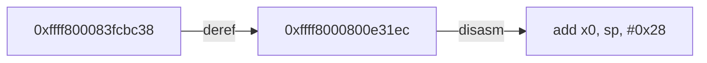

# 리눅스 커널 디버깅을 위한 gdb 사용법

gdb로 커널을 디버깅한다는 것은, `호스트`의 gdb가 QEMU에 내장된 gdbstub에 원격으로 접속해, GDB 원격 시리얼 프로토콜(RSP)로 `vmlinux`의 심볼을 써서 VM으로 띄운 커널의 메모리와 실행을 들여다보고 제어하는 것이다.

이 글의 모든 명령 출력은 stable 6.12.92 버전의 x86_64, arm64, riscv64 세 아키텍처의 커널과 최신의 x86_64 mainline(7.1-rc) 커널을 QEMU에 올린 환경에서 실제로 실행한 결과이다. 각 커널은 `CONFIG_DEBUG_INFO_DWARF5`, `CONFIG_GDB_SCRIPTS`, `CONFIG_KALLSYMS_ALL`로 빌드되어 있고, 디버깅에 쓰는 호스트 OS 환경은 7.0.1 버전의 Arch Linux이고, gdb 17.2에 pwndbg 플러그인을 얹은 것이다. 부팅 런처는 기본적으로 CPU를 정지(`-S`)시킨 채 gdb 접속을 기다린다.

```bash
# 게스트: QEMU를 -S로 정지시킨 채 gdbstub에서 gdb 접속을 기다린다 (포트는 예시로 1234)
qemu-system-aarch64 -M virt -cpu cortex-a72 -accel tcg,thread=multi -m 2G -smp 1 \
  -kernel arch/arm64/boot/Image \
  -drive file=rootfs.ext4,format=raw,if=virtio -snapshot \
  -append "root=/dev/vda rw console=ttyAMA0 nokaslr" \
  -nographic -gdb tcp::포트번호 -S

# 호스트: vmlinux 심볼을 들고 gdbstub에 접속한다
gdb ./vmlinux -ex 'target remote :포트번호'
```

`-S`로 정지된 CPU는 호스트 gdb에서 `continue` 명령을 보내야 비로소 실행된다. 그리고 gdb가 접속을 끊으면(`detach`) QEMU는 다시 실행을 재개한다.

## 1. 배포판별 gdb 설치와 크로스 디버깅 환경

커널 디버깅은 호스트의 gdb 하나로 시작한다. 그런데 디버깅 대상이 호스트와 다른 아키텍처(arm64, riscv64)일 수 있으므로, 현재 gdb가 타 아키텍처 바이너리를 대상으로 디버깅을 할 수 있어야 한다.

배포판별 설치는 다음과 같다.

```bash
# Arch Linux
sudo pacman -S gdb                                          # 멀티 아키텍처 (x86_64, arm64, riscv64 모두 이해)
sudo pacman -S aarch64-linux-gnu-gdb riscv64-linux-gnu-gdb  # 전용 크로스 gdb (선택)

# Debian / Ubuntu
sudo apt install gdb              # 호스트 아키텍처 전용
sudo apt install gdb-multiarch    # 여러 아키텍처를 한 gdb로

# Fedora / RHEL
sudo dnf install gdb
```

여기서 배포판마다 갈리는 핵심이 하나 있다. **Arch의 gdb 패키지는 이미 멀티 아키텍처로 빌드되어 있어서 별도의 `gdb-multiarch`가 존재하지 않는다.** 확인은 인자 없이 `set architecture`를 실행해 gdb가 이해하는 아키텍처 목록을 보면 된다.

```text
$ gdb -nx -batch -ex 'set architecture'
Requires an argument. Valid arguments are ARC600, ..., i386, i386:x86-64, # [!hl]
..., aarch64, aarch64:llp64, ..., riscv, riscv:rv64, riscv:rv32, ..., auto.
```

`i386:x86-64`, `aarch64`, `riscv:rv64`가 한 gdb 안에 모두 들어 있다. 그래서 Arch에서는 `gdb-multiarch`를 찾을 필요가 없다(애초에 pacman 저장소에 패키지가 없다). 반면 Debian/Ubuntu의 기본 `gdb`는 호스트 아키텍처 하나만 대상으로 빌드되므로, 다른 아키텍처 커널을 열려면 `gdb-multiarch`를 따로 설치하거나 아키텍처별 크로스 gdb를 쓴다.

크로스 gdb는 대상 아키텍처 이름이 접두사로 붙은 별도 바이너리다.

```text
$ command -v gdb gdb-multiarch aarch64-linux-gnu-gdb riscv64-linux-gnu-gdb
/usr/bin/gdb
                          # gdb-multiarch: 없음 (Arch에는 패키지 자체가 없다)
/usr/bin/aarch64-linux-gnu-gdb
/usr/bin/riscv64-linux-gnu-gdb
```

### 컴파일러, 툴체인 버전 호환성

디버깅 대상인 `vmlinux`는 빌드 산출물이다. gdb가 심볼과 소스 라인, 구조체 레이아웃을 알려면 커널이 디버그 정보를 담아 빌드되어 있어야 한다. 적어도 다음 커널 configuration이 켜져 있어야 한다.

- `CONFIG_DEBUG_INFO_DWARF5=y` (또는 DWARF4): 타입, 지역변수, 소스 라인 정보. `CONFIG_DEBUG_INFO_REDUCED`가 켜져 있으면 구조체 멤버 정보가 깎여 `ptype`이 부실해진다.
- `CONFIG_GDB_SCRIPTS=y`: 커널 제공 `lx-*` 헬퍼(`lx-*`)를 쓰기 위한 옵션.
- `CONFIG_KALLSYMS_ALL=y`: 더 많은 심볼을 커널 이미지에 포함.

크로스 컴파일이라면 커널 빌드용 툴체인(`aarch64-linux-gnu-gcc` 등)과 gdb의 대상 아키텍처가 일치해야 한다. 한 가지 자주 겪는 혼동은, 게스트에 올리는 부팅 이미지(`arch/*/boot/bzImage`, `Image`)와 gdb에 지정하는 심볼 파일(`vmlinux`)이 서로 다른 파일이라는 것이다. QEMU에는 부팅 이미지를, gdb에는 **같은 빌드의** `vmlinux`를 지정해야 심볼이 들어맞는다. 부팅 이미지는 `vmlinux`를 `objcopy`로 가공해 아키텍처별 부트 헤더를 붙인 `Image`(arm64, riscv64)나 `bzImage`(x86)다. `vmlinux` 자체를 부팅 이미지로 쓰는 일은 거의 없지만, `CONFIG_PVH` 같은 별도 옵션이 갖춰지면 `-kernel`에 직접 줘서 부팅하는 것도 가능은 하다.

```bash
# 게스트(QEMU)에는 부팅 이미지를, 호스트(gdb)에는 같은 빌드의 vmlinux를 준다
qemu-system-aarch64 ... -kernel arch/arm64/boot/Image ...   # 부팅 이미지(심볼 없음)
gdb ./vmlinux                                                # 심볼, 타입, 소스 라인이 든 파일
```

### pwndbg 설치와 등록, lx-* 로드

pwndbg와 커널의 `lx-*` 스크립트는 둘 다 **호스트**에서 동작한다. 게스트(QEMU 안의 커널)는 gdbstub만 열어 둘 뿐이고, 게스트 안에 gdb를 설치할 일은 없다. 디버깅하는 gdb는 전부 호스트 쪽이다.

**pwndbg**는 gdb에 source로 등록하는 파이썬 확장이다. 클론하면 `setup.sh`가 전용 venv를 만들고 `~/.gdbinit`에 로드 라인을 추가한다.

```bash
git clone https://github.com/pwndbg/pwndbg
cd pwndbg && ./setup.sh        # .venv 생성 + ~/.gdbinit에 source 라인 추가
```

등록하려면 `~/.gdbinit`에 한 줄을 추가하면 된다(전역 적용).

```text
# ~/.gdbinit
source ~/pwndbg/gdbinit.py
```

**lx-***는 따로 설치할 게 없다. `CONFIG_GDB_SCRIPTS=y`로 빌드하면 커널 빌드 디렉토리에 `vmlinux-gdb.py` 심볼릭 링크가 생기고, **호스트 gdb가 그 `vmlinux`를 로드할 때** 자동으로 딸려 온다. 단 빌드 디렉토리가 gdb의 auto-load 안전 경로 안에 있어야 한다. pwndbg를 로드하면 pwndbg가 `set auto-load safe-path /`로 이 제한을 풀어 줘서 `gdb vmlinux`만으로 lx-*가 딸려 오고, 안전 경로를 건드리지 않은 순정 gdb에서는, 안전 경로를 직접 허용하거나(방법 1) 그냥 연 뒤 gdb 콘솔에서 `vmlinux-gdb.py`를 직접 `source`하면 된다(방법 2).

```text
# 방법 1: 안전 경로를 미리 허용하면 vmlinux 로드 시 lx-*가 자동으로 딸려 온다 (pwndbg면 불필요)
$ gdb -iex 'add-auto-load-safe-path /path/to/linux/kernel' ./vmlinux

# 방법 2: 안전 경로와 무관하게, 연 다음 gdb 콘솔에서 직접 읽는다
$ gdb ./vmlinux
(gdb) source /path/to/linux/kernel/vmlinux-gdb.py
```

요컨대 gdb, pwndbg, lx-*는 모두 호스트에서 로드되고, 게스트 VM에는 아무것도 설치하지 않는다. 게스트가 관여하는 경우는 중단점을 건 뒤 게스트에서 직접 명령을 실행해 커널 경로를 트리거할 때뿐이다.

## 2. gdb 핵심 사용법

이 장에서 다루는 것은 모두 **gdb 빌트인** 기능이다. pwndbg나 커널 스크립트 없이 순정 gdb만으로 동작한다.
### gdbstub에 붙어 커널 상태 들여다보기

가장 기본이 되는 흐름은 "gdbstub에 붙어서, 원하는 지점에 멈추고, 그 순간의 커널 상태를 읽는 것"이다. 커널 부팅의 진입점인 `start_kernel`에 멈춰 보자.

```text
(gdb) target remote :포트번호
(gdb) hbreak start_kernel
Hardware assisted breakpoint 1 at 0xffff8000829c0bd8: file init/main.c, line 915.
(gdb) continue

Breakpoint 1, start_kernel () at init/main.c:915 # [!hl]
915	{
(gdb) bt
#0  start_kernel () at init/main.c:915
#1  0xffff8000829cad48 in __primary_switched () at arch/arm64/kernel/head.S:243
Backtrace stopped: previous frame identical to this frame (corrupt stack?)
```

여기서 `target remote`로 gdbstub에 접속하고, `hbreak`로 하드웨어 중단점을 건 뒤, `continue`(`c`)로 실행을 재개해 `backtrace`(`bt`)로 콜 스택을 본다.

멈춘 그 순간의 커널 상태를 곧바로 읽을 수 있다.

```text
(gdb) lx-version
Linux version 6.12.92 (root@...) (aarch64-linux-gnu-gcc 13.3.0, GNU ld 2.42) #1 SMP PREEMPT ...
(gdb) p init_task.comm
$1 = "swapper/0\000\000\000\000\000\000"
```

`p init_task.comm`이 부팅 0번 태스크 `swapper`의 이름을 그대로 돌려준다. gdb가 `vmlinux`의 심볼(`init_task`)과 타입(`struct task_struct`)을 알고 있으므로, 살아 있는 커널 메모리를 C 표현식으로 읽는 것이다.

### 부팅이 끝난 커널에 붙기

앞은 `-S`로 부팅 직전에 멈춰 둔 경우였다. 이미 부팅이 끝나 셸까지 올라온 커널에 붙으려면, QEMU를 `-S` 없이 띄워(앞 qemu 명령에서 `-S`를 빼면 된다) 정상 부팅시킨 뒤 gdb로 접속한다. gdbstub에 접속하는 순간 실행 중이던 vCPU가 그 자리에서 멈추는데, 시스템이 한가하면 그 자리는 거의 항상 idle 루프(`swapper`)다.

그래서 부팅 후 커널에서 "실제로 일어나는 일"을 잡으려면, idle에 멈춘 상태에서 원하는 함수에 중단점을 걸고 `continue`(`c`)한 뒤 게스트에서 그 경로를 실제로 트리거해야 한다. 부팅 후 디버깅에서 마주치는 이슈는 다음과 같다.

- **초기에는 idle 상태에 디버거가 멈춤**: 초기에 디버거가 멈추면 보통 `current`가 `swapper`이다. 따라서, 유의미한 지점에 중단점과 게스트 트리거를 설정해야 정보를 얻을 수 있다.
- **`continue` 중에는 콘솔이 멈춤**: 디버깅 대상이 실행 중이면 gdb는 다음 정지(중단점, 워치포인트 적중)까지 입력을 받지 않는다. 중단점이 안 잡히는데 다시 명령을 내려야 하면 `Ctrl-C`로 실행 중인 커널을 인터럽트한다. 그러면 처음 붙을 때처럼 그 순간의 위치(보통 idle)에서 멈추고 프롬프트가 돌아온다. gdb를 스크립트나 백그라운드로 돌려 그 콘솔에 직접 `Ctrl-C`를 칠 수 없는 경우에는, 다른 터미널에서 `kill -INT <gdb의 PID>`(또는 `pkill -INT gdb`)로 그 gdb 프로세스에 `SIGINT`를 보내면 된다.
- **자주 사용되는 함수에 중단점을 걸면 폭주**: `__schedule`처럼 자주 불리는 함수에 중단점을 걸면 끊임없이 적중한다. 조건부 중단점(`if`)이나 멈추지 않는 디버깅 방식(파이썬 `stop()`)을 활용해야 한다.
- **detach하면 즉시 재개**: gdb를 끊으면 커널은 멈췄던 자리에서 곧바로 다시 실행한다.
- **단일 스텝 중 인터럽트 유입**: 한 줄씩 밟는 동안 타이머 같은 인터럽트가 끼어들면 스텝이 인터럽트 핸들러로 빨려 들어갈 수 있다. 한편 오래 멈췄을 때 타이머, RCU, NMI watchdog가 stall이나 lockup을 내는 것은 시간 도약 문제라 KVM에서 나타난다.
- **멀티코어 디버깅**: 코어가 여럿이면 `current`와 per-cpu 상태가 선택한 코어마다 다르고, 코어들이 병렬로 도는 동안 실행 흐름이 매 실행 달라진다(arm64 TCG의 MTTCG에서도 마찬가지다). 같은 흐름을 반복 재현하려면 `-smp 1`로 코어 간 비결정성을 줄이고, 더 엄격하게는 `-icount`까지 쓴다.
- **모듈 심볼 Lazy 로딩**: 부팅 후 `insmod`한 모듈의 심볼은 `lx-symbols`를 다시 실행해야 잡힌다.

`Ctrl-C` 정지는 attach와 똑같은 비파괴적 정지다. gdbstub은 가상 머신을 멈춰 레지스터, 메모리 같은 상태를 들여다보고 다시 시작하는 것이라, 멈췄던 상태가 그대로 보존된 채 `continue`하면 실행 흐름이 정확히 이어진다.

조심할 것은 멈춤 자체가 아니라 재개다. KVM이면 멈춰 있던 만큼 게스트 시계가 도약해 RCU stall, 워치독, 타임아웃 경고가 뜰 수 있다. TCG에서는 시간이 함께 멈춰 이마저 없다. 그리고 VM 밖의 실시간 상대(원격 소켓 피어 등)는 멈출 수 없어, 오래 붙잡고 있으면 그 지점에서 타임아웃 이슈가 생길 수 있다.

### break, b, tbreak, hbreak, bp의 차이

중단점을 거는 명령은 여러 개이고, 비슷해 보여도 메커니즘이 다르다. `help`로 정체를 정확히 확인하면 다음과 같다.

```text
(gdb) help b
break, brea, bre, br, b # [!hl]
Set breakpoint at specified location.
```

`b`는 그냥 `break`의 별칭이다(`br`, `bre`, `brea`도 마찬가지). 즉 `b`와 `break`는 완전히 같은 명령이며, **소프트웨어 중단점**을 건다. 위치를 생략하고 `b`만 치면 지금 선택된 스택 프레임의 현재 실행 지점에 중단점이 걸린다. 위치는 함수 이름 말고도 여러 형태로 줄 수 있다. 파일과 줄(`b kernel/sched/core.c:4143`), 그리고 주소 앞에 `*`를 붙인 정확한 주소(`break *0xffff8000800fc9a0`, `b *try_to_wake_up+8`, `b *$pc`)도 받는다. **참고로 pwndbg의 `bp`는 `*` 없이 주소를 받는다(`bp <주소>`)**.

gdb는 `Note: breakpoint N also set at pc ...`로 같은 자리에 이미 중단점이 있음을 알려 준다. gdb는 한 주소에 중단점 여러 개를 허용하므로(조건을 달리해 여럿 거는 것이 정당한 쓰임이다) 에러는 아니지만, 무심코 생긴 중복이라면 정리하면 된다.

```text
pwndbg> b
Note: breakpoint 1 also set at pc 0xffff8000829c0bd8.
Breakpoint 4 at 0xffff8000829c0bd8: file init/main.c, line 915.
pwndbg> info b
Num     Type           Disp Enb Address            What
1       breakpoint     keep y   0xffff8000829c0bd8 in start_kernel at init/main.c:915
        breakpoint already hit 1 time
4       breakpoint     keep y   0xffff8000829c0bd8 init/main.c:915
pwndbg> d 4            # 중복된 4번만 지우고
pwndbg> c              # 이어서 진행
Continuing.
```

`info b`로 같은 `Address`에 둘이 걸린 것을 확인하고, 군더더기 번호를 `delete`로 지운 뒤 이어 가면 된다.

```text
(gdb) help tbreak
Set a temporary breakpoint.
Like "break" except the breakpoint is only temporary,
so it will be deleted when hit.

(gdb) help hbreak
Set a hardware assisted breakpoint.
Like "break" except the breakpoint requires hardware support, # [!hl]
some target hardware may not have this support.
```

- `tbreak`: 한 번 걸리면 이후에 자동으로 사라지는 일회용 소프트웨어 중단점.
- `hbreak`: **하드웨어 중단점**. 메모리를 덮어쓰지 않고 CPU의 디버그 레지스터(QEMU gdbstub이 에뮬레이션)로 멈춘다.

그렇다면 `bp`는 무엇인가? 순정 gdb에는 그런 명령이 없다.

```text
(gdb) help bp
Undefined command: "bp".  Try "help". # [!hl]
```

`bp`는 **pwndbg가 추가하는 명령**이다. pwndbg를 로드한 gdb에서는 다음과 같이 나온다.

```text
pwndbg> help bp
Set a breakpoint at the specified address.
usage: bp [-h] where
```

즉 `bp`가 "달라 보였던" 이유는 그것이 gdb 명령이 아니라 pwndbg가 얹은 명령이기 때문이다. 정리하면, `b`(=`break`)와 `tbreak`는 소프트웨어 중단점, `hbreak`는 하드웨어 중단점, `bp`는 pwndbg 전용이다.

### 초기 부팅에 hbreak를 권장하는 이유

아키텍처마다 커널 부팅 극초기에 서로 다른 현상을 보인다.

x86_64에서는 QEMU가 `-S`로 vCPU를 레거시 리셋 벡터(real mode)에 세워 둔 채 멈춘다. 이 시점에는 커널의 상위 가상 주소가 전혀 매핑되어 있지 않아, `start_kernel`에 소프트웨어 중단점(`break`)을 걸고 `continue`하면 gdb가 그 주소에 브레이크를 거는데 실패한다.

```text
# x86_64: 리셋 벡터(real mode), 소프트웨어 중단점 삽입 실패
(gdb) break start_kernel
Breakpoint 1 at 0xffffffff83b4da60: file init/main.c, line 915.
(gdb) continue
Warning:
Cannot insert breakpoint 1.
Cannot access memory at address 0xffffffff83b4da60 # [!hl]

Command aborted.
```

소프트웨어 중단점은 메모리를 써야 하는데 그 주소를 쓸 수 없으니 삽입에 실패하고 `continue`까지 중단된다. 그런데 똑같은 `break start_kernel`을 arm64나 riscv64에서 하면 결과가 다르다. 이 아키텍처들에서는 QEMU가 vCPU를 커널 이미지의 엔트리에 세워 두기 때문에, 소프트웨어 중단점이 그대로 삽입되고 `start_kernel`에 곧바로 멈춘다.

```text
# arm64: 커널 엔트리에서 시작, 소프트웨어 중단점이 그대로 들어가고 정지
(gdb) break start_kernel
Breakpoint 1 at 0xffff8000829c0bd8: file init/main.c, line 915.
(gdb) continue

Breakpoint 1, start_kernel () at init/main.c:915 # [!hl]

# riscv64: 동일하게 start_kernel에 정지
(gdb) break start_kernel
Breakpoint 1 at 0xffffffff80c00882 (2 locations)
(gdb) continue

Breakpoint 1.1, 0xffffffff80c00882 in start_kernel () # [!hl]
```

정리하면, 리셋 직후 소프트웨어 중단점이 실패하는 것은 x86_64 특유의 현상이다. 반면 하드웨어 중단점(`hbreak`)은 메모리를 건드리지 않으므로 어느 아키텍처에서나 이 시점에 안전하게 동작한다. 앞서 보인 표준 세션이 `hbreak`를 쓴 이유다. 부팅 극초기를 아키텍처 가리지 않고 확실히 잡으려면 `hbreak`가 무난하고, 페이징이 선 뒤의 일반 함수에는 소프트웨어 `break`(`b`)가 잘 듣는다.

### watch는 왜 하드웨어 백업이 필요한가

특정 변수가 *바뀌는* 순간을 잡는 것이 watchpoint다. 커널 전역 변수 `jiffies_64`(타이머 틱마다 증가)를 지켜보자.

```text
(gdb) watch jiffies_64
Hardware watchpoint 2: jiffies_64 # [!hl]
(gdb) continue

Hardware watchpoint 2: jiffies_64

Old value = 4294892732
New value = 4294892733
tick_do_update_jiffies64 (now=<optimized out>) at kernel/time/tick-sched.c:130
```

`Hardware watchpoint`라는 표기가 핵심이다. gdb가 CPU의 디버그 레지스터로 변경을 감시하므로 거의 공짜다. 만약 하드웨어 슬롯이 부족해 gdb가 **소프트웨어** watchpoint로 떨어지면(`Watchpoint`로 표기), gdb는 매 명령마다 멈춰 값을 비교한다. 유저 프로그램이라면 느릴 뿐이지만, 커널 전체를 매 명령마다 멈춰 가며 돌리면 진행이 사실상 기어갈 정도로 느려진다. 그래서 커널에서 watch를 실용적으로 쓰려면 하드웨어 백업이 거의 필수다. 참고로 x86의 하드웨어 디버그 레지스터는 4개(DR0–DR3)뿐이라, `hbreak`와 watchpoint류가 이 4개를 나눠 쓴다.

watchpoint는 한 종류가 아니라 *무엇을 잡을 것인가*에 따라 세 가지 종류가 존재한다. 쓰기(값이 바뀔 때)만 잡으려면 `watch`, 읽기만 잡으려면 `rwatch`, 읽기와 쓰기 모두 잡으려면 `awatch`다. 셋 다 하드웨어로 백업되고, `info watchpoints`가 종류를 구분해 보여 준다.

```text
(gdb) watch jiffies_64
Hardware watchpoint 4: jiffies_64
(gdb) rwatch jiffies_64
Hardware read watchpoint 5: jiffies_64
(gdb) awatch jiffies_64
Hardware access (read/write) watchpoint 6: jiffies_64
(gdb) info watchpoints
Num     Type            Disp Enb Address            What
4       hw watchpoint   keep y                      jiffies_64
5       read watchpoint keep y                      jiffies_64
6       acc watchpoint  keep y                      jiffies_64
```

셋 다 디버그 레지스터(x86은 4개)를 나눠 쓰므로 남발하면 디버그 활용에 필요한 여분의 레지스터가 부족해진다.

### 조건부 중단점

매번 멈추지 않고 특정 조건에서만 멈추려면 `if`를 붙인다. 태스크를 깨우는 `try_to_wake_up`에서, 깨우는 대상의 `pid`가 2(`kthreadd`)인 경우에만 멈추도록 해 보자.

```text
(gdb) break try_to_wake_up if p->pid == 2
(gdb) info breakpoints
Num     Type           Disp Enb Address            What
3       breakpoint     keep y   0xffff8000800fc9a0 in try_to_wake_up at kernel/sched/core.c:4143
	stop only if p->pid == 2 # [!hl]
(gdb) continue

Breakpoint 3, try_to_wake_up (p=0xffff000004669300, state=state@entry=3, wake_flags=wake_flags@entry=0) at kernel/sched/core.c:4143
```

조건식은 그 자리에서 유효한 C-like 표현식이면 된다. 다만 문자열 비교는 주의해야 한다. `p->comm == "kthreadd"`처럼 쓰면 포인터끼리 비교될 뿐이므로, 문자열은 gdb 편의 함수 `$_streq`로 비교하거나, 더 강력하게는 파이썬 API로 처리한다.

### 중단점, 워치포인트 관리: 목록, 비활성화, 해제

건 중단점과 워치포인트는 번호로 관리한다. `info breakpoints`(`i b`)로 한 번에 보고, 번호로 끄거나(`disable`) 다시 켜거나(`enable`) 지운다(`delete`). 먼저 중단점 둘과 워치포인트 하나를 걸어 보자.

```text
(gdb) break try_to_wake_up
Breakpoint 1 at 0xffff8000800fc9a0: file kernel/sched/core.c, line 4143.
(gdb) break do_unlinkat
Breakpoint 2 at 0xffff80008042e950: file fs/namei.c, line 4506.
(gdb) watch jiffies_64
Hardware watchpoint 3: jiffies_64
(gdb) info breakpoints
Num     Type           Disp Enb Address            What
1       breakpoint     keep y   0xffff8000800fc9a0 in try_to_wake_up at kernel/sched/core.c:4143
2       breakpoint     keep y   0xffff80008042e950 in do_unlinkat at fs/namei.c:4506
3       hw watchpoint  keep y                      jiffies_64
```

`Enb` 칸이 활성 여부다. `disable 2`로 2번을 잠시 끄면 `Enb`가 `n`으로 바뀌고, `enable 2`로 되살린다. 정의는 남긴 채 잠깐 무력화할 뿐이다.

```text
(gdb) disable 2
(gdb) info breakpoints
Num     Type           Disp Enb Address            What
1       breakpoint     keep y   0xffff8000800fc9a0 in try_to_wake_up at kernel/sched/core.c:4143
2       breakpoint     keep n   0xffff80008042e950 in do_unlinkat at fs/namei.c:4506
3       hw watchpoint  keep y                      jiffies_64
```

아예 지우는 것은 `delete`(`d`)다. 번호 하나면 그것만, `delete 2 3 4`처럼 여러 번호나 `delete 2-5` 같은 범위를 한 번에 줄 수도 있고, 인자 없이 `delete`만 주면 전부 지운다. 위치로 지우는 `clear`도 있어, 함수 이름이나 줄을 주면 그 자리에 걸린 중단점을 찾아 없앤다. 워치포인트도 같은 번호 체계라 `delete 3`으로 지운다.

```text
(gdb) delete 3              # 3번(워치포인트) 제거
(gdb) clear do_unlinkat     # do_unlinkat에 걸린 2번을 위치로 제거
(gdb) info breakpoints
Num     Type           Disp Enb Address            What
1       breakpoint     keep y   0xffff8000800fc9a0 in try_to_wake_up at kernel/sched/core.c:4143
```

남은 1번에 조건을 나중에 붙이거나 떼는 것도 번호로 한다. `condition <번호> <식>`은 조건을 (재)지정하고, 식 없이 `condition <번호>`만 주면 조건을 없앤다. `ignore <번호> <횟수>`는 그 횟수만큼 적중을 무시한다.

```text
(gdb) condition 1 p->pid == 2
(gdb) ignore 1 0
Will ignore next 0 crossings of breakpoint 1.
(gdb) info breakpoints
Num     Type           Disp Enb Address            What
1       breakpoint     keep y   0xffff8000800fc9a0 in try_to_wake_up at kernel/sched/core.c:4143
	stop only if p->pid == 2
```

정리하면 등록은 `break`, `watch`, 조회는 `info breakpoints`, 임시 무력화는 `disable`/`enable`, 영구 삭제는 `delete`(번호), `clear`(위치)다. 한 번만 멈추고 자동으로 사라지게 하려면 앞의 `tbreak`를 쓴다.

### 멈춘 지점의 상태 읽기

멈춘 지점에서 쓰는 기본 도구들을 `try_to_wake_up`에 멈춘 상태로 묶어 보면 다음과 같다.

```text
(gdb) bt
#0  try_to_wake_up (p=0xffff000004669300, state=state@entry=3, wake_flags=wake_flags@entry=0) at kernel/sched/core.c:4143
#1  0xffff8000800fd120 in wake_up_process (p=<optimized out>) at kernel/sched/core.c:4429 # [!hl]
#2  0xffff8000800e31ec in __kthread_create_on_node (threadfn=..., data=..., node=-1, namefmt=... "pool_workqueue_release", ...) at kernel/kthread.c:455
#3  __kthread_create_worker (...) at kernel/kthread.c:884
...
#6  workqueue_init () at kernel/workqueue.c:7945

(gdb) info registers pc sp x0 x1
pc  0xffff8000800fc9a0  <try_to_wake_up>
sp  0xffff800083fcbc30
x0  0xffff000004669300   -281474902879488
x1  0x3                  3

(gdb) p/x $TTBR1_EL1
$1 = 0x42bba000

(gdb) ptype struct task_struct
type = struct task_struct {
    struct thread_info thread_info;
    unsigned int __state;
    void *stack;
    unsigned int flags;
    ...
}
```

- `backtrace`(`bt`)는 콜 스택을 보여 준다. 상위 프레임의 인자 다수가 `<optimized out>`인데, 이는 커널이 항상 `-O2`로 컴파일되어 해당 인자가 레지스터에 살아남지 않았다는 뜻이다.
- `info registers`(`i r`)로 일부 레지스터만 골라 본다. `$TTBR1_EL1`(커널 페이지 테이블 베이스) 같은 시스템 레지스터도 순정 gdb에서 읽힌다. QEMU gdbstub이 시스템 레지스터를 노출하기 때문이다.
- `ptype`은 `vmlinux`의 DWARF 정보로 구조체 레이아웃을 그대로 보여 준다.

명령어/소스 라인 단위 진행과 함수 탈출은 `stepi`(`si`), `next`(`n`), `step`(`s`), `finish`다. 특히 `finish`는 현재 함수가 반환할 때까지 실행하고 **반환값**을 보여 준다.

```text
(gdb) finish
Run till exit from #0  try_to_wake_up (...) at kernel/sched/core.c:4143
0xffff8000800fd120 in wake_up_process (p=<optimized out>) at kernel/sched/core.c:4430
Value returned is $1 = 0 # [!hl]
```

반환값 `0`은 대상 태스크가 이미 깨어 있어 깨우지 않았다는 뜻이다(`try_to_wake_up`은 실제로 깨웠으면 1을 돌려준다).

### print로 값 들여다보기

커널 메모리를 C 표현식으로 읽는 핵심 명령이 `print`(`p`)다. 포맷 글자 하나로 같은 값을 다른 진법, 형태로 보거나, 표현식, 캐스트, 특수 함수를 섞어 쓴다. `p/<글자> 식` 형태로 출력 형식을 지정한다.

```text
(gdb) p init_task.comm
$1 = "swapper/0\000\000\000\000\000\000"
(gdb) p/x init_task.flags        # /x: 16진수
$2 = 0x4200002
(gdb) p/d $x0                    # /d: 부호 있는 10진수
$3 = -281474902879488
(gdb) p/t (unsigned char) 0xb4   # /t: 2진수
$4 = 10110100
(gdb) p/c 65                     # /c: 문자
$5 = 65 'A'
(gdb) p/a $pc                    # /a: 주소를 심볼로
$6 = 0xffff8000800fc9a0 <try_to_wake_up>
```

자주 쓰는 포맷 글자는 `/x`(16진), `/d`(10진), `/u`(부호 없는 10진), `/o`(8진), `/t`(2진), `/c`(문자), `/a`(주소+심볼), `/f`(실수), `/s`(문자열), `/i`(명령어)다.

표현식은 구조체 멤버 접근(`.`/`->`), 주소(`&`), 역참조(`*`), 캐스트(`(타입)식`), `sizeof`, 그리고 gdb의 특수 함수, 변수를 모두 C처럼 쓸 수 있다.

```text
(gdb) p sizeof(struct task_struct)        # 타입 크기
$7 = 4864
(gdb) p &init_task                        # 주소 (타입까지)
$8 = (struct task_struct *) 0xffff800083865900 <init_task>
(gdb) p $lx_current()->comm               # 특수 함수 + 멤버 접근
$9 = "init", '\000' <repeats 11 times>
(gdb) p *(unsigned long *)&init_task @ 4  # 인공 배열: 식@개수
$10 = {8, 4294967298, 0, 0}
(gdb) p $pc                               # 레지스터 특수 변수
$11 = (void (*)()) 0xffff8000800fc9a0 <try_to_wake_up>
```

`식@개수`는 gdb 고유의 "인공 배열" 표기로, 포인터가 가리키는 곳부터 원하는 개수만큼을 배열처럼 펼쳐 본다. `$pc`, `$x0` 같은 레지스터와 `$lx_current()` 같은 커널 헬퍼도 표현식 안에서 그대로 평가된다.

`whatis`는 한 단계만 풀어 타입 이름을 돌려주고, `ptype`은 구조체를 끝까지 펼친다. 특히 `ptype /o`는 각 멤버의 **오프셋과 크기**까지 찍어 줘서, 구조체 레이아웃을 따질 때 요긴하다.

```text
(gdb) whatis init_task.files
type = struct files_struct *
(gdb) ptype /o struct list_head
/* offset      |    size */  type = struct list_head {
/*      0      |       8 */    struct list_head *next;
/*      8      |       8 */    struct list_head *prev;

                               /* total size (bytes):   16 */
                             }
```

### disassemble로 어셈블리 번역

함수의 기계어를 보려면 `disassemble`(축약 `disas`)다. 인자 없으면 현재 함수를, 이름이나 주소를 주면 그 함수를, `시작,끝`이나 `시작,+길이`로 구간을 덤프한다.

```text
(gdb) disassemble try_to_wake_up
Dump of assembler code for function try_to_wake_up:
=> 0xffff8000800fc9a0 <+0>:     mov     x9, x30
   0xffff8000800fc9a8 <+8>:     paciasp
   0xffff8000800fc9ac <+12>:    sub     sp, sp, #0x70
   0xffff8000800fc9b0 <+16>:    mrs     x3, sp_el0
   ...
```

pwndbg는 같은 일을 `nearpc`(별칭 `u`, `pdisass`)로도 할 수 있다. 현재 명령에 `►`가 붙고, 분기와 메모리 접근에는 에뮬레이션 주석이 달린다.

```text
pwndbg> nearpc 5      # u 5, pdisass 5도 같은 출력
b► 0xffff8000800fc9a0 <try_to_wake_up>    mov x9, x30    X9 => 0xffff8000800fd120 (wake_up_process+32)
   0xffff8000800fc9a8 <try_to_wake_up+8>  paciasp
   0xffff8000800fc9ac <try_to_wake_up+12> sub sp, sp, #0x70
   ...
```

### x로 메모리 검사하기

메모리를 직접 들여다보는 것은 `x` 이다. 이름은 "examine memory"의 머리글자에서 왔지만, gdb에 `examine`이라고 풀어 입력하면 `Undefined command`로 거부된다. 즉 입력할 수 있는 명령 이름은 `x` 하나뿐이고, `examine`은 그 원뜻을 가리키는 이름일 뿐 둘은 축약(별칭) 관계가 아니다(`ex`나 `e`도 `examine`의 약자가 아니라 다른 명령들과 겹쳐 모호하다고 거부된다). `x/<개수><포맷><크기> 주소` 형태로 같은 메모리를 명령어, 바이트, 워드 등 원하는 모양으로 본다. 포맷 글자는 `print`와 같고(`i` 명령어, `x` 16진, `d` 10진, `c` 문자, `s` 문자열), 크기는 `b`(1), `h`(2), `w`(4), `g`(8)다.

```text
(gdb) x/5i $pc            # i: 명령어 5개
=> 0xffff8000800fc9a0 <try_to_wake_up>: mov     x9, x30
   ...
(gdb) x/8xb &init_task    # x 16진, b 바이트
0xffff800083865900 <init_task>: 0x08  0x00  0x00  0x00  0x00  0x00  0x00  0x00
(gdb) x/4xg $sp           # x 16진, g 8바이트
0xffff800083fcbc30:     0xffff800083fcbc90      0xffff8000800e31ec
0xffff800083fcbc40:     0xffff800083fcbdc0      0xffff800083fcbdc0
```

`x`는 주소에서 메모리를 읽어 보여 준다는 점에서 C의 역참조 연산자 `*`와 가장 닮았다. 실제로 `x/1xg &jiffies_64`는 `*(unsigned long *)&jiffies_64`와 같은 8바이트를 읽는다. 다만 둘이 100% 같지는 않다. `*`는 포인터의 타입(`T *`)에 따라 `T` 값을 *만들어 내는* 연산자라 다른 식에 끼워 쓸 수 있는 반면, `x`는 식의 타입을 무시하고 `<크기><포맷>`을 직접 받아 그 바이트를 *표시만* 하는 명령이다. 같은 주소라도 `x/xg`(8바이트), `x/xw`(4바이트), `x/xb`(1바이트)로 읽는 폭이 달라지고 값을 돌려주지도 않는다. 그래서 `x`와 완벽히 동일한 C 연산자는 없고, 의미가 가장 가까운 것은 `*`이다.

### step, next, finish로 흐름 제어하기

실행을 잘게 끊어 진행하는 명령은 네 개이고, 실행 단위가 무엇인지(소스 한 줄마다 vs 기계어 한 명령마다)와 함수 호출을 만나면 함수 내부로 진입하는지(vs 실행 후 다음 명령어로 점프하는지)의 두 가지로 구분된다.

| 명령 | 실행 단위 | 함수 호출을 만나면 | IDE 용어 |
|---|---|---|---|
| `step` (`s`) | C 코드 한 줄 | 함수 내부로 진입 | step into |
| `next` (`n`) | C 코드 한 줄 | 끝까지 실행하고 다음 명령어로 점프 | step over |
| `stepi` (`si`) | 기계어 한 명령 | 함수 내부로 진입 | step into (명령 단위) |
| `nexti` (`ni`) | 기계어 한 명령 | 끝까지 실행하고 다음 명령어로 점프 | step over (명령 단위) |

현재 함수를 빠져나올 때까지 실행하는 `finish`(IDE의 step out)도 있다. `finish`는 함수가 반환할 때까지 실행한 뒤 반환값을 보여 준다.

`next`는 호출이 있든 없든 같은 함수 안에서 다음 줄로만 간다. `try_to_wake_up`에서 `scoped_guard (raw_spinlock_irqsave, &p->pi_lock)` 줄에 `next`를 치면, 그 락 획득 호출을 끝까지 실행하되 그 안으로 들어가지는 않고 다음 줄로 넘어간다(step over).

```text
try_to_wake_up (...) at kernel/sched/core.c:4180   scoped_guard (raw_spinlock_irqsave, &p->pi_lock) {
(gdb) next        # -> kernel/sched/core.c:4181   smp_mb__after_spinlock();
(gdb) next        # -> kernel/sched/core.c:4182   if (!ttwu_state_match(p, state, &success))   (락 호출을 넘김: over)
```

반대로 `step`은 호출 줄에서 그 함수 안으로 내려간다. 같은 함수의 `if (!ttwu_state_match(p, state, &success))` 줄에서 `step`을 치면 `ttwu_state_match`로 진입한다(step into).

```text
try_to_wake_up (...) at kernel/sched/core.c:4182   if (!ttwu_state_match(p, state, &success))
(gdb) step
ttwu_state_match (state=3, p=0xffff000004669300, ...) at kernel/sched/core.c:4000   (호출 안으로 진입: into)
4000		*success = !!(match = __task_state_match(p, state));
```

`stepi`와 `nexti`도 유사하게 작동한다. `bl`(arm64)이나 `call`(x86) 명령에서 `stepi`는 그 함수의 첫 명령으로 진입하고, `nexti`는 호출을 끝까지 실행한 뒤 다음 명령으로 넘어간다.

```text
(gdb) x/i $pc
=> 0xffff8000800fc9e0 <try_to_wake_up+64>:      bl      0xffff8000800f2f38 <preempt_count_add>
(gdb) stepi
preempt_count_add (val=val@entry=1) at kernel/sched/core.c:5803     # bl 안으로 진입
(gdb) x/i $pc
=> 0xffff8000800f2f38 <preempt_count_add>:       nop
```

### set var로 값 강제 변경

디버깅 중에 변수 값을 강제로 바꿀 수도 있다. `set var <식> = <값>`(또는 `p <식> = <값>`)이다. 일상적으로 권장되는 동작은 아니지만, 에러 경로를 강제로 타게 하거나 특정 조건을 흉내내어 테스트할 때 쓴다. `try_to_wake_up`의 인자 `state`(`int try_to_wake_up(struct task_struct *p, unsigned int state, int wake_flags)`의 두 번째 인자)를 바꿔 보면 다음과 같다.

```text
(gdb) p state
$1 = 3                   # TASK_NORMAL
(gdb) set var state = 1
(gdb) p state
$2 = 1                   # TASK_INTERRUPTIBLE 로 바뀜
```

커널 메모리에 그대로 써지므로, 이대로 `continue`하면 커널이 바뀐 값으로 진행한다. 그만큼 위험하니 무엇을 바꾸는지 알고 써야 한다.

커널 패닉을 유발할 수도 있다. gdb는 변수든 레지스터든 커널 메모리를 그대로 쓸 수 있어서, 중요한 값 하나만 쓰레기값으로 바꿔도 패닉이 난다. 아래는 arm64 v6.12 커널을 VM으로 띄워 gdb로 실제 패닉을 유발한 것이다. 먼저 `set var`로 커널의 `panic_on_oops`를 1로 켜 oops가 곧 패닉이 되게 하고, `try_to_wake_up` 진입점에서 깨우려는 태스크 포인터 `p`(`x0`)를 NULL로 강제한다.

```text
(gdb) set var panic_on_oops = 1      # oops를 즉시 패닉으로 승격
(gdb) hbreak try_to_wake_up
(gdb) continue
Breakpoint, try_to_wake_up (p=0xffff000004c14c00, state=3, wake_flags=0) at kernel/sched/core.c:4143
(gdb) set $x0 = 0                    # 깨우려는 태스크 포인터 p를 NULL로 강제
(gdb) continue
```

재개하는 순간 `try_to_wake_up`은 `p->pi_lock`을 잠그려 하는데, `p`가 0이라 주소 `0x89c`(= `p`가 0일 때 `pi_lock`의 오프셋)를 역참조해 NULL 포인터 역참조 Oops가 난다. `panic_on_oops`를 켜 두었으므로 Oops는 그대로 패닉으로 이어진다(마침 PID 1 문맥이라 켜 두지 않았어도 패닉했을 것이다). 게스트 콘솔에 찍힌 실제 출력이다.

```text
Unable to handle kernel NULL pointer dereference at virtual address 000000000000089c
Internal error: Oops: 0000000096000004 [#1] PREEMPT SMP
CPU: 0 UID: 0 PID: 1 Comm: swapper/0 Not tainted 6.12.92 #1
pc : _raw_spin_lock_irqsave+0x64/0xa8
lr : _raw_spin_lock_irqsave+0x30/0xa8
...
Call trace:
 _raw_spin_lock_irqsave+0x64/0xa8
 try_to_wake_up+0x64/0x760
 ...
Kernel panic - not syncing: Oops: Fatal exception
---[ end Kernel panic - not syncing: Oops: Fatal exception ]---
```

`pc`가 `_raw_spin_lock_irqsave`이고 콜 트레이스가 `try_to_wake_up+0x64`인 것이 핵심이다. `p`를 NULL로 만든 탓에 `try_to_wake_up`이 `p->pi_lock`을 잠그려다 폴트가 났다는 뜻이다. `-snapshot`으로 띄웠으므로 디스크 이미지나 VM 설정에는 아무 변화가 없고, 패닉은 이 일회용 게스트 런타임에서만 일어난다. QEMU를 다시 띄우면 멀쩡하다.

이 명령들(`disassemble`, `nearpc`, `x`, `step`/`next`, `set var`)은 gdb/pwndbg의 기본 기능이라 아키텍처에 중립적이다. x86_64, arm64, riscv64에서도 그대로 동작하며, 디스어셈블 출력만 아키텍처별로 달라진다(x86은 `mov`/`push`/`call`, arm64는 `mov`/`paciasp`/`bl` 등 ...).

### info 명령어로 심볼, 함수, 변수 조회하기

방대한 커널에서 어떤 함수나 변수에 중단점, 워치포인트를 걸기 전에, 그것이 심볼로 잡히는지와 어디에 있는지를 먼저 조회할 수 있다. 핵심은 `info`(축약 `i`) 계열 명령어이다.

```text
(gdb) info line try_to_wake_up
Line 4143 of "kernel/sched/core.c" starts at address 0xffff8000800fc9a0 <try_to_wake_up> and ends at 0xffff8000800fc9dc <try_to_wake_up+60>.
(gdb) info address try_to_wake_up
Symbol "try_to_wake_up" is a function at address 0xffff8000800fc9a0.
(gdb) info address init_task
Symbol "init_task" is static storage at address 0xffff800083865900.
(gdb) info symbol $pc
try_to_wake_up in section .text
(gdb) whatis init_task
type = struct task_struct
(gdb) info args
p = 0xffff000004669300
state = 3
wake_flags = 0
```

`info address`는 그 심볼이 함수인지 전역/static 변수인지 알려 준다.

- `info functions <정규식>` / `info variables <정규식>`: 전역, static 함수와 변수를 정규식으로 조회.
- `info scope <위치>`: 그 위치의 스코프에 있는 (지역)변수와 저장 위치.
- `info args` / `info locals`: 현재 프레임의 인자와 지역변수.
- `info line` / `info address` / `info symbol`: 각각 위치가 대응하는 소스 줄과 주소, 심볼이 함수인지 변수인지와 그 주소, 그리고 주소가 어느 심볼에 속하는지를 알려 준다.
- `whatis` / `ptype`: 타입과 존재 여부.

커널은 매크로 디버그 정보(`-g3`) 없이 빌드될 수 있어, `info macro`로 정의를 찾지 못할 수 있다.

```text
(gdb) info macro __GFP_ZERO
The symbol `__GFP_ZERO' has no definition as a C/C++ preprocessor macro
at <user-defined>:-1
```

커널은 워낙 방대해서 이름이 부분적으로 겹치는 심볼이 수없이 많다. 셸에서 `ls -al | grep  vmlinux`로 이름을 찾는 방법처럼 gdb에서도 할 수 있다. 하나는 `info ... <정규식>`이고, 다른 하나는 gdb의 `pipe`(`|`) 명령으로 출력을 셸 명령에 그대로 파이프하는 것이다.

```text
(gdb) info variables jiffies          # 이름에 jiffies가 든 것 전부 (수십 개)
...
(gdb) pipe info variables jiffies | grep jiffies_64   # 셸로 파이프 (ls | grep 처럼)
61:	u64 jiffies_64;
(gdb) info address jiffies_64          # 정확한 주소 찾기
Symbol "jiffies_64" is static storage at address 0xffff8000838579c0.
```

이렇게 `jiffies_64`가 실재하는 전역 변수임을 확인하고 나면, 안심하고 `watch jiffies_64`를 걸 수 있다.

### apropos로 명령 찾기

심볼이 아니라 명령 자체를 잊었을 때는 `apropos`로 키워드에 맞는 gdb/pwndbg 명령을 찾는다. 명령과 한 줄 설명이 함께 나온다.

```text
(gdb) apropos breakpoint
bc -- Clear the breakpoint with the specified index.
bd -- Disable the breakpoint with the specified index.
bl -- List breakpoints.
bp -- Set a breakpoint at the specified address.
break, brea, bre, br, b -- Set breakpoint at specified location.
break-range -- Set a breakpoint for an address range.
...
```

### 커널 디버깅의 주의점

커널은 유저 프로그램과 다른 점이 여럿 있다. 실제로 마주치는 증상 위주로 정리한다.

- **detach가 곧 실행 재개**: `-S`로 정지시킨 커널을 한 번 붙었다가 끊으면, 다음에 붙을 때는 이미 부팅이 끝나 있다. `start_kernel` 같은 일회성 지점은 매번 새로 부팅해서 잡아야 한다.
- **심볼/버전 불일치**: 구조체 레이아웃마저 커널 버전 사이에서 바뀐다. 예컨대 `struct file`의 첫 멤버는 6.12에서 `atomic_long_t f_count`이지만 7.1에서는 `spinlock_t f_lock`으로 재배치되었다.

### gdb가 멈춘 시간을 게스트 시계에서 제외하기

부팅이 끝난 커널은 쉴 새 없이 스케줄링하고 타이머 틱을 센다. 그런데 중단점에 멈춰 gdb로 디버깅하는 동안 흘러간 "그 시간"을 게스트가 어떻게 처리하는지는 QEMU 가속 방식에 따라 갈린다.

**KVM 가속(`-enable-kvm`)**에서는 게스트 시계가 호스트 실시간을 따라간다(`kvm-clock`, TSC). gdb가 vCPU를 멈춰도 호스트 시간은 계속 흐르므로, 재개하는 순간 게스트는 멈춰 있던 시간이 한꺼번에 지나간 것으로 본다. 실제로 KVM 게스트를 45초 멈췄다 재개하면 콘솔에 다음이 찍힌다.

```text
clocksource: Long readout interval, skipping watchdog check: cs_nsec: 45775429558 wd_nsec: 504061131
```

`kvm-clock`은 45.77초(`cs_nsec`)가 흘렀다고 보는데 워치독 clocksource는 0.5초(`wd_nsec`)만 흘러, 둘의 어긋남으로 커널이 시간 도약을 감지했다. 정지가 더 길거나 잦으면 여기서 그치지 않고 RCU stall, soft lockup, hung task 경고가 줄줄이 따라붙는다. 커널을 디버깅할 때 로그가 이런 경고로 뒤덮이는 이유다.

이 시간을 게스트 계산에서 제외하는 길은 두 가지다.

첫째, **KVM 대신 TCG(전체 에뮬레이션)로 구동한다.** TCG에서는 QEMU의 가상 클럭(`QEMU_CLOCK_VIRTUAL`)이 vCPU가 멈추면 같이 멈춘다. gdb로 붙잡고 있는 동안 게스트 시간도 정지하므로 재개해도 시간 도약이 없다. x86 호스트 머신에서 arm64 아키텍처 기반의 v6.12 커널을 QEMU에서 가상화할 때에는 TCG가 기본값이다.

둘째, **`-icount`로 게스트 시간을 실행한 명령 수에 묶어 더 엄격하게 만든다.** 평범한 TCG가 정지 시간을 *근사적으로* 빼 준다면(실행 중 가상 클럭은 호스트 속도를 느슨하게 계산하고, 에뮬레이션이 밀리면 시간을 건너뛰어 따라잡기도 한다. 실제로 게스트 VM에서 top 명령어를 보면 uptime 시간이 초당 2초씩 증가하는 현상도 관측된다), `-icount shift=N`은 게스트 시간을 실행한 명령(retired instruction) 수에 못 박는다. 그래서 정지 구간은 근사가 아니라 *정확히* 0이고, 실행 중에도 호스트 부하와 무관하게 시간이 흐른다. 게다가 실행이 결정론적이 되어(같은 입력 → 같은 명령 스트림 → 같은 타이머, 인터럽트 지점 → 같은 상태) 매번 동일하게 재현되고, 경합도 같은 자리에서 잡히며 역재생(record/replay)도 할 수 있다. 평범한 TCG에는 이 정도의 재현성이 보장되지는 않는다. 단 `-icount`는 TCG 전용이라 KVM과 함께 쓸 수 없고, 단일 스레드라 느리다.

```bash
# KVM 가속(x86): 빠르지만 정지 동안 호스트 시간이 게스트로 샌다 (-cpu host는 KVM 전용)
qemu-system-x86_64  -enable-kvm -cpu host             ...  -gdb tcp::포트번호 -S

# TCG 전체 에뮬레이션: -enable-kvm을 빼고 -accel tcg (가상 클럭이 vCPU와 함께 멈춘다)
qemu-system-x86_64  -accel tcg -cpu max               ...  -gdb tcp::포트번호 -S

# TCG + icount: 게스트 시간을 실행 명령 수에 묶어 디버거 정지를 완전히 배제
qemu-system-aarch64 -accel tcg -icount shift=auto -cpu cortex-a72  ...  -gdb tcp::포트번호 -S
```

`-icount`는 단일 스레드 TCG를 전제하므로 `-accel tcg`의 `thread=multi`(MTTCG)와 함께 쓰지 못한다. `shift=auto`는 호스트 속도에 맞춰 자동 보정하고, 고정 `shift=N`을 주면 그만큼 확실하게 결정론적 동작을 보장한다.

실제로 `-accel tcg -icount shift=auto -smp 2`로 띄워 `try_to_wake_up`에 멈춘 뒤 콘솔에서 45초를 붙잡고 있다가 재개해 보면 두 가지가 드러난다. 먼저, 중단점은 `CPU#0`에서 걸렸지만 멈춘 순간 두 vCPU가 모두 정지해 있다.

```text
(gdb) info threads
  Id   Target Id                    Frame
* 1    Thread 1.1 (CPU#0 [running]) try_to_wake_up (p=0xffff000004689300, state=3, wake_flags=0) at kernel/sched/core.c:4143
  2    Thread 1.2 (CPU#1 [running]) __arch_counter_get_cntvct () at ./arch/arm64/include/asm/arch_timer.h:208
```

중단점이 걸린 `CPU#0`만이 아니라 다른 코어 `CPU#1`까지 그 순간 함께 멈췄다(all-stop). 그리고 45초를 붙잡고 있어도 게스트의 `jiffies_64`는 한 틱도 늘지 않는다.

```text
(gdb) p jiffies_64        # 멈춘 직후
$1 = 4294892484
   ── 디버거 콘솔에서 45초 경과 ──
(gdb) p jiffies_64        # 재개해 다음 wakeup에서 다시 멈춘 뒤
$2 = 4294892484           # delta 0: 정지한 45초가 게스트 시간에서 통째로 빠졌다
```

KVM이었다면 같은 자리에서 `jiffies_64`가 45초 × `HZ`만큼 도약했을 값이다. 즉 `continue` 이후 다음 적중 전까지는 vCPU들이 (icount에서는 직렬로) 진행하고, 적중하는 순간 전부 멈추며, 그 멈춰 있던 시간만 게스트 시계에서 빠진다.

여기서 멈출 수 있는 것은 VM "안"의 시간뿐이다. TCG(필요하면 `-icount`까지)는 게스트의 클럭소스, 타이머 틱, hrtimer, 스케줄러 deadline, RCU, 워치독, 그리고 게스트 시계를 기준으로 재는 소켓 재전송, 블록 I/O 타임아웃까지 함께 정지시킨다. 그래서 이들 *내부* 타임아웃은 디버거 정지로 터지지 않는다. 이는 평범한 TCG면 이미 성립하므로 RCU, 스케줄링 stall을 막는 데 `-icount`가 따로 필요하지는 않다. 그러나 VM "밖"은 어떤 옵션으로도 멈추지 못한다. 상대방 TCP 클라이언트, 서버, 실시간 하드웨어는 벽시계대로 계속 흐르므로, gdb로 오래 붙잡고 있으면 그쪽에서 연결을 끊거나 타임아웃을 낸다. 따라서 디버깅 중에는 살아 있는 네트워크 피어 같은 외부 실시간 의존을 피하고, 게스트 로컬 I/O, 루프백, 스냅샷으로 재현하는 편이 안전하다.

성능 비용은 분명하다. TCG는 소프트웨어 에뮬레이션이라 KVM보다 보통 한 자릿수에서 수십 배 느리다. `-icount`는 거기에 단일 스레드 실행까지 강제하므로, `-smp`로 vCPU를 여럿 줘도 진짜 병렬이 아니라 한 스트림 위에서 결정론적으로 번갈아 돈다.

### KASLR로 심볼이 어긋날 때

커널 주소 공간 배치 무작위화(KASLR)가 켜진 채 부팅하면, 커널은 링크 시점 주소에서 임의의 양만큼 *밀려서(slide)* 올라간다. 그러면 `vmlinux`의 정적 심볼 주소와 실제 런타임 주소가 어긋나, 백트레이스에 `?? ()`가 뜬다. 이 예는 x86_64 기준이다. arm64는 KASLR 시드를 UEFI 펌웨어 부팅에서 받으므로, `-kernel`로 직접 부팅하면 슬라이드가 생기지 않는다.

```text
(gdb) bt 1
#0  0xffffffff96d122cf in ?? () # [!hl]
(gdb) p/x &_text
$1 = 0xffffffff81000000        # vmlinux 링크 시점 베이스
```

런타임 베이스는 pwndbg의 `kbase`로 찾는다. 그 차이가 곧 슬라이드 값이다.

```text
pwndbg> kbase -v
Found virtual text base address: 0xffffffff95c00000 # [!hl]
corresponding physical address: 0x29000000

slide = 0xffffffff95c00000 - 0xffffffff81000000 = 0x14c00000
```

베이스를 찾으면 `kbase -r`가 어긋남을 한 번에 바로잡는다. 내부적으로는 방금 찾은 런타임 베이스로 `add-symbol-file vmlinux <런타임 베이스>`를 실행해, `vmlinux`의 심볼 파일을 슬라이드된 주소에 다시 로드한다. 그러면 gdb가 모든 심볼을 슬라이드 값만큼 옮겨 잡아 `?? ()`가 사라지고, 백트레이스와 심볼이 런타임 주소로 정확히 들어맞는다. 아니면 애초에 부팅 커맨드라인에 `nokaslr`를 줘서 슬라이드를 0으로 만들어도 된다. 기본적으로 `nokaslr`로 부팅하므로 정적 심볼이 그대로 들어맞고, 위 결과는 일부러 `nokaslr`를 빼고 부팅해 슬라이드를 만든 경우다.

## 3. pwndbg로 더 편리하게

지금까지는 빌트인 gdb 명령어만 사용하였다. pwndbg는 gdb에 얹는 플러그인으로, 설치하면 순정 gdb에는 없는 더 편리한 기능을 쓸 수 있다.

### pwndbg 공통 기능

pwndbg는 본래 유저스페이스 익스플로잇용 도구이지만, 그 기능 상당수는 커널을 디버깅할 때도 그대로 동작한다. gdb에는 아예 없는 명령들이다.

```text
(gdb) context
Undefined command: "context".  Try "help".
(gdb) telescope $sp
Undefined command: "telescope".  Try "help".
```

pwndbg를 로드하면 멈출 때마다 레지스터, 디스어셈블, 스택을 한 화면에 자동으로 그려 주고, `telescope`는 한 포인터를 따라가며 가리키는 대상을 재귀적으로 풀어 준다.

멈춤 직후 자동으로 뜨는 이 화면이 디버깅에 유용하다. arm64 v6.12 커널에서 `try_to_wake_up`에 멈췄을 때의 실제 모습은 다음과 같다.

<pre class="pwndbg-context">
LEGEND: <span class="ansi-yellow">STACK</span> | <span class="ansi-blue">HEAP</span> | <span class="ansi-red">CODE</span> | <span class="ansi-magenta">DATA</span> | <span class="ansi-u ansi-red">WX</span> | RODATA
<span class="ansi-blue">─────────────[ REGISTERS / show-flags off / show-compact-regs off ]─────────────</span>
<span class="ansi-red">*</span><span class="ansi-b ansi-red">X0  </span> <span class="ansi-magenta">0xffff000004669300</span> ◂— 8
<span class="ansi-red">*</span><span class="ansi-b ansi-red">X1  </span> 3
<span class="ansi-red">*</span><span class="ansi-b ansi-red">X9  </span> <span class="ansi-red">0xffff8000800e31ec (__kthread_create_on_node+244)</span> ◂— <span class="ansi-c-green">add</span> <span class="ansi-c-cyan">x0</span>, <span class="ansi-c-cyan">sp</span>, <span class="ansi-c-purple">#0x28</span>
<span class="ansi-red">*</span><span class="ansi-b ansi-red">X19 </span> <span class="ansi-magenta">0xffff00000443d940</span> —▸ <span class="ansi-magenta">0xffff0000044084e0</span> ◂— <span class="ansi-yellow">&#x27;pool_workqueue_release&#x27;</span>
 <span class="ansi-gray">...</span>
<span class="ansi-red">*</span><span class="ansi-b ansi-red">X29 </span> <span class="ansi-yellow">0xffff800083fcbc30</span> —▸ <span class="ansi-yellow">0xffff800083fcbc90</span> —▸ <span class="ansi-yellow">0xffff800083fcbcd0</span> ◂— ...
<span class="ansi-red">*</span><span class="ansi-b ansi-red">SP  </span> <span class="ansi-yellow">0xffff800083fcbc30</span> —▸ <span class="ansi-yellow">0xffff800083fcbc90</span> —▸ <span class="ansi-yellow">0xffff800083fcbcd0</span> ◂— ...
 <span class="ansi-b">LR  </span> <span class="ansi-red">0xffff8000800fd120 (wake_up_process+32)</span> ◂— <span class="ansi-c-green">ldp</span> <span class="ansi-c-cyan">x29</span>, <span class="ansi-c-cyan">x30</span>, [<span class="ansi-c-cyan">sp</span>], <span class="ansi-c-purple">#0x10</span>
<span class="ansi-red">*</span><span class="ansi-b ansi-red">PC  </span> <span class="ansi-red">0xffff8000800fc9a0 (try_to_wake_up)</span> ◂— <span class="ansi-c-green">mov</span> <span class="ansi-c-cyan">x9</span>, <span class="ansi-c-cyan">x30</span>
<span class="ansi-blue">─────────────────────[ DISASM / aarch64 / set emulate on ]──────────────────────</span>
<span class="ansi-red">b►</span> <span class="ansi-b ansi-green">0xffff8000800fc9a0</span> <span class="ansi-b ansi-green">&lt;try_to_wake_up&gt;</span>   <span class="ansi-b ansi-c-green">mov</span> <span class="ansi-b ansi-c-cyan">x9</span>, <span class="ansi-b ansi-c-cyan">x30</span>   <span class="ansi-b ansi-red">X9</span> =&gt; <span class="ansi-red">0xffff8000800fd120 (wake_up_process+32)</span>
   0xffff8000800fc9a8 &lt;try_to_wake_up+8&gt;     <span class="ansi-c-green">paciasp</span>
   0xffff8000800fc9ac &lt;try_to_wake_up+12&gt;    <span class="ansi-c-green">sub</span>    <span class="ansi-c-cyan">sp</span>, <span class="ansi-c-cyan">sp</span>, <span class="ansi-c-purple">#0x70</span>   <span class="ansi-b ansi-red">SP</span> =&gt; <span class="ansi-yellow">0xffff800083fcbbc0</span>
 <span class="ansi-gray">...</span>
<span class="ansi-blue">───────────────────────────────[ SOURCE (CODE) ]────────────────────────────────</span>
   4142 <span class="ansi-c-cyan">int</span> <span class="ansi-c-green">try_to_wake_up</span>(<span class="ansi-c-cyan">struct</span> <span class="ansi-c-green">task_struct</span> <span class="ansi-c-pink">*</span>p, <span class="ansi-c-cyan">unsigned</span> <span class="ansi-c-cyan">int</span> state, <span class="ansi-c-cyan">int</span> wake_flags)
<span class="ansi-b ansi-green"> ► 4143 </span><span class="ansi-b">{</span>
   4144         <span class="ansi-c-green">guard</span>(preempt)();
 <span class="ansi-gray">...</span>
<span class="ansi-blue">───────────────────────────────────[ STACK ]────────────────────────────────────</span>
00:0000│ x29 sp <span class="ansi-yellow">0xffff800083fcbc30</span> —▸ <span class="ansi-yellow">0xffff800083fcbc90</span> —▸ <span class="ansi-yellow">0xffff800083fcbcd0</span> ◂— ...
01:0008│+008    <span class="ansi-yellow">0xffff800083fcbc38</span> —▸ <span class="ansi-red">0xffff8000800e31ec (__kthread_create_on_node+244)</span> ◂— <span class="ansi-c-green">add</span> <span class="ansi-c-cyan">x0</span>, <span class="ansi-c-cyan">sp</span>, <span class="ansi-c-purple">#0x28</span>
 <span class="ansi-gray">...</span>
<span class="ansi-blue">─────────────────────────────────[ BACKTRACE ]──────────────────────────────────</span>
 ► 0 0xffff8000800fc9a0 try_to_wake_up
   1 0xffff8000800fd120 wake_up_process+32
   2 0xffff8000800e31ec __kthread_create_on_node+244
   3 0xffff8000800e3504 __kthread_create_worker+316
<span class="ansi-blue">────────────────────────────────────────────────────────────────────────────────</span>
</pre>

한 번 멈추면 레지스터(`REGISTERS`), 현재 위치의 디스어셈블(`DISASM`), C 소스(`SOURCE`), 스택(`STACK`), 콜 스택(`BACKTRACE`)이 한 화면에 자동 정렬되어 뜬다. 각 레지스터는 가리키는 대상까지 따라가 `X19 —▸ … ◂— 'pool_workqueue_release'`처럼 참조 관계를 해석해 주고, `BACKTRACE`는 `try_to_wake_up`에서 `wake_up_process`, `__kthread_create_on_node`, `__kthread_create_worker`로 이어지는 kthread 생성 경로를 그대로 보여 준다. 플러그인이 없는 순수한 gdb라면 `info registers`, `x/i $pc`, `list`, `backtrace`를 일일이 실행해야 모을 수 있는 정보들을 한 번에 볼 수 있다.

이 화면을 읽는 데 필요한 기호는 몇 개뿐이다.

- `—▸`(오른쪽 화살표)는 "가리킨다", 즉 포인터를 따라간다. `A —▸ B`는 `A` 주소에서 8바이트만큼 차지하는 값의 실제 내용이 `B`라는 뜻으로, C로 비유하자면 `*(void **)A == B`다. pwndbg는 이렇게 나온 주소를 다시 역참조하며 재귀적으로 따라간다(telescope).
- `◂—`(왼쪽 화살표)는 "여기 든 값 그 자체"다. 더 따라갈 주소가 아닌 최종 값(리터럴, 문자열, 또는 그 자리가 코드면 그 명령어)에서 체인이 끝난다. `◂— ...`는 사슬이 더 이어지지만 표시 깊이 한계에서 잘렸다는 표시다.
- `=>`와 `<=`는 역참조가 아니라 *에뮬레이션 예측*(`set emulate on`)이다. 현재 명령이 실행되면 레지스터가 받을 값은 `X9 => 0x...`처럼 `=>`로, 메모리에 써질 값은 `[주소] <= 0x...`처럼 `<=`로 미리 보여 준다(아직 실행 전이다).
- 레지스터 앞의 `*`는 직전 정지 이후 값이 바뀐 레지스터, `DISASM`의 `►`는 지금 실행할 명령(PC), `b►`는 거기에 중단점도 걸려 있다는 표시다.

앞 화면의 세 줄을 기호 단위로 분해하면 다음과 같다.

**1. 레지스터 체인**

```text
*X29  0xffff800083fcbc30 —▸ 0xffff800083fcbc90 —▸ 0xffff800083fcbcd0 ◂— ...
```

`X29`는 프레임 포인터(FP)다. 담긴 주소를 따라가면 스택 프레임을 한 칸씩 거슬러 올라가는 연결 리스트가 되고, 각 노드는 이전 프레임에 저장된 프레임 포인터다.

| 토큰 | 의미 |
|---|---|
| `*X29` | 직전 정지 이후 값이 바뀐 레지스터(`*`). `X29`는 프레임 포인터 |
| `0xffff800083fcbc30` | `X29`가 담은 주소. 사슬의 시작 |
| `—▸ 0xffff800083fcbc90` | `*(void **)0xffff800083fcbc30`. 한 번 역참조한 값 |
| `—▸ 0xffff800083fcbcd0` | `*(void **)0xffff800083fcbc90`. 다시 역참조한 값 |
| `◂— ...` | 사슬이 더 이어지지만 표시 깊이에서 잘림 |



**2. 디스어셈블 줄**

```text
b► 0xffff8000800fc9a0 <try_to_wake_up>  mov x9, x30  X9 => 0xffff8000800fd120 (wake_up_process+32)
```

| 토큰 | 의미 |
|---|---|
| `b►` | 지금 실행할 명령(PC)이자 같은 자리에 중단점이 걸려 있음 |
| `0xffff8000800fc9a0 <try_to_wake_up>` | 그 명령의 주소와 심볼(`try_to_wake_up`의 첫 명령) |
| `mov x9, x30` | 실제로 실행할 명령 |
| `X9 => 0xffff8000800fd120 (wake_up_process+32)` | 이 명령을 실행하면 `x9`가 받을 값(에뮬레이션 예측). `x30`은 LR로 복귀 주소를 담는다 |

`=>`는 메모리를 따라가는 `—▸`가 아니라, 명령 실행 후 레지스터가 받을 값을 미리 보여 주는 예측이다(아직 실행 전이다).

**3. 스택 슬롯**

```text
01:0008│+008  0xffff800083fcbc38 —▸ 0xffff8000800e31ec (__kthread_create_on_node+244) ◂— add x0, sp, #0x28
```

| 토큰 | 의미 |
|---|---|
| `01` | telescope 행 번호 |
| `0008` | 사슬 시작에서의 바이트 오프셋 |
| `+008` | `sp`로부터의 오프셋. 슬롯 주소 = `sp + 0x8 == 0xffff800083fcbc38` |
| `0xffff800083fcbc38` | 이 슬롯의 주소 |
| `—▸ 0xffff8000800e31ec` | `*(void **)0xffff800083fcbc38`. 슬롯에 담긴 값(복귀 주소) |
| `(__kthread_create_on_node+244)` | 그 값이 가리키는 코드 주소의 심볼 |
| `◂— add x0, sp, #0x28` | 그 코드 주소에 박힌 4바이트 명령(디스어셈블) |

마지막 `add x0, sp, #0x28`은 스택에 든 값이 아니다. 슬롯에 담긴 값은 복귀 주소 `0xffff8000800e31ec`이고, 그 주소가 실행 가능한 코드 영역이라 pwndbg가 그 자리의 4바이트 기계어 워드(AArch64 명령어는 고정 4바이트다)를 숫자 대신 디스어셈블해 보여 준 것이다. 즉 명령은 `.text`에 있지 스택에 있지 않다. `x/i 0xffff8000800e31ec`로 같은 디스어셈블을, `x/4xb 0xffff8000800e31ec`로 그 원시 바이트를 직접 확인할 수 있다.



```text
pwndbg> telescope $sp 6
00:0000│ x29 sp 0xffff800083fcbc30 —▸ 0xffff800083fcbc90 —▸ 0xffff800083fcbcd0 —▸ 0xffff800083fcbd80 ◂— ...
01:0008│+008    0xffff800083fcbc38 —▸ 0xffff8000800e31ec (__kthread_create_on_node+244) ◂— add x0, sp, #0x28
02:0010│+010    0xffff800083fcbc40 —▸ 0xffff800083fcbdc0 —▸ 0xffff800083fcbe20 ◂— ...
...
05:0028│+028    0xffff800083fcbc58 ◂— 0xffffffd0
```

`telescope $sp 6`은 `sp`에서 8바이트씩 여섯 슬롯을 찍되, 각 슬롯의 값을 다시 역참조해 사슬로 풀어 준다. C로 보면 각 행은 `*(void **)(sp + 오프셋)`을 구하고, 그 결과가 또 주소이면 거기에 `*`를 거듭 적용해 더는 주소가 아닌 값에 닿을 때까지 따라가는 것이다. 그래서 화살표가 여러 개인 한 행은 시작 주소에 역참조를 그 개수만큼 거듭한 것과 같다. `A —▸ B —▸ C —▸ D ◂— ...`에서 `B == *(void **)A`, `C == *(void **)B`, `D == *(void **)C`이므로 `D`는 `A`를 세 번 역참조한 값, 즉 개념적으로 `***A`다(엄밀히는 매 단계에서 읽은 8바이트를 다시 포인터로 해석하므로 `*(void **)`를 세 번 포갠 꼴이다). 한 행은 이 다중 역참조의 최종 값만이 아니라 중간 단계(`*A`, `**A`, ...)까지 함께 찍어 준다. 끝의 `◂—`는 거기서 한 번 더 따라간 값이 포인터가 아니거나 표시 깊이에 걸려 사슬이 멈췄다는 표시다.

`vmmap`(메모리 맵), `hexdump`(메모리 덤프), capstone 기반 디스어셈블 역시 주소와 메모리만 다루므로 커널 디버깅에서도 그대로 쓸 수 있다. 반대로 pwndbg의 힙 분석(`bins`, `tcache` 같은 ptmalloc2 명령)은 유저스페이스 `malloc`을 전제하므로 **커널 디버깅에는 못 쓴다**. `bp`도 주소만 받는 명령(`bp <주소>`)이라 마찬가지다.

예컨대 커널 디버깅에서 `vmmap`은 커널 이미지의 영역 배치를 권한과 함께 보여 준다.

```text
pwndbg> vmmap
            Start                End Perm     Size File
0xffff800080010000 0xffff800081480000 r-xp 1470000 kernel [.text]
0xffff800081480000 0xffff8000829c0000 rw-p 1540000 kernel [.bss]
0xffff8000829c0000 0xffff800082ae0000 r-xp  120000 kernel [.text]
0xffff800082ae0000 0xffff800083fa0000 rw-p  14c0000 kernel [.bss] [stack]
```

`.text`는 `r-xp`(실행), `.bss`/`.data`는 `rw-p`로 갈려, 어떤 주소가 코드인지 데이터인지와 권한(W+X 위반 여부)을 한눈에 본다. 맨 위 `.text` 시작 주소 `0xffff800080010000`이 곧 `kbase`다(앞쪽 저주소 물리 RAM 영역은 생략했다).

`hexdump <주소> [바이트 수]`는 주어진 주소부터 지정한 바이트 수만큼 메모리를 16진과 ASCII로 나란히 펼친다. 바이트 수를 생략하면 기본 64바이트다. 읽는 법을 보기 좋은 예로 커널 버전 문자열 `linux_banner`를 `0x60`(96)바이트만큼 덤프한다. 아래는 arm64 v6.12에서 직접 돌린 결과다.

```text
pwndbg> p linux_banner
$1 = 0xffff800081ac2698 <linux_banner> "Linux version 6.12.92 (root@5044726c930e) (aarch64-linux-gnu-gcc (Ubuntu 13.3.0-6ubuntu2~24.04.1) 13.3.0, GNU ld (GNU Binutils for Ubuntu) 2.42) #2 SMP PREEMPT Wed Jun 17 13:33:27 UTC 2026\n"
pwndbg> hexdump linux_banner 0x60
+0000 0xffff800081ac2698  4c 69 6e 75 78 20 76 65  72 73 69 6f 6e 20 36 2e  │Linux.ve│rsion.6.│
+0010 0xffff800081ac26a8  31 32 2e 39 32 20 28 72  6f 6f 74 40 35 30 34 34  │12.92.(r│oot@5044│
+0020 0xffff800081ac26b8  37 32 36 63 39 33 30 65  29 20 28 61 61 72 63 68  │726c930e│).(aarch│
+0030 0xffff800081ac26c8  36 34 2d 6c 69 6e 75 78  2d 67 6e 75 2d 67 63 63  │64-linux│-gnu-gcc│
+0040 0xffff800081ac26d8  20 28 55 62 75 6e 74 75  20 31 33 2e 33 2e 30 2d  │.(Ubuntu│.13.3.0-│
+0050 0xffff800081ac26e8  36 75 62 75 6e 74 75 32  7e 32 34 2e 30 34 2e 31  │6ubuntu2│~24.04.1│
```

한 행은 16바이트씩이고, 열은 다음과 같이 읽는다.

| 열 | 의미 |
|---|---|
| `+0000`, `+0010` | 덤프 시작 주소로부터의 상대 오프셋(16진). 행마다 `0x10`씩 증가한다 |
| `0xffff800081ac2698` | 그 행의 절대 주소 |
| 가운데 `4c 69 6e ...` | 그 16바이트의 값(16진). 8바이트씩 두 묶음으로 끊어 보여 준다 |
| `│Linux.ve│rsion.6.│` | 같은 16바이트의 ASCII 표현. 출력 가능한 문자는 그대로, 그 외(제어문자나 공백)는 `.`으로 찍는다 |

가운데 16진과 오른쪽 ASCII는 같은 바이트의 두 표현이다. 첫 행의 `4c 69 6e 75 78`은 ASCII로 `Linux`라서 오른쪽 칸에 `Linux`가 그대로 보인다. 이처럼 문자열을 덤프하면 ASCII 칸이 사람이 읽을 수 있는 형태가 되어, 메모리에 어떤 텍스트가 박혀 있는지 바로 확인할 수 있다.

반대로 수치 데이터를 덤프하면 ASCII 칸은 거의 의미가 없다. `jiffies_64`(부팅 후 누적 타이머 틱)를 보자.

```text
pwndbg> hexdump &jiffies_64 0x10
+0000 0xffff8000838579c0  16 db fe ff 00 00 00 00  00 00 00 00 00 00 00 00  │........│........│
```

ASCII 칸이 전부 `.`인 것은 바이트 값이 출력 가능한 문자 범위를 벗어났기 때문이다. 값을 읽을 때는 엔디언에 주의한다. arm64는 리틀엔디언이라 낮은 주소의 바이트가 하위 바이트다. 따라서 `16 db fe ff 00 00 00 00`은 64비트 정수로 모으면 `0x00000000fffedb16`이고 `16`이 최하위 바이트다. 같은 8바이트를 `x/1xg &jiffies_64`로 읽으면 이 값을 한 덩어리로 보여 준다. 바이트 배치를 그대로 보고 싶을 때는 `hexdump`, 정수 값으로 보고 싶을 때는 `x`가 편하다.

### 리눅스 커널 전용 pwndbg 기능

pwndbg에는 리눅스 커널을, 그것도 QEMU gdbstub으로 디버깅할 때만 켜지는 명령군이 있다. 아키텍처는 x86_64, arm64 한정이다. QEMU 게스트 커널이 아닌 곳에서 부르면 다음처럼 거부된다.

```text
(gdb) slab list
slab: This command may only be run when debugging the Linux kernel in QEMU. # [!hl]
(gdb) kbase
kbase: This command may only be run when debugging the Linux kernel in QEMU.
```

QEMU 게스트 커널에 제대로 붙어 있으면, 순정 gdb로는 손이 많이 가는 커널 내부를 명령 한 줄로 들여다본다. SLUB 슬랩 캐시를 보자.

```text
pwndbg> slab list
Name                       # Objects    Size    Obj Size    # inuse    order
-----------------------  -----------  ------  ----------  ---------  -------
ext4_groupinfo_4k                 26     152         152          8        0
p9_req_t                          25     160         152          0        0
isp1760_qtd                       56      72          72          0        0
...

pwndbg> slab info kmalloc-64
 Slab Cache @ 0xffff000004401700
     Name: kmalloc-64
     Flags: SLAB_RECLAIM_ACCOUNT
     ...
     kmem_cache_cpu @ 0xffff00003fde7700 [CPU 0]:
         Freelist: 0xffff000005156180
```

페이지 테이블을 직접 걸어 가상→물리 변환도 보여 준다. `init_task`의 주소를 4단계로 걸어 보면 다음과 같다.

```text
pwndbg> pagewalk &init_task
L0 @ 0xffff000002bba000[256] —▸ L0e: 0x100000004418d003 [ UNX pnx ap:00 ]
L1 @ 0xffff00000418d000[002] —▸ L1e: 0x100000004418e003 [ UNX pnx ap:00 ]
L2 @ 0xffff00000418e000[028] —▸ L2e: 0x1000000044193003 [ UNX pnx ap:00 ]
L3 @ 0xffff000004193000[101] —▸ L3e: 0xf8000043a65703 [ UNX PNX ap:00 ]
pagewalk result: 0xffff000003a65900 [phys: 0x43a65900]
```

커널 전용 명령은 그 밖에도 여러 가지가 있다. 다음은 arm64 v6.12 QEMU에서 직접 돌린 결과다. `kbase`는 커널 텍스트 베이스(KASLR 슬라이드 탐지의 기준)를, `ktask`/`kcurrent`는 태스크 목록과 현재 태스크를, `kmod`는 적재된 모듈을, `kdmesg`는 printk 링 버퍼를 보여 준다.

```text
pwndbg> kbase
Found virtual text base address: 0xffff800080010000
pwndbg> ktask
   [pid 0]     [cpu: -] task @ 0xffff800083865900: swapper/0        [uid: 0] [gid: 0]
 ► [pid 1]     [cpu: 0] task @ 0xffff000004690000: init             [uid: 0] [gid: 0] [user task]
   [pid 2]     [cpu: -] task @ 0xffff000004691300: kthreadd         [uid: 0] [gid: 0]
   ...
pwndbg> kmod
Kernel modules address found at 0xffff8000839074f0.
Address    Name    Size    Used by
---------  ------  ------  ---------
```

모듈 표가 비어 있는 것은 이 부팅에 적재된 모듈이 없어서다. `msr`(x86 MSR)과 `ksyscalls`(x86 `sys_call_table` 의존)는 x86 전용이라 arm64에서는 막힌다. 이들은 pwndbg가 자체 페이지테이블 워커와 kallsyms 파서로 구현한 것이라, 커널의 `scripts/gdb`에 의존하지 않는다(그래서 커널 버전이 바뀌면 깨지기 쉽다).

**.config가 박혀 있어야 동작하는 명령**

QEMU 게스트 커널이라고 모든 명령이 다 되는 것은 아니다. `kconfig`, `kchecksec`은 커널 이미지에 박힌 `.config`를 읽는데, 이 블롭은 커널을 `CONFIG_IKCONFIG=y`로 빌드해야 들어간다. 즉 pwndbg가 아니라 커널 빌드 옵션에 달린 전제다. `IKCONFIG`가 꺼진 커널에서는 이 두 명령이 **에러를 내는 대신 조용히 틀린 답을 준다.**

```text
# x86_64 (IKCONFIG 없음): 실제로 켜진 옵션도 "not set"으로 나온다
pwndbg> kchecksec
CONFIG_STACKPROTECTOR = y
...
CONFIG_RANDOMIZE_BASE not set   # 실제로는 y인데 not set으로 보고됨 # [!hl]
CONFIG_KALLSYMS not set         # 역시 틀림
```

같은 명령을 `IKCONFIG=y`로 빌드된 arm64 커널에서 돌리면 제대로 나온다.

```text
# arm64 (IKCONFIG=y): 올바른 값
pwndbg> kconfig RANDOMIZE_BASE
CONFIG_RANDOMIZE_BASE = y # [!hl]
pwndbg> kchecksec
CONFIG_STACKPROTECTOR = y
CONFIG_STACKPROTECTOR_STRONG = y
CONFIG_STRICT_KERNEL_RWX = y
CONFIG_RANDOMIZE_BASE = y
CONFIG_KALLSYMS = y
...
```

에러가 아니라 그럴듯한 오답이 나오는 쪽이 더 위험하다. 명령의 결과를 믿기 전에 그 명령이 무엇을 데이터 소스로 삼는지 알아야 한다.

**아키텍처마다 갈리는 명령**

페이지테이블, 슬랩처럼 구조를 아키텍처별 코드로 걸어가는 명령은 pwndbg가 x86_64, arm64용으로만 구현했고 riscv64용은 없다. 그래서 같은 명령도 아키텍처에 따라 갈린다.

riscv64에서 이런 명령을 부르면 그대로 드러난다.

```text
# riscv64
pwndbg> kbase
Exception occurred: kbase:  (<class 'NotImplementedError'>) # [!hl]
pwndbg> buddydump
WARNING: Symbol 'node_data' not found
```

x86 전용 명령은 다른 아키텍처에서 등록은 되지만 호출하면 막힌다. `msr`은 MSR 개념이 없는 곳에서 `KeyError`를 낸다(arm64는 `'aarch64'`, riscv64는 `'rv64'`).

```text
# arm64
pwndbg> msr -l
Exception occurred: msr: 'aarch64' (<class 'KeyError'>) # [!hl]
```

반면 `.config` 블롭만 읽는 `kconfig`, `kchecksec`은 이런 아키텍처별 구현이 필요 없어 riscv64에서도 동작한다(이 커널은 `IKCONFIG=y`).

```text
# riscv64: 심볼, 블롭 기반 명령은 동작
pwndbg> kconfig IKCONFIG
CONFIG_IKCONFIG = y # [!hl]
```

## 4. 커널이 직접 배포하는 lx-* 스크립트

네 번째 출처는 pwndbg가 아니라 **커널 소스 자체**다. `scripts/gdb` 폴더 아래에 커널 메인테이너들이 관리하는 파이썬 헬퍼가 있고, `CONFIG_GDB_SCRIPTS=y`로 빌드하면 `vmlinux-gdb.py` 심볼릭 링크를 통해 gdb 로드 시 자동으로 딸려 온다. 명령은 `lx-` 접두사를 쓴다.

```text
(gdb) apropos ^lx       # 이 커널에서 32개 등록됨
(gdb) lx-ps
      TASK          PID    COMM
0xffff800083865900  0x0  swapper/0
0xffff000004690000  0x1  init
0xffff000004691300  0x2  kthreadd
...
(gdb) p $lx_current()->comm
$1 = "init", '\000' <repeats 11 times>
```

`lx-ps`, `lx-dmesg`, `lx-lsmod`, `lx-version` 같은 명령어들과 `$lx_current()`, `$lx_per_cpu()` 같은 함수들이 있다.

`$lx_current()`, `$lx_per_cpu()` 같은 함수들은 독립된 명령어가 아니라, gdb 표현식에서 사용하는 함수다. `$lx_current()`는 현재 CPU의 실행 태스크(`struct task_struct`)를 돌려주고, `$lx_per_cpu(<per-cpu 변수>, <cpu>)`는 그 per-cpu 변수의 지정한 CPU 인스턴스를 돌려준다(cpu를 생략하면 현재 CPU). 그래서 `p`나 `bt` 같은 표현식 자리에 그대로 인자로 붙여서 쓴다.

```text
(gdb) p $lx_current()->pid
$1 = 1
(gdb) p $lx_current()->comm
$2 = "init", '\000' <repeats 11 times>
```

`$lx_per_cpu(runqueues, 0)`처럼 per-cpu 변수와 CPU 번호를 주면 그 CPU의 인스턴스를 읽는다. 주의할 점은, 이 함수들이 `No symbol "lx_current" in current context`처럼 인식되지 않는 경우다. 많은 경우 커널의 `scripts/gdb` 스크립트가 auto-load되지 않은 것이다. `$lx_*`와 `lx-*`는 `vmlinux-gdb.py`가 로드될 때 비로소 등록되는데, 그 경로가 auto-load 안전 경로에 없으면 gdb가 `auto-loading has been declined ...` 경고와 함께 로딩을 거부한다. `apropos lx`에 아무것도 안 뜨면 스크립트가 안 올라온 것이니, `vmlinux`를 로드하기 전에 `add-auto-load-safe-path <커널 빌드 디렉토리>`로 경로를 등록하거나, 로드 후 `source <커널>/vmlinux-gdb.py`로 직접 읽으면 된다.

```text
# riscv64: 디바이스 트리를 lx-fdtdump로 추출 (pwndbg 커널 명령은 riscv 미지원)
(gdb) lx-fdtdump
fdt_magic:         0xD00DFEED # [!hl]
fdt_totalsize:     0x17F9
version:           17
Dumped fdt blob to fdtdump.dtb
```

## 5. gdb 파이썬 API로 자동화

커널 디버깅 자동화는 gdb에 내장된 파이썬 API다. `gdb.parse_and_eval`로 표현식을 평가하고, `gdb.Value`로 구조체를 따라가며, `gdb.Breakpoint`로 멈춤을 제어한다.

파이썬 스크립트를 로드/실행하는 방법은 다양하다. 한 줄짜리는 `python <코드>`(축약 `pi`)로, 여러 줄은 `python ... end` 블록으로, 파일은 `source 파일.py`로 불러온다. 명령행에서는 `gdb -x 스크립트.py` 또는 `-ex 'py ...'`로 넘기고, `<바이너리>-gdb.py` 이름의 스크립트는 그 바이너리를 로드할 때 자동으로 읽힌다. 커널의 `lx-*`가 바로 이 자동 로드(`vmlinux-gdb.py`) 방식이다.

```text
# 1) pi: 한 줄 (python-interactive)
(gdb) pi import sys; print('embedded Python', sys.version.split()[0])
embedded Python 3.14.5

# 2) python ... end: 여러 줄 블록
(gdb) python
>import gdb
>print('sizeof(struct task_struct) =', int(gdb.parse_and_eval('sizeof(struct task_struct)')))
>end
sizeof(struct task_struct) = 4864

# 3) source FILE.py: 파일에서 불러오기
(gdb) source demo.py
[demo.py] hello-kernel 명령 등록됨
(gdb) hello-kernel
hello-kernel: sizeof(struct task_struct) = 4864
```

gdb 17.2는 Python 3.14.5를 내장하므로 표준 파이썬 문법과 라이브러리를 그대로 쓸 수 있다.

`Breakpoint`를 상속해 `stop()`을 호출할 수 있다. `stop()`이 `False`를 반환하면 멈추지 않고 지나가므로, ftrace나 eBPF처럼 "멈추지 않는 추적기"를 만들 수 있다.

```python
class WakeTracer(gdb.Breakpoint):
    def __init__(self, maxn):
        super().__init__('try_to_wake_up')
        self.n = 0
        self.maxn = maxn

    def stop(self):
        comm = gdb.parse_and_eval('p->comm').string()
        print('[wake #%d] %s' % (self.n, comm))
        self.n += 1
        return self.n >= self.maxn   # True를 반환할 때만 실제로 멈춘다
```

이 클래스를 gdb 콘솔에 정의하고 attach해 걸면, 커널이 부팅 중 깨우는 태스크들이 그대로 잡힌다. 아래는 arm64 v6.12에서 직접 돌린 콘솔 입출력이다.

```text
(gdb) target remote :1234            # 게스트 gdbstub에 attach
(gdb) source wake_tracer.py          # 위 WakeTracer 정의
(gdb) python WakeTracer(8)           # 여덟 번째 wakeup까지 추적
(gdb) continue
[wake #0] kthreadd
[wake #1] pool_workqueue_
[wake #2] kthreadd
[wake #3] kworker/R-kvfre
[wake #4] kthreadd
[wake #5] kworker/R-rcu_g
[wake #6] kthreadd
[wake #7] swapper/0

Breakpoint 1, try_to_wake_up (p=0xffff000004668000, state=3, wake_flags=0) at kernel/sched/core.c:4143
```

재사용할 명령은 `gdb.Command`로, 구조체 탐색은 `gdb.Value`로 묶는다.

```python
class KCur(gdb.Command):
    "현재 태스크의 pid/comm 출력"
    def __init__(self):
        super().__init__('kcur', gdb.COMMAND_USER)

    def invoke(self, arg, from_tty):
        cur = gdb.parse_and_eval('$lx_current()')
        print('pid=%d comm=%s' % (int(cur['pid']), cur['comm'].string()))
```

```text
(gdb) kcur
pid=1 comm=init
```

여기서 `kcur`는 직접 정의한 사용자 명령이며, pwndbg의 `kcurrent`와는 이름만 비슷할 뿐 무관하다.

`finish`(반환값을 보여 주는 함수 탈출)도 파이썬에서는 `gdb.FinishBreakpoint`로 프로그래밍할 수 있어, 진입 인자와 반환값을 짝지어 로깅하는 식의 자동화가 가능하다.

## 명령어 레퍼런스

본문에 등장한 모든 명령을 출처별로 모아, 각각 무엇을 하고 어떻게 쓰는지를 한 곳에 정리한다.

**gdb 빌트인**

| 명령 (축약) | 하는 일 | 예시 |
|---|---|---|
| `file` | 심볼, 타입, 소스 정보가 든 파일을 적재 | `file ./vmlinux` |
| `target remote` | 원격 gdbstub(QEMU)에 접속 | `target remote :1234` |
| `break` (`b`) | 소프트웨어 중단점을 건다 | `b try_to_wake_up` |
| `tbreak` | 한 번 멈추면 사라지는 일회용 중단점 | `tbreak start_kernel` |
| `hbreak` | 하드웨어 중단점(메모리를 안 건드림) | `hbreak start_kernel` |
| `watch` | 값이 바뀔 때 멈춤 | `watch jiffies_64` |
| `rwatch` / `awatch` | 값이 읽힐 때 / 읽기, 쓰기 모두에 멈춤 | `rwatch jiffies_64` |
| `info breakpoints` (`i b`) | 건 중단점, 워치포인트 목록 | `info breakpoints` |
| `disable` / `enable` | 중단점을 임시로 끄기 / 켜기 | `disable 2` |
| `delete` (`d`) | 번호로 제거(인자 없으면 전부) | `delete 3` |
| `clear` | 위치(함수, 줄)로 중단점 제거 | `clear do_unlinkat` |
| `condition` | 중단점에 조건을 (재)지정, 삭제 | `condition 1 p->pid == 2` |
| `ignore` | 다음 N번 적중을 무시 | `ignore 1 5` |
| `continue` (`c`) | 실행 재개 | `continue` |
| `step` (`s`) / `next` (`n`) | 소스 한 줄 진행(안으로 / 건너뛰며) | `next` |
| `stepi` (`si`) / `nexti` (`ni`) | 기계어 한 명령 진행(안으로 / 건너뛰며) | `stepi` |
| `finish` | 현재 함수 반환까지 실행하고 반환값 표시 | `finish` |
| `backtrace` (`bt`) | 콜 스택 출력 | `bt` |
| `info registers` (`i r`) | 레지스터 값(이름을 주면 일부만) | `info registers pc sp` |
| `info args` / `info locals` | 현재 프레임의 인자 / 지역변수 | `info args` |
| `info threads` | vCPU(스레드) 목록과 상태 | `info threads` |
| `print` (`p`) | 표현식을 C처럼 평가해 출력 | `p init_task.comm` |
| `p/포맷` | 진법, 형태 지정(`x`16진 `d`10진 `t`2진 `c`문자 `a`주소) | `p/x init_task.flags` |
| `x` (examine) | 메모리를 직접 검사 | `x/8xb &init_task` |
| `disassemble` (`disas`) | 함수, 구간 기계어 덤프 | `disassemble try_to_wake_up` |
| `set var` | 변수 값 강제 수정 | `set var state = 1` |
| `ptype` (`/o`) | 타입을 끝까지 펼침(`/o`는 오프셋, 크기까지) | `ptype /o struct file` |
| `whatis` | 타입 이름만 한 단계 | `whatis init_task.files` |
| `info functions` / `info variables` | 정규식으로 함수 / 변수 조회 | `info functions ^do_sys_openat` |
| `info line` / `info address` / `info symbol` | 위치 / 종류, 주소 / 주소→심볼 | `info address jiffies_64` |
| `info scope` | 그 위치의 지역변수와 저장 위치 | `info scope try_to_wake_up` |
| `info macro` | 매크로 정의(매크로 디버그 정보 빌드 필요) | `info macro __GFP_ZERO` |
| `pipe` (`\|`) | gdb 출력을 셸 명령으로 파이프 | `pipe info variables x \| grep y` |
| `python` (`pi`) / `source` | 파이썬 한 줄 / 파일 실행 | `pi print(1)` ,  `source x.py` |
| `apropos` | 명령 이름, 설명 검색 | `apropos ^lx` |
| `help` | 명령 도움말 | `help break` |

**pwndbg 공통 기능 (리눅스 커널에서도 동작)**

| 명령 | 하는 일 | 예시 |
|---|---|---|
| `context` | 멈출 때마다 레지스터, 디스어셈블, 소스, 스택, 콜스택을 한 화면에 | (멈추면 자동) |
| `telescope` | 포인터를 따라가며 가리키는 대상을 재귀적으로 풀기 | `telescope $sp 6` |
| `nearpc` (`u` / `pdisass`) | PC 근처 디스어셈블(에뮬레이션 주석) | `nearpc 5` |
| `vmmap` | 메모리 매핑 표 | `vmmap` |
| `hexdump` | 메모리 16진 덤프 | `hexdump &init_task` |
| `regs` | 레지스터를 한눈에 | `regs` |
| `bp` | 주소에 중단점 | `bp 0xffff800080412cd8` |

**pwndbg 커널 전용 기능 (QEMU 커널 디버깅 중에만)**

| 명령 | 하는 일 | 지원 아키텍처 |
|---|---|---|
| `kbase` | 커널 텍스트 베이스(KASLR 슬라이드) 탐지 | x86_64, arm64 |
| `slab` | SLUB 슬랩 캐시 조회 (`slab list` / `slab info`) | x86_64, arm64 |
| `buddydump` | 버디 할당자 freelist 덤프 | x86_64, arm64 |
| `pagewalk` | 가상→물리 페이지 테이블 워크 | x86_64, arm64 |
| `kcurrent` | 현재 실행 중 태스크 | x86_64, arm64 |
| `kmod` | 적재된 커널 모듈 | x86_64, arm64 |
| `msr` / `ksyscalls` | x86 MSR / syscall 테이블 | x86_64 전용 |
| `ktask` | 전체 태스크 목록 | x86_64, arm64 |
| `kdmesg` | 커널 로그 링 버퍼 | x86_64, arm64, riscv64 |
| `kconfig` / `kchecksec` | `.config` 블롭 조회(`CONFIG_IKCONFIG=y` 필요) | x86_64, arm64, riscv64 |
| `kversion` / `kcmdline` | 커널 버전 / 부팅 커맨드라인 | x86_64, arm64, riscv64 |

**커널 lx-* (커널 `scripts/gdb`)**

| 명령 | 하는 일 | 예시 |
|---|---|---|
| `lx-ps` | 태스크 목록 | `lx-ps` |
| `lx-dmesg` | 커널 로그 | `lx-dmesg` |
| `lx-lsmod` | 적재된 모듈 | `lx-lsmod` |
| `lx-version` | 커널 버전 문자열 | `lx-version` |
| `lx-fdtdump` | 디바이스 트리(FDT) 덤프 | `lx-fdtdump` |
| `lx-symbols` | 모듈 심볼 (재)로드 | `lx-symbols` |
| `$lx_current()` / `$lx_per_cpu()` | 현재 태스크 / per-cpu 변수(표현식에서 호출) | `p $lx_current()->comm` |

